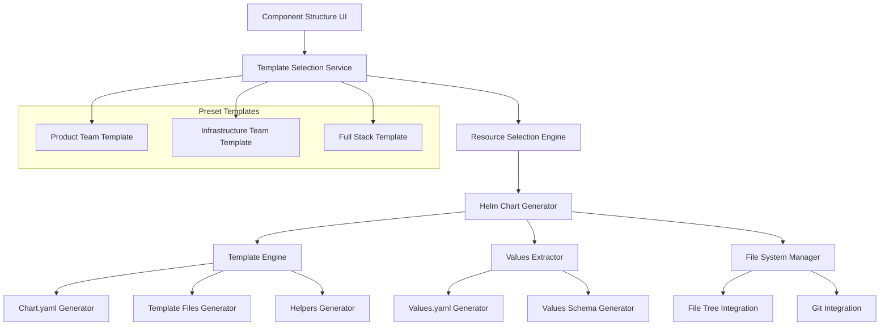
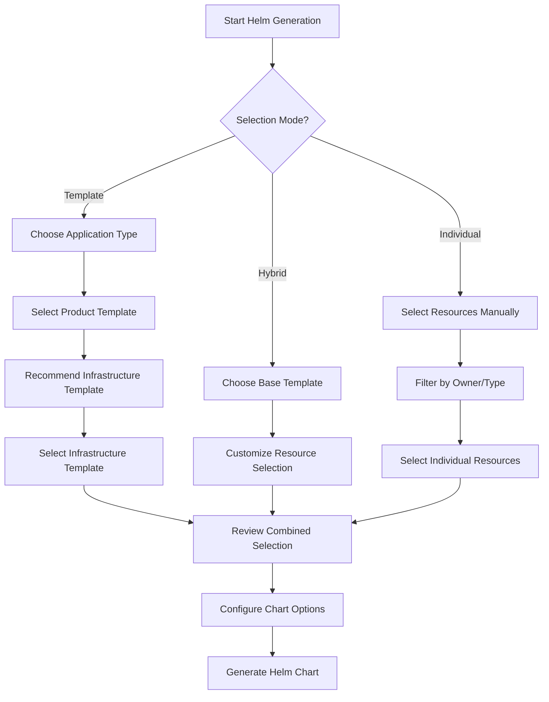
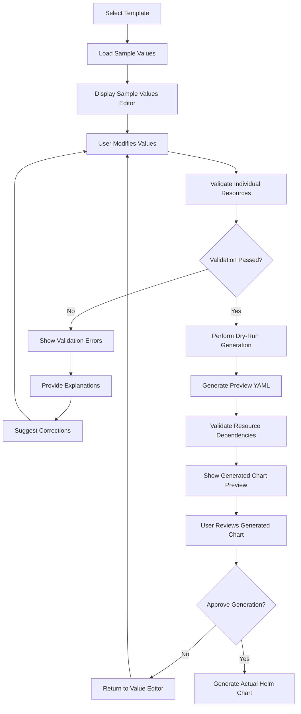
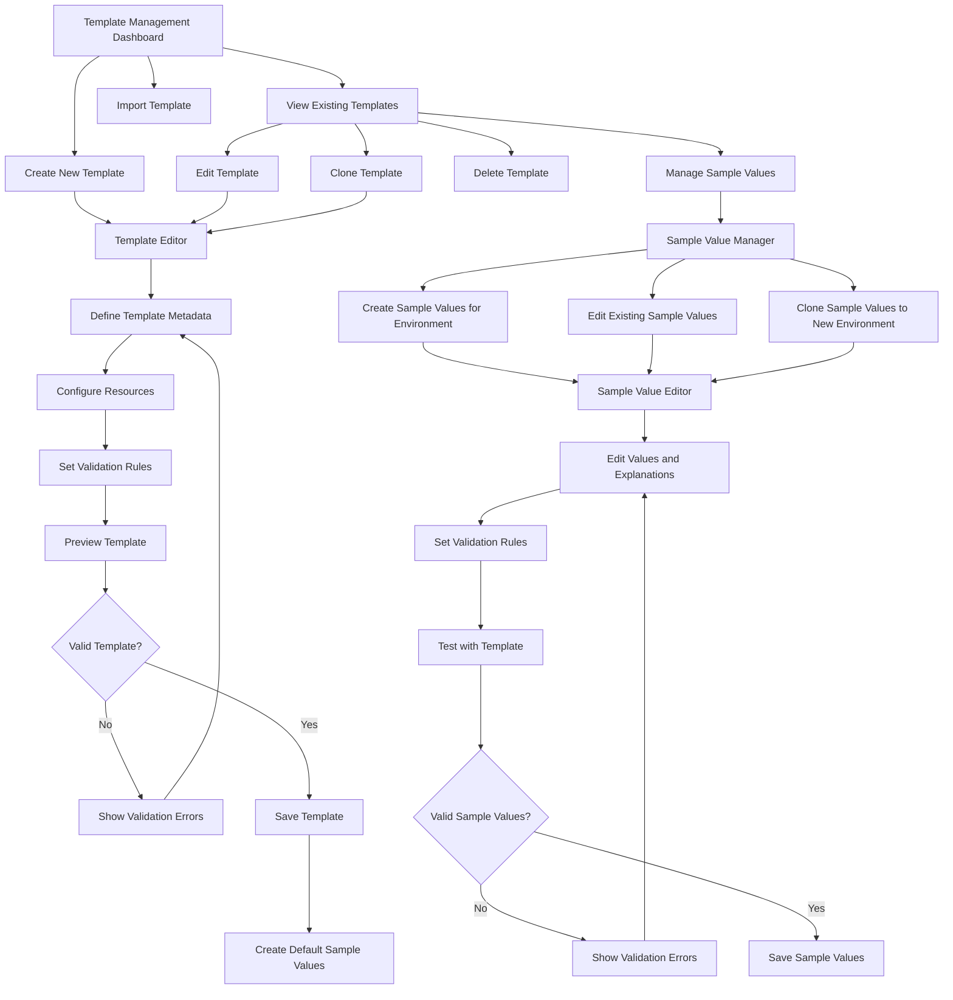

# Design Document

## Overview

This design document outlines the implementation of Helm chart generation from selected Kubernetes resources in the Component Structure interface. The feature will extend the existing product-component architecture to provide preset templates based on team ownership and enable direct generation of Helm charts with proper templating and values extraction.

## Architecture

### High-Level Architecture



### Component Integration

The feature integrates with existing components:
- **ProductComponentNavigator**: Extended to show Helm generation actions
- **ResourceFileManager**: Enhanced to support Helm chart structure
- **HelmTemplateGenerator**: Expanded with preset template support
- **File Explorer**: Updated to display Helm chart files with appropriate icons

## Components and Interfaces

### 1. Template Selection Service

**Purpose**: Manages preset templates and their resource mappings based on team ownership.

```typescript
interface PresetTemplate {
  id: string
  name: string
  displayName: string
  description: string
  owner: 'product' | 'infrastructure' | 'both'
  category: string
  applicationType: string
  resources: TemplateResource[]
}

interface TemplateResource {
  kind: string
  apiVersion: string
  required: boolean
  owner: 'product' | 'infrastructure'
  defaultValues?: Record<string, any>
}

class TemplateSelectionService {
  getAvailableTemplates(): PresetTemplate[]
  getTemplatesByOwner(owner: 'product' | 'infrastructure' | 'both'): PresetTemplate[]
  getTemplatesByApplicationType(applicationType: string): PresetTemplate[]
  getTemplatesByCategory(category: string): PresetTemplate[]
  getCompatibleTemplates(productTemplate: PresetTemplate): PresetTemplate[]
  getResourcesForTemplate(templateId: string): TemplateResource[]
  validateTemplateSelection(templateId: string, availableResources: ResourceFile[]): ValidationResult
  suggestInfrastructureTemplate(productTemplate: PresetTemplate): PresetTemplate | null
}
```

### 2. Helm Chart Generation Engine

**Purpose**: Orchestrates the chart generation process from selected resources or templates.

```typescript
interface HelmGenerationRequest {
  productName: string
  componentName: string
  chartName?: string
  chartVersion?: string
  selectedResources?: ResourceFile[]
  selectedProductTemplate?: string
  selectedInfrastructureTemplate?: string
  selectedCompleteTemplate?: string
  selectionMode: 'template' | 'individual' | 'hybrid'
  generationOptions: GenerationOptions
}

interface GenerationOptions {
  includeHelpers: boolean
  extractValues: boolean
  createSchema: boolean
  mergeExisting: boolean
  outputDirectory?: string
}

class HelmChartGenerationEngine {
  async generateChart(request: HelmGenerationRequest): Promise<GenerationResult>
  async validateResources(resources: ResourceFile[]): Promise<ValidationResult>
  async mergeWithExisting(chartPath: string, newResources: ResourceFile[]): Promise<MergeResult>
}
```

### 3. Enhanced Resource Selection Interface

**Purpose**: Extends the Component Structure interface to support template selection and resource filtering.

```typescript
interface ResourceSelectionState {
  selectedProductTemplate?: PresetTemplate
  selectedInfrastructureTemplate?: PresetTemplate
  selectedCompleteTemplate?: PresetTemplate
  selectedResources: Set<string>
  selectionMode: 'template' | 'individual' | 'hybrid'
  filterByOwner?: 'product' | 'infrastructure'
  filterByKind?: string[]
  filterByApplicationType?: string
}

interface HelmGenerationModalProps {
  productName: string
  componentName: string
  availableResources: ResourceFile[]
  onGenerate: (request: HelmGenerationRequest) => void
  onCancel: () => void
}

interface TemplateSelectionPanelProps {
  availableTemplates: PresetTemplate[]
  selectedProductTemplate?: PresetTemplate
  selectedInfrastructureTemplate?: PresetTemplate
  onProductTemplateSelect: (template: PresetTemplate) => void
  onInfrastructureTemplateSelect: (template: PresetTemplate) => void
  onCompleteTemplateSelect: (template: PresetTemplate) => void
}
```

### 4. Template Engine Extensions

**Purpose**: Enhances existing template generation with preset template support and team ownership awareness.

```typescript
class EnhancedHelmTemplateGenerator extends HelmTemplateGenerator {
  generateFromTemplate(template: PresetTemplate, resources: ResourceFile[]): TemplateResult
  extractValuesWithOwnership(resources: ResourceFile[]): ValuesWithOwnership
  generateHelpersWithTeamLabels(chartName: string): string
  createNotesWithOwnershipInfo(template: PresetTemplate): string
}

interface ValuesWithOwnership {
  productTeam: Record<string, any>
  infrastructureTeam: Record<string, any>
  shared: Record<string, any>
}
```

## Data Models

### Preset Template Definitions

```typescript
// Product Team Templates - Multiple application types
const PRODUCT_TEAM_TEMPLATES: PresetTemplate[] = [
  {
    id: 'product-aspnet-web-api',
    name: 'aspnet-web-api',
    displayName: 'ASP.NET Core Web API',
    description: 'Backend API service with database connectivity and monitoring',
    owner: 'product',
    category: 'backend-api',
    applicationType: 'web-api',
    resources: [
      { kind: 'Deployment', apiVersion: 'apps/v1', required: true, owner: 'product' },
      { kind: 'Service', apiVersion: 'v1', required: true, owner: 'product' },
      { kind: 'ConfigMap', apiVersion: 'v1', required: true, owner: 'product' },
      { kind: 'Secret', apiVersion: 'v1', required: true, owner: 'product' },
      { kind: 'ImageStream', apiVersion: 'image.openshift.io/v1', required: false, owner: 'product' },
      { kind: 'HorizontalPodAutoscaler', apiVersion: 'autoscaling/v2', required: false, owner: 'product' },
      { kind: 'ServiceMonitor', apiVersion: 'monitoring.coreos.com/v1', required: false, owner: 'product' }
    ]
  },
  {
    id: 'product-react-frontend',
    name: 'react-frontend',
    displayName: 'React Frontend Application',
    description: 'Frontend web application with static content serving',
    owner: 'product',
    category: 'frontend',
    applicationType: 'web-frontend',
    resources: [
      { kind: 'Deployment', apiVersion: 'apps/v1', required: true, owner: 'product' },
      { kind: 'Service', apiVersion: 'v1', required: true, owner: 'product' },
      { kind: 'ConfigMap', apiVersion: 'v1', required: true, owner: 'product' },
      { kind: 'ImageStream', apiVersion: 'image.openshift.io/v1', required: false, owner: 'product' }
    ]
  },
  {
    id: 'product-worker-service',
    name: 'worker-service',
    displayName: 'Background Worker Service',
    description: 'Background processing service with queue connectivity',
    owner: 'product',
    category: 'worker',
    applicationType: 'background-worker',
    resources: [
      { kind: 'Deployment', apiVersion: 'apps/v1', required: true, owner: 'product' },
      { kind: 'ConfigMap', apiVersion: 'v1', required: true, owner: 'product' },
      { kind: 'Secret', apiVersion: 'v1', required: true, owner: 'product' },
      { kind: 'HorizontalPodAutoscaler', apiVersion: 'autoscaling/v2', required: false, owner: 'product' }
    ]
  },
  {
    id: 'product-database',
    name: 'database-service',
    displayName: 'Database Service',
    description: 'Stateful database service with persistent storage',
    owner: 'product',
    category: 'database',
    applicationType: 'database',
    resources: [
      { kind: 'StatefulSet', apiVersion: 'apps/v1', required: true, owner: 'product' },
      { kind: 'Service', apiVersion: 'v1', required: true, owner: 'product' },
      { kind: 'ConfigMap', apiVersion: 'v1', required: true, owner: 'product' },
      { kind: 'Secret', apiVersion: 'v1', required: true, owner: 'product' },
      { kind: 'PersistentVolumeClaim', apiVersion: 'v1', required: true, owner: 'product' }
    ]
  }
]

// Infrastructure Team Templates - Multiple infrastructure patterns
const INFRASTRUCTURE_TEAM_TEMPLATES: PresetTemplate[] = [
  {
    id: 'infra-web-application',
    name: 'web-application-infra',
    displayName: 'Web Application Infrastructure',
    description: 'Infrastructure setup for web applications with external access',
    owner: 'infrastructure',
    category: 'web-infrastructure',
    applicationType: 'web-application',
    resources: [
      { kind: 'Route', apiVersion: 'route.openshift.io/v1', required: true, owner: 'infrastructure' },
      { kind: 'ServiceAccount', apiVersion: 'v1', required: true, owner: 'infrastructure' },
      { kind: 'RoleBinding', apiVersion: 'rbac.authorization.k8s.io/v1', required: false, owner: 'infrastructure' },
      { kind: 'NetworkPolicy', apiVersion: 'networking.k8s.io/v1', required: true, owner: 'infrastructure' },
      { kind: 'ResourceQuota', apiVersion: 'v1', required: false, owner: 'infrastructure' }
    ]
  },
  {
    id: 'infra-internal-service',
    name: 'internal-service-infra',
    displayName: 'Internal Service Infrastructure',
    description: 'Infrastructure for internal services without external access',
    owner: 'infrastructure',
    category: 'internal-infrastructure',
    applicationType: 'internal-service',
    resources: [
      { kind: 'ServiceAccount', apiVersion: 'v1', required: true, owner: 'infrastructure' },
      { kind: 'RoleBinding', apiVersion: 'rbac.authorization.k8s.io/v1', required: true, owner: 'infrastructure' },
      { kind: 'NetworkPolicy', apiVersion: 'networking.k8s.io/v1', required: true, owner: 'infrastructure' },
      { kind: 'ResourceQuota', apiVersion: 'v1', required: false, owner: 'infrastructure' }
    ]
  },
  {
    id: 'infra-database',
    name: 'database-infra',
    displayName: 'Database Infrastructure',
    description: 'Infrastructure setup for database services with security and storage',
    owner: 'infrastructure',
    category: 'database-infrastructure',
    applicationType: 'database',
    resources: [
      { kind: 'ServiceAccount', apiVersion: 'v1', required: true, owner: 'infrastructure' },
      { kind: 'RoleBinding', apiVersion: 'rbac.authorization.k8s.io/v1', required: true, owner: 'infrastructure' },
      { kind: 'NetworkPolicy', apiVersion: 'networking.k8s.io/v1', required: true, owner: 'infrastructure' },
      { kind: 'SecurityContextConstraints', apiVersion: 'security.openshift.io/v1', required: true, owner: 'infrastructure' },
      { kind: 'ResourceQuota', apiVersion: 'v1', required: false, owner: 'infrastructure' }
    ]
  }
]

// Complete Application Stack Templates - Combining Product + Infrastructure
const COMPLETE_STACK_TEMPLATES: PresetTemplate[] = [
  {
    id: 'complete-web-api-stack',
    name: 'web-api-complete-stack',
    displayName: 'Complete Web API Stack',
    description: 'Full stack for ASP.NET Core Web API with infrastructure',
    owner: 'both',
    category: 'complete-stack',
    applicationType: 'web-api',
    resources: [
      // Product Team Resources
      ...PRODUCT_TEAM_TEMPLATES.find(t => t.id === 'product-aspnet-web-api')!.resources,
      // Infrastructure Team Resources
      ...INFRASTRUCTURE_TEAM_TEMPLATES.find(t => t.id === 'infra-web-application')!.resources
    ]
  },
  {
    id: 'complete-frontend-stack',
    name: 'frontend-complete-stack',
    displayName: 'Complete Frontend Stack',
    description: 'Full stack for React frontend application with infrastructure',
    owner: 'both',
    category: 'complete-stack',
    applicationType: 'web-frontend',
    resources: [
      // Product Team Resources
      ...PRODUCT_TEAM_TEMPLATES.find(t => t.id === 'product-react-frontend')!.resources,
      // Infrastructure Team Resources
      ...INFRASTRUCTURE_TEAM_TEMPLATES.find(t => t.id === 'infra-web-application')!.resources
    ]
  },
  {
    id: 'complete-worker-stack',
    name: 'worker-complete-stack',
    displayName: 'Complete Worker Service Stack',
    description: 'Full stack for background worker service with infrastructure',
    owner: 'both',
    category: 'complete-stack',
    applicationType: 'background-worker',
    resources: [
      // Product Team Resources
      ...PRODUCT_TEAM_TEMPLATES.find(t => t.id === 'product-worker-service')!.resources,
      // Infrastructure Team Resources
      ...INFRASTRUCTURE_TEAM_TEMPLATES.find(t => t.id === 'infra-internal-service')!.resources
    ]
  },
  {
    id: 'complete-database-stack',
    name: 'database-complete-stack',
    displayName: 'Complete Database Stack',
    description: 'Full stack for database service with infrastructure',
    owner: 'both',
    category: 'complete-stack',
    applicationType: 'database',
    resources: [
      // Product Team Resources
      ...PRODUCT_TEAM_TEMPLATES.find(t => t.id === 'product-database')!.resources,
      // Infrastructure Team Resources
      ...INFRASTRUCTURE_TEAM_TEMPLATES.find(t => t.id === 'infra-database')!.resources
    ]
  }
]
```

### Chart Generation Configuration

```typescript
interface ChartConfiguration {
  metadata: {
    name: string
    version: string
    description: string
    appVersion: string
    keywords: string[]
    home?: string
    sources?: string[]
    maintainers?: Maintainer[]
  }
  templates: {
    includeHelpers: boolean
    includeNotes: boolean
    addOwnershipLabels: boolean
    addTeamAnnotations: boolean
  }
  values: {
    extractionStrategy: 'automatic' | 'manual' | 'template-based'
    organizationStrategy: 'flat' | 'hierarchical' | 'team-based'
    includeDefaults: boolean
  }
}
```

## Error Handling

### Validation Errors

```typescript
interface ValidationError {
  type: 'missing_resource' | 'invalid_template' | 'ownership_conflict' | 'schema_validation'
  message: string
  resource?: string
  field?: string
  suggestion?: string
}

class HelmValidationService {
  validateTemplateResources(template: PresetTemplate, resources: ResourceFile[]): ValidationError[]
  validateOwnershipConsistency(resources: ResourceFile[]): ValidationError[]
  validateHelmCompliance(chartPath: string): ValidationError[]
}
```

### Generation Error Recovery

```typescript
interface GenerationError extends Error {
  type: 'file_system' | 'template_processing' | 'values_extraction' | 'merge_conflict'
  recoverable: boolean
  recovery?: () => Promise<void>
}

class ErrorRecoveryService {
  handleFileSystemError(error: GenerationError): Promise<void>
  handleMergeConflict(error: GenerationError): Promise<ConflictResolution>
  handleTemplateError(error: GenerationError): Promise<void>
}
```

## Testing Strategy

### Unit Testing

1. **Template Selection Service Tests**
   - Template filtering by owner
   - Resource validation for templates
   - Template metadata consistency

2. **Helm Generation Engine Tests**
   - Chart structure generation
   - Values extraction accuracy
   - Template processing correctness

3. **Resource Selection Tests**
   - Multi-selection functionality
   - Filter application
   - State management

### Integration Testing

1. **End-to-End Generation Workflow**
   - Template selection → Resource selection → Chart generation
   - File system integration
   - Git integration

2. **Existing Chart Merge Testing**
   - Conflict detection and resolution
   - Custom modification preservation
   - Values file merging

### Component Testing

1. **UI Component Tests**
   - Template selection interface
   - Resource selection checkboxes
   - Progress indicators and feedback

2. **Service Integration Tests**
   - File system operations
   - YAML processing
   - Helm validation

### Performance Testing

1. **Large Resource Set Handling**
   - Generation time with 50+ resources
   - Memory usage during processing
   - UI responsiveness during generation

2. **File System Performance**
   - Chart generation speed
   - File tree update performance
   - Git operations efficiency

## Template Selection User Flow

### Multi-Template Selection Interface

The interface will provide three selection modes:

1. **Template Mode**: Users select from predefined templates
   - **Product Templates**: Choose application type (Web API, Frontend, Worker, Database)
   - **Infrastructure Templates**: Choose infrastructure pattern (Web App, Internal Service, Database)
   - **Complete Stack Templates**: Choose full stack combinations

2. **Individual Mode**: Users manually select individual resources
   - Checkbox selection for each available resource
   - Filtering by owner, kind, and application type
   - Visual indicators for team ownership

3. **Hybrid Mode**: Combine template selection with individual customization
   - Start with a template selection
   - Add/remove individual resources as needed
   - Override template defaults

### Template Recommendation Engine

```typescript
class TemplateRecommendationEngine {
  recommendInfrastructureTemplate(productTemplate: PresetTemplate): PresetTemplate[]
  recommendCompleteStack(applicationType: string): PresetTemplate[]
  validateTemplateCompatibility(productTemplate: PresetTemplate, infraTemplate: PresetTemplate): boolean
  suggestMissingResources(selectedTemplates: PresetTemplate[]): TemplateResource[]
}
```

### Sample Values and Validation System

```typescript
interface SampleValueSet {
  id: string
  name: string
  description: string
  applicationType: string
  environment: 'development' | 'staging' | 'production'
  values: Record<string, any>
  resourceExamples: ResourceSampleValue[]
}

interface ResourceSampleValue {
  kind: string
  apiVersion: string
  sampleFields: Record<string, any>
  explanation: Record<string, string>
  validationRules: ValidationRule[]
}

interface ValidationRule {
  field: string
  type: 'required' | 'format' | 'range' | 'dependency'
  rule: string
  message: string
  severity: 'error' | 'warning' | 'info'
}

class SampleValueService {
  getSampleValuesForTemplate(template: PresetTemplate, environment: string): SampleValueSet
  getSampleValuesForResource(kind: string, applicationType: string): ResourceSampleValue
  generateRelatedSampleValues(resources: TemplateResource[]): SampleValueSet
  validateSampleValues(values: Record<string, any>, template: PresetTemplate): ValidationResult[]
}

class DryRunValidationService {
  validateIndividualResource(resource: ResourceFile, sampleValues: Record<string, any>): ValidationResult
  validateResourceDependencies(resources: ResourceFile[], sampleValues: Record<string, any>): ValidationResult[]
  performDryRunGeneration(template: PresetTemplate, sampleValues: Record<string, any>): DryRunResult
  explainValidationErrors(errors: ValidationResult[]): ExplanationResult[]
}

interface DryRunResult {
  success: boolean
  generatedYaml: Record<string, string>
  validationErrors: ValidationResult[]
  warnings: ValidationResult[]
  resourceRelationships: ResourceRelationship[]
}

interface ResourceRelationship {
  source: string
  target: string
  relationship: 'depends_on' | 'references' | 'configures'
  field: string
  explanation: string
}
```

### Template Selection Workflow



## Implementation Phases

### Phase 1: Multi-Template System Foundation
- Implement enhanced PresetTemplate data models with applicationType
- Create TemplateSelectionService with multiple template support
- Add comprehensive template definitions (Product, Infrastructure, Complete Stack)
- Implement TemplateRecommendationEngine for smart suggestions

### Phase 2: Enhanced Template Selection UI
- Create multi-mode template selection interface (Template/Individual/Hybrid)
- Implement template filtering by application type and owner
- Add template compatibility validation and recommendations
- Create template preview with resource breakdown

### Phase 3: Advanced Resource Selection
- Extend Component Structure interface with enhanced selection modes
- Implement hybrid selection (template + individual customization)
- Add resource filtering by owner, kind, and application type
- Create smart resource recommendation based on selected templates

### Phase 4: Chart Generation Engine
- Implement HelmChartGenerationEngine with multi-template support
- Extend HelmTemplateGenerator with application-type awareness
- Add values extraction with team-based and application-type organization
- Implement Chart.yaml generation with proper metadata and dependencies

### Phase 5: File System Integration & Advanced Features
- Enhance ResourceFileManager for complex Helm chart structures
- Implement file tree integration with application-type icons
- Add Git integration for chart files with proper commit messages
- Create comprehensive validation, conflict resolution, and testing
### 
Sample Value Sets for Templates

```typescript
// Sample Values for ASP.NET Core Web API
const ASPNET_WEB_API_SAMPLES: SampleValueSet = {
  id: 'aspnet-web-api-dev',
  name: 'ASP.NET Web API Development',
  description: 'Sample values for ASP.NET Core Web API in development environment',
  applicationType: 'web-api',
  environment: 'development',
  values: {
    global: {
      product: 'customer-api',
      component: 'api-service',
      environment: 'development'
    },
    deployment: {
      name: 'customer-api',
      replicas: 2,
      image: {
        repository: 'registry.company.com/customer-api',
        tag: '1.0.0',
        pullPolicy: 'IfNotPresent'
      },
      resources: {
        requests: { cpu: '100m', memory: '256Mi' },
        limits: { cpu: '500m', memory: '512Mi' }
      },
      env: [
        { name: 'ASPNETCORE_ENVIRONMENT', value: 'Development' },
        { name: 'ConnectionStrings__DefaultConnection', valueFrom: { secretKeyRef: { name: 'customer-api-secrets', key: 'database-connection' } } }
      ]
    },
    service: {
      name: 'customer-api-service',
      type: 'ClusterIP',
      ports: [{ name: 'http', port: 80, targetPort: 8080, protocol: 'TCP' }]
    },
    configMap: {
      name: 'customer-api-config',
      data: {
        'appsettings.json': JSON.stringify({
          Logging: { LogLevel: { Default: 'Information' } },
          AllowedHosts: '*',
          ApiSettings: { Version: 'v1', EnableSwagger: true }
        })
      }
    },
    secret: {
      name: 'customer-api-secrets',
      type: 'Opaque',
      data: {
        'database-connection': 'Server=postgres-service;Database=customerdb;User Id=api_user;Password=dev_password;',
        'jwt-secret': 'your-256-bit-secret-key-here'
      }
    }
  },
  resourceExamples: [
    {
      kind: 'Deployment',
      apiVersion: 'apps/v1',
      sampleFields: {
        'spec.replicas': 2,
        'spec.template.spec.containers[0].image': 'registry.company.com/customer-api:1.0.0',
        'spec.template.spec.containers[0].ports[0].containerPort': 8080,
        'spec.template.spec.containers[0].env[0].name': 'ASPNETCORE_ENVIRONMENT'
      },
      explanation: {
        'spec.replicas': 'Number of pod instances to run. Start with 2 for high availability.',
        'spec.template.spec.containers[0].image': 'Container image for your ASP.NET Core application',
        'spec.template.spec.containers[0].ports[0].containerPort': 'Port your application listens on (typically 8080 for ASP.NET Core)',
        'spec.template.spec.containers[0].env[0].name': 'Environment variable to set ASP.NET Core environment'
      },
      validationRules: [
        { field: 'spec.replicas', type: 'range', rule: 'min:1,max:10', message: 'Replicas should be between 1 and 10 for development', severity: 'warning' },
        { field: 'spec.template.spec.containers[0].image', type: 'required', rule: 'not_empty', message: 'Container image is required', severity: 'error' }
      ]
    }
  ]
}

// Sample Values for React Frontend
const REACT_FRONTEND_SAMPLES: SampleValueSet = {
  id: 'react-frontend-dev',
  name: 'React Frontend Development',
  description: 'Sample values for React frontend application in development environment',
  applicationType: 'web-frontend',
  environment: 'development',
  values: {
    global: {
      product: 'customer-portal',
      component: 'frontend',
      environment: 'development'
    },
    deployment: {
      name: 'customer-portal-frontend',
      replicas: 2,
      image: {
        repository: 'registry.company.com/customer-portal-frontend',
        tag: '1.0.0',
        pullPolicy: 'IfNotPresent'
      },
      resources: {
        requests: { cpu: '50m', memory: '128Mi' },
        limits: { cpu: '200m', memory: '256Mi' }
      },
      env: [
        { name: 'REACT_APP_API_URL', value: 'http://customer-api-service' },
        { name: 'REACT_APP_ENVIRONMENT', value: 'development' }
      ]
    },
    service: {
      name: 'customer-portal-frontend-service',
      type: 'ClusterIP',
      ports: [{ name: 'http', port: 80, targetPort: 3000, protocol: 'TCP' }]
    },
    configMap: {
      name: 'customer-portal-frontend-config',
      data: {
        'nginx.conf': `server {
          listen 3000;
          location / {
            root /usr/share/nginx/html;
            try_files $uri $uri/ /index.html;
          }
        }`
      }
    }
  },
  resourceExamples: [
    {
      kind: 'Deployment',
      apiVersion: 'apps/v1',
      sampleFields: {
        'spec.replicas': 2,
        'spec.template.spec.containers[0].image': 'registry.company.com/customer-portal-frontend:1.0.0',
        'spec.template.spec.containers[0].ports[0].containerPort': 3000,
        'spec.template.spec.containers[0].env[0].name': 'REACT_APP_API_URL'
      },
      explanation: {
        'spec.replicas': 'Number of frontend instances. 2 provides redundancy.',
        'spec.template.spec.containers[0].image': 'Container image for your React application',
        'spec.template.spec.containers[0].ports[0].containerPort': 'Port your React app serves on (typically 3000)',
        'spec.template.spec.containers[0].env[0].name': 'Environment variable for API endpoint URL'
      },
      validationRules: [
        { field: 'spec.template.spec.containers[0].env[0].value', type: 'format', rule: 'url', message: 'API URL should be a valid URL', severity: 'error' }
      ]
    }
  ]
}

// Sample Values for Web Application Infrastructure
const WEB_INFRASTRUCTURE_SAMPLES: SampleValueSet = {
  id: 'web-infra-dev',
  name: 'Web Application Infrastructure Development',
  description: 'Sample infrastructure values for web applications in development environment',
  applicationType: 'web-application',
  environment: 'development',
  values: {
    route: {
      name: 'customer-portal-route',
      host: 'customer-portal-dev.apps.company.com',
      path: '/',
      tls: {
        termination: 'edge',
        insecureEdgeTerminationPolicy: 'Redirect'
      },
      to: {
        kind: 'Service',
        name: 'customer-portal-frontend-service'
      }
    },
    serviceAccount: {
      name: 'customer-portal-sa',
      automountServiceAccountToken: false
    },
    networkPolicy: {
      name: 'customer-portal-netpol',
      podSelector: {
        matchLabels: { app: 'customer-portal' }
      },
      policyTypes: ['Ingress', 'Egress'],
      ingress: [
        {
          from: [{ namespaceSelector: { matchLabels: { name: 'openshift-ingress' } } }],
          ports: [{ protocol: 'TCP', port: 8080 }]
        }
      ]
    }
  },
  resourceExamples: [
    {
      kind: 'Route',
      apiVersion: 'route.openshift.io/v1',
      sampleFields: {
        'spec.host': 'customer-portal-dev.apps.company.com',
        'spec.tls.termination': 'edge',
        'spec.to.name': 'customer-portal-frontend-service'
      },
      explanation: {
        'spec.host': 'External hostname for accessing your application',
        'spec.tls.termination': 'TLS termination at the router (edge) for HTTPS',
        'spec.to.name': 'Name of the service to route traffic to'
      },
      validationRules: [
        { field: 'spec.host', type: 'format', rule: 'hostname', message: 'Host must be a valid hostname', severity: 'error' },
        { field: 'spec.to.name', type: 'dependency', rule: 'service_exists', message: 'Referenced service must exist', severity: 'error' }
      ]
    }
  ]
}
```

### Dry-Run and Validation Workflow



### Sample Value Management Interface

```typescript
interface SampleValueEditorProps {
  template: PresetTemplate
  environment: string
  initialValues?: Record<string, any>
  onValuesChange: (values: Record<string, any>) => void
  onValidate: (values: Record<string, any>) => void
  onDryRun: (values: Record<string, any>) => void
}

interface ValidationDisplayProps {
  validationResults: ValidationResult[]
  explanations: ExplanationResult[]
  onFixSuggestion: (field: string, suggestedValue: any) => void
}

interface DryRunPreviewProps {
  dryRunResult: DryRunResult
  onApprove: () => void
  onModify: () => void
}

class SampleValueEditorService {
  loadSampleValues(template: PresetTemplate, environment: string): SampleValueSet
  validateValues(values: Record<string, any>, template: PresetTemplate): ValidationResult[]
  generateExplanations(validationResults: ValidationResult[]): ExplanationResult[]
  suggestCorrections(validationResults: ValidationResult[]): CorrectionSuggestion[]
  performDryRun(template: PresetTemplate, values: Record<string, any>): DryRunResult
}
```
### 
Template and Sample Value Management System

```typescript
interface TemplateManagementService {
  // Template CRUD operations
  createTemplate(template: PresetTemplate): Promise<string>
  updateTemplate(id: string, template: Partial<PresetTemplate>): Promise<void>
  deleteTemplate(id: string): Promise<void>
  cloneTemplate(id: string, newName: string): Promise<string>
  
  // Template organization
  getTemplatesByCategory(category: string): Promise<PresetTemplate[]>
  getTemplatesByOwner(owner: string): Promise<PresetTemplate[]>
  searchTemplates(query: string): Promise<PresetTemplate[]>
  
  // Template validation
  validateTemplate(template: PresetTemplate): Promise<ValidationResult[]>
  testTemplateGeneration(template: PresetTemplate, sampleValues: SampleValueSet): Promise<DryRunResult>
}

interface SampleValueManagementService {
  // Sample value CRUD operations
  createSampleValueSet(sampleSet: SampleValueSet): Promise<string>
  updateSampleValueSet(id: string, sampleSet: Partial<SampleValueSet>): Promise<void>
  deleteSampleValueSet(id: string): Promise<void>
  cloneSampleValueSet(id: string, newEnvironment: string): Promise<string>
  
  // Environment-specific management
  getSampleValuesByEnvironment(environment: string): Promise<SampleValueSet[]>
  getSampleValuesForTemplate(templateId: string, environment: string): Promise<SampleValueSet[]>
  
  // Sample value validation
  validateSampleValues(sampleSet: SampleValueSet): Promise<ValidationResult[]>
  generateSampleValuesFromExisting(templateId: string, existingValues: Record<string, any>): Promise<SampleValueSet>
}

// Template Storage Structure
interface TemplateRepository {
  // File-based storage in .kiro/templates/
  templates: {
    [templateId: string]: {
      metadata: PresetTemplate
      lastModified: string
      version: string
      author: string
    }
  }
  sampleValues: {
    [sampleSetId: string]: {
      metadata: SampleValueSet
      lastModified: string
      version: string
      author: string
    }
  }
}
```

### Template Management UI Components

```typescript
interface TemplateManagerProps {
  onTemplateSelect: (template: PresetTemplate) => void
  onTemplateEdit: (template: PresetTemplate) => void
  onTemplateCreate: () => void
}

interface TemplateEditorProps {
  template?: PresetTemplate
  mode: 'create' | 'edit' | 'clone'
  onSave: (template: PresetTemplate) => void
  onCancel: () => void
  onPreview: (template: PresetTemplate) => void
}

interface SampleValueManagerProps {
  templateId: string
  environment: string
  onSampleValueSelect: (sampleSet: SampleValueSet) => void
  onSampleValueEdit: (sampleSet: SampleValueSet) => void
  onSampleValueCreate: () => void
}

interface SampleValueEditorProps {
  sampleSet?: SampleValueSet
  templateId: string
  mode: 'create' | 'edit' | 'clone'
  onSave: (sampleSet: SampleValueSet) => void
  onCancel: () => void
  onValidate: (sampleSet: SampleValueSet) => void
}
```

### Template Management Workflow



### File System Structure for Template Management

```
.kiro/
├── templates/
│   ├── product-team/
│   │   ├── aspnet-web-api.json
│   │   ├── react-frontend.json
│   │   ├── worker-service.json
│   │   └── database-service.json
│   ├── infrastructure-team/
│   │   ├── web-application-infra.json
│   │   ├── internal-service-infra.json
│   │   └── database-infra.json
│   ├── complete-stack/
│   │   ├── web-api-complete.json
│   │   ├── frontend-complete.json
│   │   └── worker-complete.json
│   └── custom/
│       └── user-defined-templates.json
├── sample-values/
│   ├── development/
│   │   ├── aspnet-web-api-dev.json
│   │   ├── react-frontend-dev.json
│   │   └── web-infra-dev.json
│   ├── staging/
│   │   ├── aspnet-web-api-staging.json
│   │   └── react-frontend-staging.json
│   ├── production/
│   │   ├── aspnet-web-api-prod.json
│   │   └── react-frontend-prod.json
│   └── custom/
│       └── user-defined-samples.json
└── template-metadata.json
```

### Template Import/Export System

```typescript
interface TemplateImportExportService {
  // Export templates and sample values
  exportTemplate(templateId: string): Promise<TemplateExportPackage>
  exportSampleValues(sampleSetId: string): Promise<SampleValueExportPackage>
  exportCompletePackage(templateIds: string[], sampleSetIds: string[]): Promise<CompleteExportPackage>
  
  // Import templates and sample values
  importTemplate(packageData: TemplateExportPackage): Promise<ImportResult>
  importSampleValues(packageData: SampleValueExportPackage): Promise<ImportResult>
  importCompletePackage(packageData: CompleteExportPackage): Promise<ImportResult>
  
  // Template sharing
  shareTemplate(templateId: string, shareOptions: ShareOptions): Promise<string>
  importSharedTemplate(shareUrl: string): Promise<ImportResult>
}

interface TemplateExportPackage {
  version: string
  exportDate: string
  template: PresetTemplate
  associatedSampleValues: SampleValueSet[]
  dependencies: string[]
  metadata: {
    author: string
    description: string
    tags: string[]
  }
}

interface ShareOptions {
  includesSampleValues: boolean
  environments: string[]
  expirationDate?: string
  accessLevel: 'public' | 'organization' | 'private'
}
```

### Template Versioning and History

```typescript
interface TemplateVersioningService {
  // Version management
  createVersion(templateId: string, changes: string): Promise<string>
  getVersionHistory(templateId: string): Promise<TemplateVersion[]>
  revertToVersion(templateId: string, versionId: string): Promise<void>
  compareVersions(templateId: string, version1: string, version2: string): Promise<VersionDiff>
  
  // Change tracking
  trackChanges(templateId: string, changes: TemplateChange[]): Promise<void>
  getChangeLog(templateId: string, fromDate?: string, toDate?: string): Promise<TemplateChange[]>
}

interface TemplateVersion {
  id: string
  templateId: string
  version: string
  createdAt: string
  author: string
  changes: string
  template: PresetTemplate
}

interface TemplateChange {
  field: string
  oldValue: any
  newValue: any
  changeType: 'added' | 'modified' | 'removed'
  timestamp: string
  author: string
}
```

### Environment-Specific Configuration Management

```typescript
interface EnvironmentConfigurationService {
  // Environment management
  createEnvironment(name: string, config: EnvironmentConfig): Promise<void>
  updateEnvironment(name: string, config: Partial<EnvironmentConfig>): Promise<void>
  deleteEnvironment(name: string): Promise<void>
  
  // Environment-specific templates
  getEnvironmentTemplates(environment: string): Promise<PresetTemplate[]>
  getEnvironmentSampleValues(environment: string): Promise<SampleValueSet[]>
  
  // Environment inheritance
  inheritFromEnvironment(sourceEnv: string, targetEnv: string, options: InheritanceOptions): Promise<void>
  validateEnvironmentCompatibility(template: PresetTemplate, environment: string): Promise<ValidationResult[]>
}

interface EnvironmentConfig {
  name: string
  displayName: string
  description: string
  defaultValues: Record<string, any>
  validationRules: ValidationRule[]
  resourceConstraints: ResourceConstraint[]
  allowedTemplates: string[]
}

interface InheritanceOptions {
  includeTemplates: boolean
  includeSampleValues: boolean
  overrideExisting: boolean
  transformationRules: TransformationRule[]
}
```

### Template Marketplace and Community Features

```typescript
interface TemplateMarketplaceService {
  // Community templates
  browseMarketplaceTemplates(category?: string, owner?: string): Promise<MarketplaceTemplate[]>
  downloadMarketplaceTemplate(templateId: string): Promise<TemplateExportPackage>
  publishTemplate(templateId: string, publishOptions: PublishOptions): Promise<string>
  
  // Ratings and reviews
  rateTemplate(templateId: string, rating: number, review?: string): Promise<void>
  getTemplateRatings(templateId: string): Promise<TemplateRating[]>
  
  // Template updates
  checkForUpdates(templateId: string): Promise<UpdateInfo[]>
  updateFromMarketplace(templateId: string, updateId: string): Promise<void>
}

interface MarketplaceTemplate {
  id: string
  name: string
  displayName: string
  description: string
  author: string
  category: string
  tags: string[]
  rating: number
  downloadCount: number
  lastUpdated: string
  version: string
  compatibility: string[]
}

interface PublishOptions {
  visibility: 'public' | 'organization' | 'private'
  category: string
  tags: string[]
  description: string
  documentation?: string
  examples: SampleValueSet[]
}
```

This comprehensive template management system provides:

1. **Template CRUD Operations**: Full create, read, update, delete capabilities for templates and sample values
2. **Environment Management**: Support for different environments with specific configurations
3. **Version Control**: Track changes, maintain history, and revert to previous versions
4. **Import/Export**: Share templates and sample values between teams and projects
5. **Template Marketplace**: Community-driven template sharing and discovery
6. **Validation and Testing**: Ensure templates and sample values work correctly before deployment
7. **File-based Storage**: Organized file structure for easy backup and version control integration

This makes the system maintainable and scalable as requirements grow across different environments and teams.