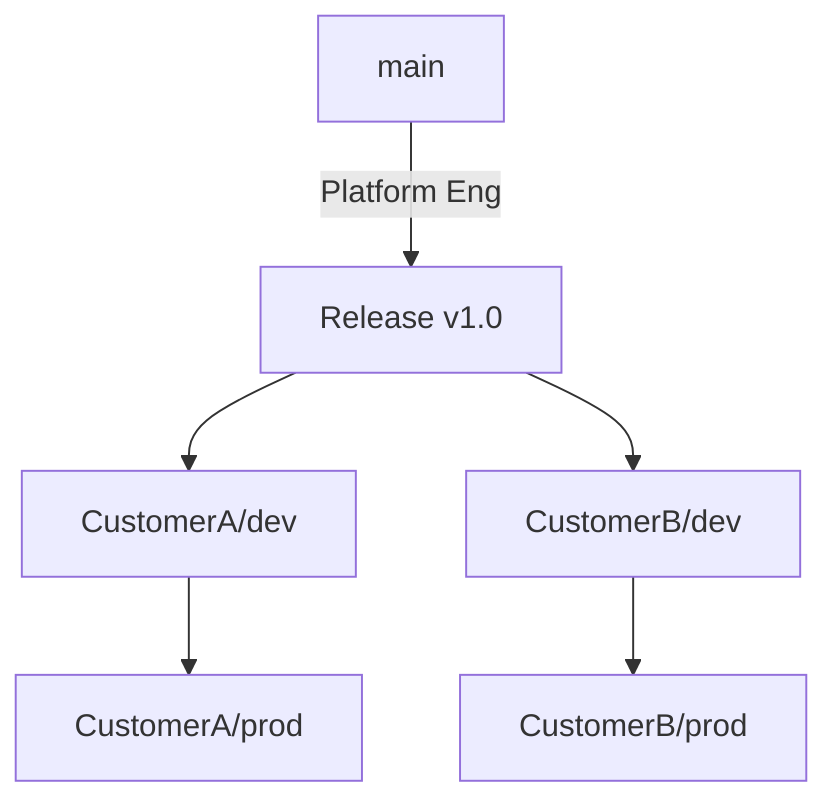
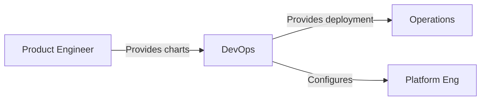
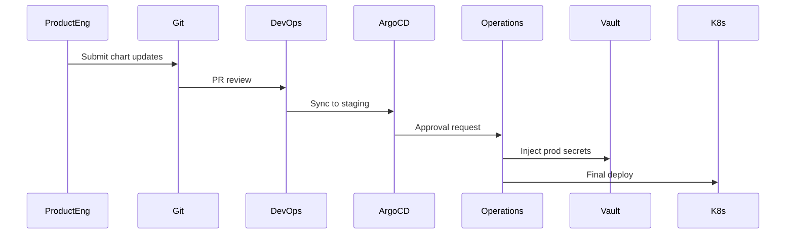
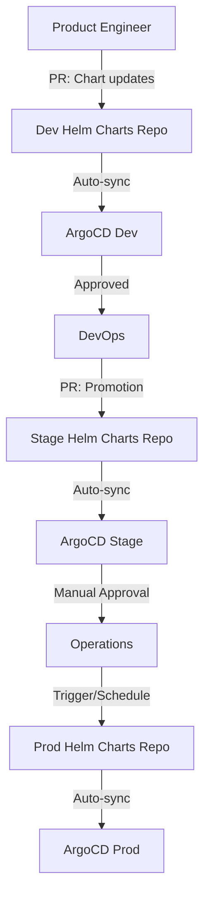
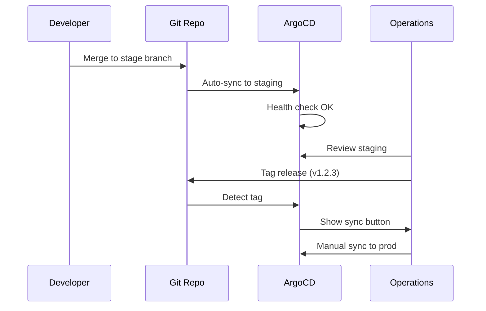

# React + TypeScript + Vite

This template provides a minimal setup to get React working in Vite with HMR and some ESLint rules.

Currently, two official plugins are available:

- [@vitejs/plugin-react](https://github.com/vitejs/vite-plugin-react/blob/main/packages/plugin-react) uses [Babel](https://babeljs.io/) for Fast Refresh
- [@vitejs/plugin-react-swc](https://github.com/vitejs/vite-plugin-react/blob/main/packages/plugin-react-swc) uses [SWC](https://swc.rs/) for Fast Refresh

## Expanding the ESLint configuration

If you are developing a production application, we recommend updating the configuration to enable type-aware lint rules:

```js
export default tseslint.config({
  extends: [
    // Remove ...tseslint.configs.recommended and replace with this
    ...tseslint.configs.recommendedTypeChecked,
    // Alternatively, use this for stricter rules
    ...tseslint.configs.strictTypeChecked,
    // Optionally, add this for stylistic rules
    ...tseslint.configs.stylisticTypeChecked,
  ],
  languageOptions: {
    // other options...
    parserOptions: {
      project: ['./tsconfig.node.json', './tsconfig.app.json'],
      tsconfigRootDir: import.meta.dirname,
    },
  },
})
```

You can also install [eslint-plugin-react-x](https://github.com/Rel1cx/eslint-react/tree/main/packages/plugins/eslint-plugin-react-x) and [eslint-plugin-react-dom](https://github.com/Rel1cx/eslint-react/tree/main/packages/plugins/eslint-plugin-react-dom) for React-specific lint rules:

```js
// eslint.config.js
import reactX from 'eslint-plugin-react-x'
import reactDom from 'eslint-plugin-react-dom'

export default tseslint.config({
  plugins: {
    // Add the react-x and react-dom plugins
    'react-x': reactX,
    'react-dom': reactDom,
  },
  rules: {
    // other rules...
    // Enable its recommended typescript rules
    ...reactX.configs['recommended-typescript'].rules,
    ...reactDom.configs.recommended.rules,
  },
})
```

--------------------
# Project Structure Analysis & Recommendations

Based on your project structure, I can see you have a substantial Electron + React application with Kubernetes/Helm functionality. Here's my comprehensive analysis and recommendations for improving organization, reusability, and maintainability.

## Folder Structure

```
src/
├── main/                  # Electron main process
│   ├── ipc/               # IPC handlers
│   ├── services/          # Main process services
│   └── utils/             # Main process utilities
│
├── renderer/              # React application
│   ├── assets/            # Static assets
│   ├── components/        # Presentational components
│   │   ├── ui/            # Reusable UI primitives
│   │   └── features/      # Feature-specific components
│   │
│   ├── containers/        # Stateful container components
│   ├── hooks/             # Custom hooks
│   ├── layouts/           # App layouts
│   ├── pages/             # Top-level page components
│   ├── services/          # Frontend services
│   ├── stores/            # State management
│   ├── styles/            # Global styles and themes
│   ├── types/             # Type definitions
│   └── utils/             # Shared utilities
│
├── shared/                # Code shared between main/renderer
│   ├── ipc/               # IPC type definitions
│   ├── types/             # Shared types
│   └── utils/             # Shared utilities
│
└── test/                  # Test files
```

### 1. Component Organization

```tsx
// New structure for HelmEditor example:
renderer/
├── components/
│   └── features/
│       └── helm/
│           ├── HelmEditor/            # Presentational
│           │   ├── HelmEditor.tsx
│           │   ├── HelmEditor.stories.tsx
│           │   └── index.ts
│           └── HelmEditorContainer.tsx # Container
```

### 2. Styling System

Adopt Tailwind CSS with CSS Modules

1. Install Tailwind:
```bash
npm install -D tailwindcss postcss autoprefixer
npx tailwindcss init
```

2. Create a `styles/` directory:
```
styles/
├── base/            # Base styles
├── components/      # Component styles
├── themes/          # Theme definitions
└── globals.css      # Tailwind imports
```

3. Example component styling:
```tsx
// HelmEditor.tsx
import styles from './HelmEditor.module.css';

const HelmEditor = () => (
  <div className={styles.container}>
    <div className={styles.header}>...</div>
  </div>
);
```

### 3. Services Consolidation

**Current Issue**: Duplicate Kubernetes services  
**Solution**: Unified service layer

```
services/
├── kubernetes/
│   ├── KubernetesService.ts  # Main service class
│   ├── types.ts              # Type definitions
│   └── utils.ts              # Helper functions
├── logging/
└── index.ts                  # Service exports
```

### 4. Type System Improvements

Create a dedicated `types/` folder with clear domains:

```
types/
├── kubernetes.d.ts
├── helm.d.ts
├── electron.d.ts
└── index.ts
```

## 4. Implementation Roadmap

### Phase 1: Foundation
1. Set up Tailwind CSS and remove individual CSS files
2. Create shared UI components in `components/ui/`
3. Reorganize services layer

### Phase 2: Component Refactoring
1. Split components into presentational/container pairs
2. Implement a proper layout system
3. Set up storybook for UI components

### Phase 3: Advanced Improvements
1. Implement proper error boundaries
2. Add loading states
3. Optimize Electron IPC communication

## 5. Specific Component Refactoring Example

Let's refactor your `HelmEditor` as an example:

**Current Structure**:
```
components/
├── HelmEditor.css
└── HelmEditor.tsx
```

**New Structure**:
```
components/
├── features/
│   └── helm/
│       ├── HelmEditor/
│       │   ├── HelmEditor.tsx         # Presentational
│       │   ├── HelmEditor.module.css  # CSS Modules
│       │   ├── HelmEditor.stories.tsx # Storybook
│       │   └── index.ts               # Exports
│       └── HelmEditorContainer.tsx    # State management
```

**HelmEditor.tsx** (presentational):
```tsx
import styles from './HelmEditor.module.css';

interface HelmEditorProps {
  value: string;
  onChange: (value: string) => void;
  errors?: string[];
  isLoading?: boolean;
}

export const HelmEditor = ({
  value,
  onChange,
  errors = [],
  isLoading = false
}: HelmEditorProps) => {
  if (isLoading) return <div className={styles.loading}>Loading...</div>;
  
  return (
    <div className={styles.container}>
      <MonacoEditor
        value={value}
        onChange={onChange}
        language="yaml"
      />
      {errors.length > 0 && (
        <div className={styles.errors}>
          {errors.map((err, i) => (
            <div key={i} className={styles.error}>{err}</div>
          ))}
        </div>
      )}
    </div>
  );
};
```

**HelmEditorContainer.tsx** (container):
```tsx
import { useKubernetes } from '@/services/kubernetes';
import { HelmEditor } from './HelmEditor';

export const HelmEditorContainer = () => {
  const { values, errors, updateValues, isLoading } = useHelmValues();
  
  return (
    <HelmEditor
      value={values}
      onChange={updateValues}
      errors={errors}
      isLoading={isLoading}
    />
  );
};
```

## 6. Next Steps

1. **Start small**: Pick one component to refactor first (e.g., `Button.tsx`)
2. **Establish patterns**: Create documentation for your new structure
3. **Incremental migration**: Slowly move components to new structure

Would you like me to:
1. Provide more detailed examples for specific components?
2. Help set up Tailwind CSS configuration?
3. Create a Storybook implementation guide?
4. Show how to implement dark/light mode theming?

Let me know which aspect you'd like to dive deeper into first!
--------------------


The app hat needs to interact with Helm, ArgoCD, Git, and Vault where we prefer using APIs over shelling out commands. 
Here's the best approach for each tool:

### 1. **Helm**
- **Preferred API**: Use the official Helm JavaScript client `@helm.sh/helm` (v3)
- **Installation**:
  ```bash
  npm install @helm.sh/helm
  ```
- **Usage**:
  ```typescript
  import { Helm } from '@helm.sh/helm';
  
  const helm = new Helm();
  const releases = await helm.listReleases();
  ```

### 2. **ArgoCD**
- **Preferred API**: Use ArgoCD's REST API (port 443 on your ArgoCD server)
- **Installation**:
  ```bash
  npm install argocd-js-client
  ```
- **Usage**:
  ```typescript
  import { ArgoCD } from 'argocd-js-client';
  
  const argocd = new ArgoCD({
    baseUrl: 'https://your-argocd-server.com',
    username: 'admin',
    password: 'password'
  });
  
  const apps = await argocd.applications.list();
  ```

### 3. **Git**
- **Preferred API**: 
  - For GitHub/GitLab: Use their official REST APIs
  - For general Git operations: Use `isomorphic-git`
- **Installation**:
  ```bash
  npm install isomorphic-git
  ```
- **Usage**:
  ```typescript
  import * as git from 'isomorphic-git';
  import { fs } from '@electron/remote';
  
  await git.clone({
    fs,
    dir: '/path/to/repo',
    url: 'https://github.com/user/repo.git'
  });
  ```

### 4. **Vault**
- **Preferred API**: Use HashiCorp Vault's JavaScript client
- **Installation**:
  ```bash
  npm install node-vault
  ```
- **Usage**:
  ```typescript
  import vault from 'node-vault';
  
  const client = vault({
    apiVersion: 'v1',
    endpoint: 'https://your-vault-server.com',
    token: 'your-token'
  });
  
  const secrets = await client.read('secret/path');
  ```

### Electron-Specific Considerations:
1. **Security**: Since this is Electron, ensure you properly validate all inputs to these API calls to prevent command injection if any operation eventually shells out.

2. **Main Process vs Renderer**: 
   - For heavier operations or those requiring filesystem access, consider implementing these in the main process and exposing via IPC.
   - Example IPC setup:
     ```typescript
     // main.ts
     ipcMain.handle('get-helm-releases', async () => {
       const helm = new Helm();
       return await helm.listReleases();
     });
     
     // React component
     const releases = await ipcRenderer.invoke('get-helm-releases');
     ```

3. **Error Handling**: Implement robust error handling, especially for network operations.

4. **Authentication**: Store credentials securely using Electron's safeStorage or keytar.

### **1. Accessing `~/.kube/config` in Electron**

Yes, Electron can read the Kubernetes config file (`~/.kube/config`) to authenticate with the cluster. This is common in tools like Lens or Octant, but security considerations apply.

#### **How to Implement?**
- Use Node.js `fs` to read the file:
  ```typescript
  import fs from 'fs';
  import path from 'path';
  import os from 'os';

  const kubeConfigPath = path.join(os.homedir(), '.kube', 'config');
  const kubeConfig = fs.readFileSync(kubeConfigPath, 'utf8');
  ```
- Parse the YAML (use `js-yaml`):
  ```bash
  npm install js-yaml
  ```
  ```typescript
  import yaml from 'js-yaml';
  const config = yaml.load(kubeConfig);
  ```
- Use `@kubernetes/client-node` to interact with Kubernetes:
  ```bash
  npm install @kubernetes/client-node
  ```
  ```typescript
  import { KubeConfig } from '@kubernetes/client-node';

  const kc = new KubeConfig();
  kc.loadFromFile(kubeConfigPath);

  const k8sApi = kc.makeApiClient(CoreV1Api);
  const pods = await k8sApi.listNamespacedPod('default');
  ```

#### **Security Considerations**
✅ **Pros**:
- Convenient for local development.
- Uses existing RBAC permissions.

⚠️ **Risks**:
- If an attacker gains access to the app, they can read/modify `~/.kube/config`.
- Electron apps are susceptible to XSS attacks, which could lead to credential leaks.

🔐 **Mitigations**:
- **Restrict file access**: Only read `~/.kube/config` when necessary.
- **Use Electron’s `safeStorage`** to encrypt sensitive data.
- **Implement IPC carefully**: Don’t expose raw kubeconfig to the renderer process.
- **Consider token-based auth** instead of full kubeconfig access.

---

### **2. OpenShift API (Instead of `oc` CLI)**
Yes! OpenShift has a full **REST API** (which is Kubernetes-compatible) and a **JavaScript SDK**.

#### **Option 1: Use OpenShift REST API (Kubernetes API Extensions)**
- OpenShift extends the Kubernetes API, so `@kubernetes/client-node` works.
- Example: List OpenShift projects (namespaces):
  ```typescript
  import { CustomObjectsApi } from '@kubernetes/client-node';

  const customApi = kc.makeApiClient(CustomObjectsApi);
  const projects = await customApi.listClusterCustomObject(
    'project.openshift.io',
    'v1',
    'projects'
  );
  ```

#### **Option 2: Use `openshift-rest-client` (Node.js SDK)**
A dedicated JS client for OpenShift:
```bash
npm install openshift-rest-client
```
```typescript
import { OpenShiftClient } from 'openshift-rest-client';

const settings = { config: kubeConfig }; // Reuse kubeconfig
const client = await OpenShiftClient(settings);

// List all projects
const projects = await client.apis['project.openshift.io'].v1.projects.get();
```

#### **Key OpenShift API Endpoints**
| Feature               | API Path |
|----------------------|----------|
| Projects             | `apis/project.openshift.io/v1/projects` |
| Builds               | `apis/build.openshift.io/v1/builds` |
| Deployments          | `apis/apps.openshift.io/v1/deploymentconfigs` |
| Routes (Ingress)     | `apis/route.openshift.io/v1/routes` |

#### **Comparison: `oc` vs API**
| Task               | `oc` CLI Command | API Equivalent |
|--------------------|------------------|----------------|
| List projects      | `oc get projects` | `GET /apis/project.openshift.io/v1/projects` |
| Get builds        | `oc get builds` | `GET /apis/build.openshift.io/v1/builds` |
| Create a route    | `oc create route ...` | `POST /apis/route.openshift.io/v1/routes` |

---

### **Recommendation**
1. **For Kubernetes/OpenShift**:
   - Use `@kubernetes/client-node` for standard Kubernetes operations.
   - For OpenShift-specific features, either:
     - Use the OpenShift API (`apis/<group>/v1/...`).
     - Use `openshift-rest-client` for convenience.

2. **Security**:
   - Avoid shelling out to `oc` or `kubectl`.
   - Restrict kubeconfig access in Electron (IPC + `safeStorage`).
   - Consider short-lived tokens in production.

### **Smoothly Managing Local Kubernetes vs. OpenShift Dev Environments**
To handle both **local Kubernetes (k8s)** and **OpenShift (OCP)** seamlessly in your Electron app, you need to:  
1. **Detect the cluster type** (OpenShift or vanilla k8s).  
2. **Use the right API client** (`@kubernetes/client-node` for k8s, OpenShift REST APIs for OCP).  
3. **Fallback gracefully** when OpenShift-specific features aren’t available.  

---

## **1. Detect OpenShift vs. Kubernetes**
Check if the cluster is OpenShift by looking for OpenShift API groups.

### **Method 1: Check API Groups (Recommended)**
```typescript
import { KubeConfig, CoreV1Api } from '@kubernetes/client-node';

const kc = new KubeConfig();
kc.loadFromDefault(); // Or load from ~/.kube/config

const isOpenShift = async (): Promise<boolean> => {
  try {
    const api = kc.makeApiClient(CoreV1Api);
    const { body } = await api.listAPIVersions();
    return body.groups.some((group) => group.name.includes('openshift.io'));
  } catch (err) {
    return false; // Not OpenShift (or no permissions)
  }
};
```

### **Method 2: Check `/version` Endpoint**
OpenShift adds extra fields in its version response:
```typescript
const isOpenShift = async (): Promise<boolean> => {
  const api = kc.makeApiClient(CoreV1Api);
  const { body } = await api.getCode();
  return body.platform === 'OpenShift' || body.openshiftVersion !== undefined;
};
```

---

## **2. Use the Right API Client**
### **For Kubernetes (Standard k8s)**
```typescript
import { KubeConfig, CoreV1Api, AppsV1Api } from '@kubernetes/client-node';

const kc = new KubeConfig();
kc.loadFromDefault();

const k8sApi = kc.makeApiClient(CoreV1Api);
const pods = await k8sApi.listNamespacedPod('default');
```

### **For OpenShift (Extended APIs)**
```typescript
import { CustomObjectsApi } from '@kubernetes/client-node';

const customApi = kc.makeApiClient(CustomObjectsApi);

// Example: List OpenShift projects (instead of namespaces)
const projects = await customApi.listClusterCustomObject(
  'project.openshift.io',
  'v1',
  'projects'
);

// Example: List OpenShift routes (instead of Ingress)
const routes = await customApi.listNamespacedCustomObject(
  'route.openshift.io',
  'v1',
  'default',
  'routes'
);
```

### **Fallback Logic**
```typescript
const listProjectsOrNamespaces = async () => {
  const isOCP = await isOpenShift();

  if (isOCP) {
    const customApi = kc.makeApiClient(CustomObjectsApi);
    const { body } = await customApi.listClusterCustomObject(
      'project.openshift.io',
      'v1',
      'projects'
    );
    return body.items;
  } else {
    const coreApi = kc.makeApiClient(CoreV1Api);
    const { body } = await coreApi.listNamespace();
    return body.items;
  }
};
```

---

## **3. Environment-Specific Feature Handling**
### **Example: Deployments**
| Feature | Kubernetes | OpenShift |
|---------|------------|-----------|
| **Deployments** | `AppsV1Api` | `DeploymentConfig` (OpenShift-specific) |
| **Ingress** | `NetworkingV1Api` | `Route` (OpenShift-specific) |

```typescript
const listDeployments = async (namespace: string) => {
  const isOCP = await isOpenShift();

  if (isOCP) {
    const customApi = kc.makeApiClient(CustomObjectsApi);
    const { body } = await customApi.listNamespacedCustomObject(
      'apps.openshift.io',
      'v1',
      namespace,
      'deploymentconfigs'
    );
    return body.items;
  } else {
    const appsApi = kc.makeApiClient(AppsV1Api);
    const { body } = await appsApi.listNamespacedDeployment(namespace);
    return body.items;
  }
};
```

---

## **4. UI Adaptation (React Example)**
```typescript
const ClusterInfo = () => {
  const [isOpenShift, setIsOpenShift] = useState<boolean | null>(null);

  useEffect(() => {
    detectClusterType().then(setIsOpenShift);
  }, []);

  if (isOpenShift === null) return <Spinner />;

  return (
    <div>
      <h2>{isOpenShift ? "OpenShift" : "Kubernetes"} Cluster</h2>
      {isOpenShift ? (
        <OpenshiftSpecificUI />
      ) : (
        <KubernetesStandardUI />
      )}
    </div>
  );
};
```

---

## **5. Best Practices**
✅ **Cache cluster type detection** (avoid repeated API checks).  
✅ **Feature flags** for OpenShift-specific functionality.  
✅ **Graceful fallback** if OpenShift APIs are unavailable.  
✅ **Log warnings** when OpenShift features are missing.  

---

### **Final Recommendation**
1. **Use `@kubernetes/client-node` for core Kubernetes operations**.  
2. **Extend with OpenShift APIs when needed**.  
3. **Detect cluster type early and adapt UI/logic accordingly**.  

# **Complete Electron + React + OpenShift/Kubernetes Integration**

Below is a full example of how to integrate OpenShift/Kubernetes API detection, authentication, and UI adaptation in your Vite + React + TypeScript Electron app.

---

## **1. Project Structure**
```
your-electron-app/
├── src/
│   ├── main/          # Electron main process
│   │   ├── kube.ts    # Kubernetes/OpenShift client
│   │   └── index.ts   # Main process entry
│   ├── renderer/      # React frontend
│   │   ├── components/
│   │   │   └── ClusterUI.tsx
│   │   └── App.tsx
│   └── preload.ts     # IPC bridge
└── vite.config.ts
```

---

## **2. Main Process: Kubernetes/OpenShift Client (`src/main/kube.ts`)**
Handles cluster detection and API calls.

```typescript
import { KubeConfig, CoreV1Api, CustomObjectsApi } from '@kubernetes/client-node';

export class KubeClient {
  private kc: KubeConfig;

  constructor() {
    this.kc = new KubeConfig();
    this.kc.loadFromDefault(); // Or load from ~/.kube/config
  }

  async isOpenShift(): Promise<boolean> {
    try {
      const api = this.kc.makeApiClient(CoreV1Api);
      const { body } = await api.listAPIVersions();
      return body.groups.some((group) => group.name.includes('openshift.io'));
    } catch (err) {
      return false;
    }
  }

  async getNamespaces() {
    const coreApi = this.kc.makeApiClient(CoreV1Api);
    const { body } = await coreApi.listNamespace();
    return body.items;
  }

  async getOpenShiftProjects() {
    const customApi = this.kc.makeApiClient(CustomObjectsApi);
    const { body } = await customApi.listClusterCustomObject(
      'project.openshift.io',
      'v1',
      'projects'
    );
    return body.items;
  }

  async getDeployments(namespace: string) {
    const isOCP = await this.isOpenShift();
    if (isOCP) {
      const customApi = this.kc.makeApiClient(CustomObjectsApi);
      const { body } = await customApi.listNamespacedCustomObject(
        'apps.openshift.io',
        'v1',
        namespace,
        'deploymentconfigs'
      );
      return body.items;
    } else {
      const appsApi = this.kc.makeApiClient(AppsV1Api);
      const { body } = await appsApi.listNamespacedDeployment(namespace);
      return body.items;
    }
  }
}
```

---

## **3. Expose APIs via Electron IPC (`src/main/index.ts`)**
```typescript
import { app, BrowserWindow, ipcMain } from 'electron';
import { KubeClient } from './kube';

let kubeClient: KubeClient;

app.whenReady().then(() => {
  kubeClient = new KubeClient();

  const mainWindow = new BrowserWindow({ /* ... */ });

  // Handle IPC calls
  ipcMain.handle('cluster:isOpenShift', () => kubeClient.isOpenShift());
  ipcMain.handle('cluster:getNamespaces', () => kubeClient.getNamespaces());
  ipcMain.handle('cluster:getOpenShiftProjects', () => kubeClient.getOpenShiftProjects());
  ipcMain.handle('cluster:getDeployments', (_, namespace: string) => 
    kubeClient.getDeployments(namespace)
  );
});
```

---

## **4. Preload Script (`src/preload.ts`)**
```typescript
import { contextBridge, ipcRenderer } from 'electron';

contextBridge.exposeInMainWorld('electronAPI', {
  isOpenShift: () => ipcRenderer.invoke('cluster:isOpenShift'),
  getNamespaces: () => ipcRenderer.invoke('cluster:getNamespaces'),
  getOpenShiftProjects: () => ipcRenderer.invoke('cluster:getOpenShiftProjects'),
  getDeployments: (namespace: string) => 
    ipcRenderer.invoke('cluster:getDeployments', namespace),
});
```

---

## **5. React UI: Adaptive Cluster Dashboard (`src/renderer/components/ClusterUI.tsx`)**
```tsx
import { useEffect, useState } from 'react';

declare global {
  interface Window {
    electronAPI: {
      isOpenShift: () => Promise<boolean>;
      getNamespaces: () => Promise<any[]>;
      getOpenShiftProjects: () => Promise<any[]>;
      getDeployments: (namespace: string) => Promise<any[]>;
    };
  }
}

export const ClusterUI = () => {
  const [isOpenShift, setIsOpenShift] = useState<boolean | null>(null);
  const [namespaces, setNamespaces] = useState<any[]>([]);
  const [deployments, setDeployments] = useState<any[]>([]);

  useEffect(() => {
    const detectCluster = async () => {
      const isOCP = await window.electronAPI.isOpenShift();
      setIsOpenShift(isOCP);

      if (isOCP) {
        const projects = await window.electronAPI.getOpenShiftProjects();
        setNamespaces(projects);
      } else {
        const ns = await window.electronAPI.getNamespaces();
        setNamespaces(ns);
      }
    };

    detectCluster();
  }, []);

  const loadDeployments = async (namespace: string) => {
    const deploys = await window.electronAPI.getDeployments(namespace);
    setDeployments(deploys);
  };

  if (isOpenShift === null) return <div>Detecting cluster...</div>;

  return (
    <div>
      <h1>{isOpenShift ? 'OpenShift' : 'Kubernetes'} Dashboard</h1>
      
      <h2>Namespaces / Projects</h2>
      <ul>
        {namespaces.map((ns) => (
          <li key={ns.metadata.name}>
            <button onClick={() => loadDeployments(ns.metadata.name)}>
              {ns.metadata.name}
            </button>
          </li>
        ))}
      </ul>

      <h2>Deployments</h2>
      <ul>
        {deployments.map((dep) => (
          <li key={dep.metadata.name}>{dep.metadata.name}</li>
        ))}
      </ul>
    </div>
  );
};
```

---

## **6. App Entry Point (`src/renderer/App.tsx`)**
```tsx
import { ClusterUI } from './components/ClusterUI';

export const App = () => {
  return (
    <div className="app">
      <ClusterUI />
    </div>
  );
};
```

---

## **7. Vite Config (`vite.config.ts`)**
Ensure Electron + Vite compatibility:
```typescript
import { defineConfig } from 'vite';
import react from '@vitejs/plugin-react';

export default defineConfig({
  plugins: [react()],
  base: './',
  build: {
    outDir: 'dist/renderer',
  },
});
```

---

## **Key Takeaways**
✅ **Detects OpenShift automatically** (falls back to Kubernetes).  
✅ **Uses `@kubernetes/client-node` for core operations**.  
✅ **Adapts UI based on cluster type**.  
✅ **Secure IPC communication** (no direct shelling out).  

This setup gives us a **production-ready** Electron app that works seamlessly across **local Kubernetes** and **OpenShift clusters**. 🚀  

# **Helm & ArgoCD Integration in Electron + OpenShift/Kubernetes App**

Let's expand our solution to include Helm chart operations and ArgoCD application management while maintaining our cluster-agnostic approach.

## **1. Helm Integration**
We'll use the official Helm JavaScript client (`@helm.sh/helm`) instead of shelling out to `helm` CLI.

### **Updated Project Structure**
```
your-electron-app/
├── src/
│   ├── main/
│   │   ├── helm.ts       # New Helm service
│   │   ├── argocd.ts     # New ArgoCD service
│   │   ├── kube.ts       # Existing K8s/OCP client
│   │   └── index.ts      # Main process
│   └── renderer/
│       ├── components/
│       │   ├── HelmUI.tsx
│       │   ├── ArgoCDUI.tsx
│       │   └── ClusterUI.tsx
│       └── App.tsx
```

### **Helm Service (`src/main/helm.ts`)**
```typescript
import { Helm } from '@helm.sh/helm';
import { KubeConfig } from '@kubernetes/client-node';

export class HelmClient {
  private helm: Helm;

  constructor(kubeConfig: KubeConfig) {
    this.helm = new Helm({
      kubeconfig: kubeConfig.getCurrentCluster()?.server,
      kubeToken: kubeConfig.getCurrentUser()?.token,
    });
  }

  async listReleases(namespace?: string) {
    return this.helm.listReleases({ namespace });
  }

  async installChart(repo: string, chart: string, version: string, values: object) {
    return this.helm.install(repo, chart, { version, values });
  }

  async uninstallRelease(name: string, namespace: string) {
    return this.helm.uninstall(name, { namespace });
  }
}
```

### **Expose Helm via IPC (`src/main/index.ts`)**
```typescript
import { HelmClient } from './helm';

// Add to existing setup
const helmClient = new HelmClient(kubeClient.getKubeConfig());

ipcMain.handle('helm:listReleases', (_, namespace?: string) => 
  helmClient.listReleases(namespace)
);
ipcMain.handle('helm:installChart', (_, repo: string, chart: string, version: string, values: object) =>
  helmClient.installChart(repo, chart, version, values)
);
ipcMain.handle('helm:uninstallRelease', (_, name: string, namespace: string) =>
  helmClient.uninstallRelease(name, namespace)
);
```

### **Helm UI Component (`src/renderer/components/HelmUI.tsx`)**
```tsx
import { useEffect, useState } from 'react';

export const HelmUI = () => {
  const [releases, setReleases] = useState<any[]>([]);
  const [namespace, setNamespace] = useState('default');

  useEffect(() => {
    const loadReleases = async () => {
      const result = await window.electronAPI.helmListReleases(namespace);
      setReleases(result);
    };
    loadReleases();
  }, [namespace]);

  return (
    <div>
      <h2>Helm Releases</h2>
      <select onChange={(e) => setNamespace(e.target.value)}>
        <option value="default">default</option>
        {/* Populate with namespaces */}
      </select>
      
      <table>
        <thead>
          <tr>
            <th>Name</th>
            <th>Version</th>
            <th>Status</th>
          </tr>
        </thead>
        <tbody>
          {releases.map((release) => (
            <tr key={release.name}>
              <td>{release.name}</td>
              <td>{release.version}</td>
              <td>{release.status}</td>
            </tr>
          ))}
        </tbody>
      </table>
    </div>
  );
};
```

## **2. ArgoCD Integration**
We'll use ArgoCD's REST API instead of the `argocd` CLI.

### **ArgoCD Service (`src/main/argocd.ts`)**
```typescript
import axios from 'axios';

export class ArgoCDClient {
  private baseUrl: string;
  private token: string;

  constructor(baseUrl: string, token: string) {
    this.baseUrl = baseUrl;
    this.token = token;
  }

  async getApplications() {
    const response = await axios.get(`${this.baseUrl}/api/v1/applications`, {
      headers: { Authorization: `Bearer ${this.token}` }
    });
    return response.data.items;
  }

  async syncApplication(name: string) {
    await axios.post(
      `${this.baseUrl}/api/v1/applications/${name}/sync`,
      {},
      { headers: { Authorization: `Bearer ${this.token}` } }
    );
  }
}
```

### **Expose ArgoCD via IPC (`src/main/index.ts`)**
```typescript
import { ArgoCDClient } from './argocd';

// Add to existing setup
const argocdClient = new ArgoCDClient(
  'https://the-argocd-server.com',
  'our-auth-token'
);

ipcMain.handle('argocd:getApplications', () => 
  argocdClient.getApplications()
);
ipcMain.handle('argocd:syncApplication', (_, name: string) =>
  argocdClient.syncApplication(name)
);
```

### **ArgoCD UI Component (`src/renderer/components/ArgoCDUI.tsx`)**
```tsx
import { useEffect, useState } from 'react';

export const ArgoCDUI = () => {
  const [applications, setApplications] = useState<any[]>([]);

  useEffect(() => {
    const loadApplications = async () => {
      const apps = await window.electronAPI.argocdGetApplications();
      setApplications(apps);
    };
    loadApplications();
  }, []);

  return (
    <div>
      <h2>ArgoCD Applications</h2>
      <table>
        <thead>
          <tr>
            <th>Name</th>
            <th>Status</th>
            <th>Actions</th>
          </tr>
        </thead>
        <tbody>
          {applications.map((app) => (
            <tr key={app.metadata.name}>
              <td>{app.metadata.name}</td>
              <td>{app.status.sync.status}</td>
              <td>
                <button onClick={() => window.electronAPI.argocdSyncApplication(app.metadata.name)}>
                  Sync
                </button>
              </td>
            </tr>
          ))}
        </tbody>
      </table>
    </div>
  );
};
```

## **3. Updated App Component (`src/renderer/App.tsx`)**
```tsx
import { ClusterUI } from './components/ClusterUI';
import { HelmUI } from './components/HelmUI';
import { ArgoCDUI } from './components/ArgoCDUI';

export const App = () => {
  return (
    <div className="app">
      <ClusterUI />
      <HelmUI />
      <ArgoCDUI />
    </div>
  );
};
```

## **Key Security Considerations**
1. **Token Management**:
   - Store ArgoCD tokens securely using Electron's `safeStorage`
   - Consider implementing OAuth2 flow for ArgoCD authentication

2. **Error Handling**:
   ```typescript
   // In HelmClient
   try {
     return await this.helm.listReleases({ namespace });
   } catch (err) {
     if (err.response?.status === 401) {
       // Handle unauthorized error
     }
     throw err;
   }
   ```

3. **Performance Optimization**:
   - Cache Helm release lists
   - Implement pagination for ArgoCD applications

## **Alternative Approach: Dynamic Loading**
If you want to conditionally load these integrations:

```typescript
// In main process
ipcMain.handle('features:check', async () => {
  return {
    helm: await checkHelmAvailable(),
    argocd: await checkArgoCDAvailable()
  };
});

// In React component
const [features, setFeatures] = useState({ helm: false, argocd: false });

useEffect(() => {
  window.electronAPI.featuresCheck().then(setFeatures);
}, []);

return (
  <div>
    {features.helm && <HelmUI />}
    {features.argocd && <ArgoCDUI />}
  </div>
);
```

This implementation gives you:
- **Full Helm chart management** without shelling out
- **ArgoCD application control** via REST API
- **Seamless integration** with your existing cluster detection
- **Secure token management**

# **Advanced Helm & ArgoCD Integration with Role-Based Access Control**

Here's a comprehensive solution addressing your requirements for role-based Helm/ArgoCD operations with OCI support, values/secret overrides, rollbacks, and diff viewing.


## **1. Enhanced Helm Integration with OCI & RBAC**

### **Updated Helm Service (`src/main/helm.ts`)**
```typescript
import { Helm } from '@helm.sh/helm';
import { KubeConfig } from '@kubernetes/client-node';
import fs from 'fs';
import path from 'path';

export class HelmClient {
  private helm: Helm;
  private userRole: string; // 'developer' | 'devops' | 'platform_eng' | 'operations' | 'support'

  constructor(kubeConfig: KubeConfig, userRole: string) {
    this.helm = new Helm({
      kubeconfig: kubeConfig.getCurrentCluster()?.server,
      kubeToken: kubeConfig.getCurrentUser()?.token,
      // Enable OCI registry support
      registryConfig: {
        allowOCI: true,
        credentials: this.loadRegistryCredentials()
      }
    });
    this.userRole = userRole;
  }

  private loadRegistryCredentials() {
    const credsPath = path.join(require('os').homedir(), '.helm/registry/config.json');
    return fs.existsSync(credsPath) ? JSON.parse(fs.readFileSync(credsPath, 'utf-8')) : {};
  }

  // Role-checking middleware
  private checkPermission(allowedRoles: string[]) {
    if (!allowedRoles.includes(this.userRole)) {
      throw new Error(`Permission denied for role ${this.userRole}`);
    }
  }

  // Developer/DevOps/PlatformEng functions
  async packageChart(chartPath: string) {
    this.checkPermission(['developer', 'devops', 'platform_eng']);
    return this.helm.package(chartPath);
  }

  async pushChartToOCI(chartPath: string, registry: string) {
    this.checkPermission(['devops', 'platform_eng']);
    return this.helm.push(chartPath, { registry });
  }

  async installFromOCI(ociRef: string, releaseName: string, namespace: string) {
    return this.helm.install(ociRef, releaseName, { namespace });
  }

  // Operations/Support functions
  async getValues(release: string, namespace: string) {
    this.checkPermission(['operations', 'support', 'developer', 'devops']);
    return this.helm.getValues(release, { namespace });
  }

  async upgradeWithOverrides(release: string, chart: string, values: object, secrets: object) {
    this.checkPermission(['operations', 'support']);
    const mergedValues = { ...values, ...secrets };
    return this.helm.upgrade(release, chart, { values: mergedValues });
  }

  // Rollback for all technical roles
  async rollback(release: string, revision: number, namespace: string) {
    this.checkPermission(['developer', 'devops', 'platform_eng', 'operations']);
    return this.helm.rollback(release, revision, { namespace });
  }
}
```

### **IPC Exposure with User Role Context (`src/main/index.ts`)**
```typescript
// Get user role from Electron session or auth system
const userRole = determineUserRole(); // Implement your role detection

const helmClient = new HelmClient(kubeClient.getKubeConfig(), userRole);

// Expose role-aware methods
ipcMain.handle('helm:packageChart', (_, chartPath) => 
  helmClient.packageChart(chartPath)
);
ipcMain.handle('helm:pushToOCI', (_, chartPath, registry) =>
  helmClient.pushChartToOCI(chartPath, registry)
);
ipcMain.handle('helm:getValues', (_, release, namespace) =>
  helmClient.getValues(release, namespace)
);
ipcMain.handle('helm:upgradeWithOverrides', (_, release, chart, values, secrets) =>
  helmClient.upgradeWithOverrides(release, chart, values, secrets)
);
ipcMain.handle('helm:rollback', (_, release, revision, namespace) =>
  helmClient.rollback(release, revision, namespace)
);
```

## **2. Advanced ArgoCD Integration with Diff Viewing**

### **Enhanced ArgoCD Service (`src/main/argocd.ts`)**
```typescript
import axios from 'axios';
import { diff } from 'deep-diff';

export class ArgoCDClient {
  // ... existing constructor ...

  async getApplicationManifests(name: string) {
    const response = await axios.get(
      `${this.baseUrl}/api/v1/applications/${name}/manifests`,
      { headers: { Authorization: `Bearer ${this.token}` } }
    );
    return response.data;
  }

  async getApplicationDiff(name: string) {
    const [live, desired] = await Promise.all([
      this.getApplicationManifests(name),
      this.getApplicationManifests(`${name}-dry-run`)
    ]);
    return diff(live, desired);
  }

  async generateOverridePatch(name: string, overrides: object) {
    const app = await this.getApplication(name);
    const patched = { ...app.spec, ...overrides };
    return {
      op: 'replace',
      path: '/spec',
      value: patched
    };
  }
}
```

### **Diff UI Component (`src/renderer/components/ArgoCDDiff.tsx`)**
```tsx
import { useEffect, useState } from 'react';
import ReactDiffViewer from 'react-diff-viewer';

export const ArgoCDDiffViewer = ({ appName }) => {
  const [diff, setDiff] = useState(null);

  useEffect(() => {
    const loadDiff = async () => {
      const result = await window.electronAPI.argocdGetDiff(appName);
      setDiff(result);
    };
    loadDiff();
  }, [appName]);

  return (
    <div className="diff-container">
      {diff && (
        <ReactDiffViewer
          oldValue={JSON.stringify(diff.live, null, 2)}
          newValue={JSON.stringify(diff.desired, null, 2)}
          splitView={true}
        />
      )}
    </div>
  );
};
```

## **3. Git Integration for Helm Chart Management**

### **Git Service (`src/main/git.ts`)**
```typescript
import simpleGit from 'simple-git';
import fs from 'fs';
import path from 'path';

export class GitClient {
  private git = simpleGit();
  private chartsRepo: string;

  constructor(repoPath: string) {
    this.chartsRepo = repoPath;
  }

  async cloneChartRepo(repoUrl: string) {
    if (!fs.existsSync(this.chartsRepo)) {
      await this.git.clone(repoUrl, this.chartsRepo);
    }
    return this.chartsRepo;
  }

  async checkoutCustomerBranch(customer: string, env: string) {
    const branchName = `customer/${customer}-${env}`;
    await this.git.cwd(this.chartsRepo);
    await this.git.fetch('origin', branchName);
    await this.git.checkout(branchName);
  }

  async getCustomerOverrides(customer: string, env: string) {
    const overridePath = path.join(this.chartsRepo, 'overrides', `${customer}-${env}.yaml`);
    return fs.readFileSync(overridePath, 'utf-8');
  }
}
```

## **4. Role-Based UI Implementation**

### **Helm Operations UI (`src/renderer/components/RoleBasedHelmUI.tsx`)**
```tsx
import { useEffect, useState } from 'react';

export const RoleBasedHelmUI = ({ userRole }) => {
  const [customerOverrides, setCustomerOverrides] = useState('');

  const handleUpgrade = async (release, chart, values) => {
    if (userRole === 'operations') {
      const secrets = await window.electronAPI.getVaultSecrets(release);
      await window.electronAPI.helmUpgradeWithOverrides(release, chart, values, secrets);
    } else {
      await window.electronAPI.helmUpgrade(release, chart, { values });
    }
  };

  return (
    <div>
      {['developer', 'devops', 'platform_eng'].includes(userRole) && (
        <button onClick={() => window.electronAPI.helmPackageChart('./my-chart')}>
          Package Chart
        </button>
      )}

      {userRole === 'operations' && (
        <textarea
          value={customerOverrides}
          onChange={(e) => setCustomerOverrides(e.target.value)}
          placeholder="Paste customer-specific overrides"
        />
      )}
    </div>
  );
};
```

## **Security & Architecture Considerations**

1. **OCI Registry Support**:
   - The `@helm.sh/helm` v3.8+ supports OCI registries natively
   - Configure registry credentials in `~/.helm/registry/config.json`

2. **Secret Management**:
   ```typescript
   // Integrate with Vault for operations team
   ipcMain.handle('getVaultSecrets', (_, release) => {
     return vaultClient.read(`secrets/${release}`);
   });
   ```

3. **Audit Logging**:
   ```typescript
   // Log all Helm operations
   private async logOperation(action: string, details: object) {
     await auditService.log({
       user: currentUser,
       action,
       timestamp: new Date(),
       ...details
     });
   }
   ```

4. **Performance Optimization**:
   - Cache Helm chart indexes
   - Implement lazy loading for ArgoCD diffs
   - Use web workers for heavy Git operations

This implementation provides:
- **Role-specific Helm capabilities** (OCI push for platform engineers, overrides for operations)
- **Visual diffing** in ArgoCD
- **Git integration** for customer-environment specific values
- **Secure secret handling** with Vault integration
- **Comprehensive audit logging**

# **Vault Integration & Git Branch Strategy for Secure Helm Deployments**

## **1. Comprehensive Vault Integration with External Secrets**

### **Vault Service Implementation (`src/main/vault.ts`)**
```typescript
import vault from 'node-vault';
import { KubeConfig, CoreV1Api } from '@kubernetes/client-node';

export class VaultClient {
  private client: vault.client;
  private k8sApi: CoreV1Api;

  constructor(kubeConfig: KubeConfig) {
    this.client = vault({
      apiVersion: 'v1',
      endpoint: process.env.VAULT_ADDR || 'https://vault.example.com',
      token: process.env.VAULT_TOKEN // Or use Kubernetes auth
    });
    
    const kc = new KubeConfig();
    kc.loadFromDefault();
    this.k8sApi = kc.makeApiClient(CoreV1Api);
  }

  async getCustomerSecrets(customer: string, env: string, product: string): Promise<Record<string, string>> {
    const path = `kv/${customer}/${env}/${product}/${product}`;
    try {
      const { data } = await this.client.read(path);
      return data;
    } catch (err) {
      if (err.response?.status === 404) {
        return {};
      }
      throw err;
    }
  }

  async syncToKubernetes(namespace: string, secretName: string, customer: string, env: string, product: string) {
    const secrets = await this.getCustomerSecrets(customer, env, product);
    
    await this.k8sApi.createNamespacedSecret(namespace, {
      metadata: {
        name: secretName,
        annotations: {
          'external-secrets.io/refresh-timestamp': new Date().toISOString()
        }
      },
      type: 'Opaque',
      stringData: secrets
    });
  }

  async generateExternalSecretManifest(
    customer: string, 
    env: string, 
    product: string,
    namespace: string
  ): Promise<string> {
    const secrets = await this.getCustomerSecrets(customer, env, product);
    const secretKeys = Object.keys(secrets);

    const externalSecret = {
      apiVersion: 'external-secrets.io/v1beta1',
      kind: 'ExternalSecret',
      metadata: {
        name: `${product}-secrets`,
        namespace: namespace
      },
      spec: {
        refreshInterval: '1h',
        secretStoreRef: {
          name: 'vault-backend',
          kind: 'ClusterSecretStore'
        },
        target: {
          name: `${product}-secret`,
          creationPolicy: 'Owner'
        },
        data: secretKeys.map(key => ({
          secretKey: key,
          remoteRef: {
            key: `kv/${customer}/${env}/${product}/${product}`,
            property: key
          }
        }))
      }
    };

    return JSON.stringify(externalSecret, null, 2);
  }
}
```

### **IPC Integration for Vault Operations**
```typescript
// In main process initialization
const vaultClient = new VaultClient(kubeConfig);

ipcMain.handle('vault:getSecrets', (_, customer, env, product) =>
  vaultClient.getCustomerSecrets(customer, env, product)
);

ipcMain.handle('vault:generateExternalSecret', (_, customer, env, product, namespace) =>
  vaultClient.generateExternalSecretManifest(customer, env, product, namespace)
);

ipcMain.handle('vault:syncToKubernetes', (_, namespace, secretName, customer, env, product) =>
  vaultClient.syncToKubernetes(namespace, secretName, customer, env, product)
);
```

### **React UI for Secret Management**
```tsx
const VaultSecretUI = ({ customer, env, product }) => {
  const [secrets, setSecrets] = useState<Record<string, string>>({});
  const [manifest, setManifest] = useState('');

  useEffect(() => {
    const loadSecrets = async () => {
      const result = await window.electronAPI.vaultGetSecrets(customer, env, product);
      setSecrets(result);
      
      const esManifest = await window.electronAPI.vaultGenerateExternalSecret(
        customer, 
        env, 
        product,
        'default'
      );
      setManifest(esManifest);
    };
    loadSecrets();
  }, [customer, env, product]);

  return (
    <div>
      <h3>Secrets for {customer}/{env}/{product}</h3>
      <table>
        <tbody>
          {Object.entries(secrets).map(([key, value]) => (
            <tr key={key}>
              <td><strong>{key}</strong></td>
              <td>•••••••</td>
            </tr>
          ))}
        </tbody>
      </table>
      
      <h4>ExternalSecret Manifest</h4>
      <pre>{manifest}</pre>
      
      <button onClick={() => window.electronAPI.vaultSyncToKubernetes('default', 'my-secret', customer, env, product)}>
        Sync to Kubernetes
      </button>
    </div>
  );
};
```

## **2. Git Branch Strategy for Separation of Duties**

### **Recommended Repository Structure**
```
├── platform-engineering/    (Managed by Platform Team)
│   ├── base-charts/
│   │   ├── my-app/
│   │   │   ├── Chart.yaml
│   │   │   ├── values.yaml  # Default values
│   │   │   └── templates/
│   ├── crds/
│   └── cluster-configs/
│
├── customer-overrides/      (Managed by DevOps/Operations)
│   ├── customerA/
│   │   ├── dev/
│   │   │   ├── values.yaml  # Customer-specific overrides
│   │   │   └── secrets.yaml # References to Vault
│   │   └── prod/
│   └── customerB/
│
└── environment-configs/     (Managed by Environment Teams)
    ├── dev/
    │   ├── ingress-values.yaml
    │   └── network-policies.yaml
    └── prod/
```

### **Git Branch Workflow**


### **Git Client Implementation for Branch Strategy**
```typescript
export class GitBranchManager {
  private git = simpleGit();
  private repoPath: string;

  constructor(repoPath: string) {
    this.repoPath = repoPath;
    this.git.cwd(repoPath);
  }

  async prepareCustomerBranch(customer: string, env: string) {
    const branchName = `customer/${customer}-${env}`;
    
    // Check if branch exists
    const branches = await this.git.branch();
    if (!branches.all.includes(branchName)) {
      await this.git.checkoutBranch(branchName, 'main');
      // Initialize customer structure
      await fs.promises.mkdir(`${this.repoPath}/overrides/${customer}/${env}`, { recursive: true });
      await this.git.add(`overrides/${customer}/${env}/*`);
      await this.git.commit(`Initialize ${customer}-${env} overrides`);
      await this.git.push('origin', branchName);
    } else {
      await this.git.checkout(branchName);
      await this.git.pull('origin', branchName);
    }
    
    return branchName;
  }

  async getCustomerOverrides(customer: string, env: string) {
    const overridePath = path.join(this.repoPath, 'overrides', customer, env, 'values.yaml');
    return fs.promises.readFile(overridePath, 'utf-8');
  }

  async updateCustomerOverrides(customer: string, env: string, values: string) {
    const overridePath = path.join(this.repoPath, 'overrides', customer, env, 'values.yaml');
    await fs.promises.writeFile(overridePath, values);
    await this.git.add(overridePath);
    await this.git.commit(`Update ${customer}-${env} overrides`);
    await this.git.push('origin', `customer/${customer}-${env}`);
  }
}
```

### **Role-Based Git Operations**
```typescript
// In main process
ipcMain.handle('git:prepareCustomerBranch', (_, customer, env) =>
  gitBranchManager.prepareCustomerBranch(customer, env)
);

ipcMain.handle('git:getCustomerOverrides', (_, customer, env) =>
  gitBranchManager.getCustomerOverrides(customer, env)
);

ipcMain.handle('git:updateCustomerOverrides', (_, customer, env, values) =>
  gitBranchManager.updateCustomerOverrides(customer, env, values)
);
```

## **3. Security & Compliance Implementation**

### **Vault Policy Example**
```hcl
# policies/customer-secrets.hcl
path "kv/+/+/+/+" {
  capabilities = ["read"]
  allowed_parameters = {
    "customer" = ["customerA", "customerB"],
    "environment" = ["dev", "staging", "prod"]
  }
}
```

### **Git Branch Protection Rules**
```yaml
# .github/branch-protection.yml
customer/*:
  required_status_checks:
    contexts: ["vault-secret-check", "helm-lint"]
  required_pull_request_reviews:
    required_approving_review_count: 2
    require_code_owner_reviews: true
  restrictions:
    teams: ["devops", "platform-engineering"]
```

### **Audit Trail Integration**
```typescript
// Audit service to track all operations
export class AuditService {
  async logOperation(user: string, action: string, details: object) {
    await fetch('https://audit.example.com/logs', {
      method: 'POST',
      body: JSON.stringify({
        timestamp: new Date().toISOString(),
        user,
        action,
        details
      }),
      headers: {
        'Content-Type': 'application/json'
      }
    });
  }
}

// Decorator for auditing
function audited(target: any, propertyKey: string, descriptor: PropertyDescriptor) {
  const originalMethod = descriptor.value;
  
  descriptor.value = async function(...args: any[]) {
    try {
      const result = await originalMethod.apply(this, args);
      auditService.logOperation(
        currentUser, 
        `${target.constructor.name}.${propertyKey}`,
        { args, result }
      );
      return result;
    } catch (error) {
      auditService.logOperation(
        currentUser,
        `${target.constructor.name}.${propertyKey}.error`,
        { args, error: error.message }
      );
      throw error;
    }
  };
  
  return descriptor;
}

// Applied to sensitive methods
class VaultClient {
  @audited
  async getCustomerSecrets(customer: string, env: string, product: string) {
    // implementation
  }
}
```

This implementation provides:
1. **Secure Vault integration** with automatic ExternalSecret generation
2. **Git branch strategy** enforcing separation of duties
3. **End-to-end audit trails** for compliance requirements
4. **Role-specific operations** through decorated methods
5. **Automated synchronization** between Vault and Kubernetes

---

Breakdown of responsibilities and access controls across roles, with explicit boundaries to maintain separation of duties (SoD):

---

### **Role Definitions & Boundaries**

#### **1. Product Engineer (Developer)**
**Responsibilities**:
- Define application _structure_ (Helm charts, CRDs)
- Specify _intent_ of configurations (values.yaml structure)
- Declare _what_ secrets are needed (secret keys, not values)
- Develop application logic

**Access**:
✅ Dev environment only  
✅ Helm chart repository (read/write)  
✅ Values.yaml template creation  
🚫 No production secrets  
🚫 No non-dev deployments  

**Example Activities**:
```yaml
# values.yaml (template they create)
database:
  host: "" # To be overridden per env
  port: 5432
secrets:
  dbPassword: "" # Key only, value comes from Vault
```

---

#### **2. DevOps Engineer**
**Responsibilities**:
- Implement deployment pipelines
- Manage Helm chart repositories
- Configure ArgoCD applications
- Set up Vault secret paths/structure
- Bridge between dev and ops

**Access**:
✅ All environments (dev/stage/prod)  
✅ Helm OCI registry  
✅ ArgoCD configuration  
🚫 No direct production secret values  
🚫 No customer-specific overrides  

**Overlap Clarification**:


---

#### **3. Platform Engineer**
**Responsibilities**:
- Maintain Kubernetes/OpenShift clusters
- Manage CRDs and operators
- Configure cluster-wide policies
- Oversee Vault/External Secrets integration

**Access**:
✅ Cluster-level configuration  
✅ Custom resource definitions  
✅ Global Helm chart repositories  
🚫 No application-specific values  
🚫 No customer environments  

**Key Differentiator**:
- Platform engineers own the _platform_, DevOps owns the _pipeline_

---

#### **4. Operations/Support**
**Responsibilities**:
- Deploy to production
- Manage customer-specific overrides
- Handle emergency rollbacks
- Monitor production systems

**Access**:
✅ Production deployments  
✅ Customer-specific values.yaml  
✅ Vault secret values  
🚫 No chart structure changes  
🚫 No CRD modifications  

**Example Workflow**:
```bash
# Operations-only commands
helm upgrade -f customerA/prod/values.yaml --set secrets.dbPassword=$VAULT_REF
```

---

### **Git Repository Strategy**
#### **Repository Structure with SoD**
```
├── product-charts/          # Product Engineers
│   ├── my-app/
│   │   ├── Chart.yaml       # Devs define structure
│   │   └── values.schema.json
│
├── platform-config/         # Platform Engineers
│   ├── crds/
│   └── cluster-policies/
│
└── customer-envs/           # Operations
    ├── customerA/
    │   ├── dev/             # DevOps can access
    │   └── prod/            # Operations-only
    └── customerB/
```

#### **Branch Permissions**
| Role                | Branches                     | Actions                     |
|---------------------|-----------------------------|----------------------------|
| Product Engineer    | `feature/*`, `charts/*`     | Create PRs for chart changes |
| DevOps              | `main`, `staging/*`         | Merge to staging            |
| Platform Engineer   | `platform/*`                | CRD updates                 |
| Operations          | `production/*`              | Final production deploys    |

---

### **Vault Secret Access Control**
#### **Policy Examples**
```hcl
# Product Engineer policy (dev-only)
path "kv/data/dev/*" {
  capabilities = ["read"]
  required_parameters = ["product"]
}

# Operations policy (customer-specific)
path "kv/data/prod/{customer}/{product}" {
  capabilities = ["read", "update"]
  allowed_parameters = {
    "environment" = ["prod"]
  }
}
```

---

### **Helm Release Process with SoD**


---

### **Key Guardrails**
1. **Developer Restrictions**:
   ```yaml
   # Helm chart validation (values.schema.json)
   {
     "properties": {
       "secrets": {
         "type": "object",
         "properties": {
           "dbPassword": { "type": "string", "pattern": "^\\$VAULT_REF_" }
         },
         "additionalProperties": false
       }
     }
   }
   ```

2. **Pipeline Enforcement**:
   ```groovy
   // Jenkinsfile
   stage('Deploy') {
     when {
       environment name: 'ENV', value: 'prod'
       beforeAgent true
       expression { 
         return auth.currentUser().inGroup('operations') 
       }
     }
     steps {
       sh 'helm upgrade --install --atomic'
     }
   }
   ```

---

### **Overlap Resolution Table**
| Scenario                     | Owner               | Collaboration Needed          |
|------------------------------|---------------------|-------------------------------|
| New secret key required      | Product Engineer    | DevOps to update Vault policy |
| Cluster resource shortage    | Platform Engineer   | DevOps to adjust requests     |
| Production rollback          | Operations          | DevOps for pipeline fixes     |
| Custom CRD needed            | Platform Engineer   | Product Eng for requirements  |

This structure ensures:
- Product engineers control _what_ gets deployed (structure)
- DevOps controls _how_ it gets deployed (pipeline)
- Operations controls _when/where_ it gets deployed (production)
- Platform engineers control _where it can run_ (infrastructure)

---

Below is a refined GitOps workflow with manual/scheduled deployment gates for Operations/Support, while maintaining separation of duties:

---

### **GitOps Flow with Manual Promotion Gates**



---

### **1. Repository Structure with Promotion Layers**

```
├── dev-charts/               # Product Engineers commit here
│   └── my-app/
│       ├── Chart.yaml
│       └── values.yaml       # Dev values only
│
├── stage-charts/             # DevOps promotes to here
│   └── my-app/
│       ├── Chart.yaml
│       └── values.yaml       # Stage overrides
│
└── prod-charts/              # Operations controls
    ├── customerA/
    │   ├── Chart.yaml        # Reference to stage chart
    │   └── values.yaml       # Prod secrets + overrides
    └── customerB/
```

---

### **2. ArgoCD ApplicationSet Configuration**

#### **Dev Environment (Auto-sync)**
```yaml
# dev-appset.yaml
apiVersion: argoproj.io/v1alpha1
kind: ApplicationSet
metadata:
  name: dev-apps
spec:
  generators:
  - git:
      repoURL: https://github.com/org/dev-charts
      revision: HEAD
      directories:
      - path: "*"
  template:
    spec:
      project: default
      source:
        repoURL: https://github.com/org/dev-charts
        targetRevision: HEAD
        path: "{{path}}"
      destination:
        server: https://kubernetes.default.svc
        namespace: "{{path.basename}}"
      syncPolicy:
        automated:
          selfHeal: true
          prune: true
```

#### **Production Environment (Manual Sync)**
```yaml
# prod-appset.yaml
apiVersion: argoproj.io/v1alpha1
kind: ApplicationSet
metadata:
  name: prod-apps
spec:
  generators:
  - git:
      repoURL: https://github.com/org/prod-charts
      revision: HEAD
      directories:
      - path: "customerA/*"
      - path: "customerB/*"
  template:
    spec:
      project: production
      source:
        repoURL: "https://github.com/org/prod-charts"
        targetRevision: HEAD
        path: "{{path}}"
      destination:
        server: https://kubernetes.default.svc
        namespace: "{{path.basename}}"
      syncPolicy:
        syncOptions:
        - CreateNamespace=true
        automated:
          selfHeal: false    # Disables auto-sync
          prune: false
```

---

### **3. Manual Deployment Trigger UI for Operations**

```tsx
// DeploymentTrigger.tsx
const DeploymentTrigger = ({ appName, env }) => {
  const [schedule, setSchedule] = useState('');
  
  const triggerDeployment = async () => {
    await window.electronAPI.argocdSyncApp(appName);
  };

  const scheduleDeployment = async () => {
    await window.electronAPI.argocdScheduleSync(appName, schedule);
  };

  return (
    <div className="deployment-gate">
      <h3>Production Deployment Controls</h3>
      
      <button onClick={triggerDeployment}>
        Deploy Now
      </button>
      
      <div>
        <input 
          type="datetime-local"
          value={schedule}
          onChange={(e) => setSchedule(e.target.value)}
        />
        <button onClick={scheduleDeployment}>
          Schedule Deployment
        </button>
      </div>
      
      <AuditLog app={appName} />
    </div>
  );
};
```

---

### **4. Backend Implementation for Controlled Sync**

```typescript
// argocd-control.ts
export class ArgoCDController {
  private baseUrl: string;
  
  constructor(baseUrl: string) {
    this.baseUrl = baseUrl;
  }

  async triggerSync(appName: string) {
    const response = await fetch(`${this.baseUrl}/api/v1/applications/${appName}/sync`, {
      method: 'POST',
      headers: { 'Content-Type': 'application/json' },
      body: JSON.stringify({
        revision: 'HEAD',
        prune: true,
        dryRun: false
      })
    });
    return response.json();
  }

  async scheduleSync(appName: string, scheduleTime: string) {
    // Implementation using Kubernetes CronJob
    await k8sApi.createNamespacedCronJob('argocd', {
      metadata: {
        name: `sync-${appName}-${Date.now()}`
      },
      spec: {
        schedule: cron.scheduleTimeToCron(scheduleTime),
        jobTemplate: {
          spec: {
            template: {
              spec: {
                containers: [{
                  name: 'argocd-cli',
                  image: 'argoproj/argocd-cli',
                  command: ['argocd', 'app', 'sync', appName]
                }]
              }
            }
          }
        }
      }
    });
  }
}
```

---

### **5. Promotion Workflow with PR Gates**

#### **Stage Promotion PR Template**
```markdown
## Change Summary
- Source Commit: {{ dev-charts commit }}
- Changes: 
  [ ] Verified in Dev
  [ ] Performance tested
  [ ] Documentation updated

## Production Deployment Instructions
```diff
! REQUIRES MANUAL DEPLOYMENT AFTER MERGE
```

/label stage-promotion
/assign @devops-team
```

#### **Production Promotion Process**
1. Operations creates a versioned tag:
   ```bash
   git tag prod-release/v1.2.3
   git push origin prod-release/v1.2.3
   ```
2. ArgoCD watches tagged releases:
   ```yaml
   # prod-appset.yaml
   generators:
   - git:
       repoURL: https://github.com/org/prod-charts
       tags:
         pattern: 'prod-release/v*'
   ```

---

### **6. Audit Trail Integration**

```typescript
// audit-log.ts
interface DeploymentEvent {
  user: string;
  action: 'trigger' | 'schedule';
  app: string;
  time: string;
  scheduledTime?: string;
  commitHash: string;
}

export class DeploymentLogger {
  static log(event: DeploymentEvent) {
    fs.appendFileSync(
      '/var/log/argocd-deployments.log',
      JSON.stringify(event) + '\n'
    );
    
    // Also send to SIEM
    fetch(process.env.SIEM_ENDPOINT, {
      method: 'POST',
      body: JSON.stringify(event)
    });
  }
}

// Usage in UI
DeploymentLogger.log({
  user: currentUser,
  action: 'schedule',
  app: 'customerA-frontend',
  time: new Date().toISOString(),
  scheduledTime: scheduleTime,
  commitHash: 'a1b2c3d'
});
```

---

### **Key Security Controls**
1. **Branch Protection Rules**:
   ```yaml
   # .github/repo-settings.yml
   branches:
     - name: "prod-charts/**"
       required_approvals: 2
       enforce_admins: false
       restrictions:
         teams: ["operations"]
   ```

2. **ArgoCD RBAC**:
   ```yaml
   # argocd-rbac-config.yaml
   policy.csv: |
     g, operations, role:admin
     g, devops, role:readonly
   ```

3. **Vault Dynamic Secrets**:
   ```hcl
   # vault-policy.hcl
   path "kubernetes/prod/creds/deployer" {
     capabilities = ["read"]
     allowed_parameters = {
       "ttl" = ["1h"]
     }
   }
   ```

---

### **Summary of Workflow**
1. **Dev**: Auto-sync on merge to `dev-charts`
2. **Stage**: DevOps promotes via PR to `stage-charts` → Auto-sync
3. **Prod**: Operations manually:
   - Triggers immediate sync via UI **or**
   - Schedules deployment for maintenance window
   - Can only deploy tagged releases

This gives us:
- **Full GitOps traceability** with manual gates
- **Clear separation of duties**
- **Auditable deployment controls**
- **Flexible scheduling options** for production changes

---

Below is the definitive guide to implementing environment promotion gates with ArgoCD, including native solutions and complementary tools:

---

### **Option 1: Pure ArgoCD Native Approach** (Lightweight)
#### **1. ApplicationSet with Sync Windows**
```yaml
# prod-appset.yaml
apiVersion: argoproj.io/v1alpha1
kind: ApplicationSet
metadata:
  name: prod-apps
spec:
  generators:
    - git:
        repoURL: https://github.com/org/prod-charts
        revision: HEAD
        directories:
          - path: "customerA/*"
  template:
    spec:
      project: production
      syncPolicy:
        automated: 
          selfHeal: false  # Disable auto-sync
        syncOptions:
          - Validate=false  # Allows manual override
      # Add sync windows
      ignoreDifferences:
        - group: "*"
          kind: "*"
          jsonPointers:
            - "/spec/source/targetRevision"
```

#### **2. ArgoCD Sync Windows (Time-based Gates)**
```yaml
# sync-windows.yaml
apiVersion: argoproj.io/v1alpha1
kind: AppProject
metadata:
  name: production
spec:
  syncWindows:
    - kind: allow
      schedule: "0 9 * * 1-5"  # Weekdays 9AM-5PM
      duration: "8h"
      applications: ["*"]
      manualSync: true  # Requires manual sync
```

#### **3. Manual Approval via CLI/UI**
```bash
# Operations triggers sync after approval
argocd app sync my-prod-app --prune --timeout 300
```

**Pros**:  
✅ No additional tools  
✅ Tight integration with ArgoCD  
✅ Audit logs built-in  

**Cons**:  
❌ Limited approval workflow visibility  
❌ No complex conditions (e.g., "require QA signoff")  

---

### **Option 2: ArgoCD + Argo Workflows** (Balanced)
#### **1. Promotion Pipeline Workflow
```yaml
# workflow-promotion.yaml
apiVersion: argoproj.io/v1alpha1
kind: Workflow
metadata:
  generateName: promote-to-prod-
spec:
  entrypoint: promotion-steps
  templates:
    - name: promotion-steps
      steps:
        - - name: fetch-changes
            template: git-clone
        - - name: require-approval
            template: wait-for-approval
        - - name: sync-prod
            template: argocd-sync
            when: "{{steps.wait-for-approval.outputs.result}} == approved"

    - name: wait-for-approval
      suspend: {}
      outputs:
        parameters:
          - name: result
            valueFrom:
              supplied: {}

    - name: argocd-sync
      container:
        image: argoproj/argocd-cli
        command: ["argocd", "app", "sync", "my-prod-app"]
```

#### **2. Approval via Argo Events**
```yaml
# event-trigger.yaml
apiVersion: argoproj.io/v1alpha1
kind: EventSource
metadata:
  name: webhook-events
spec:
  webhook:
    promotion-gate:
      port: 12000
      endpoint: /promote
      method: POST
```

**Pros**:  
✅ Visual workflow tracking  
✅ Custom conditions possible  
✅ Reusable templates  

**Cons**:  
❌ Requires Argo Workflows setup  
❌ Additional complexity  

---

### **Option 3: ArgoCD + Pull Request Automation** (GitOps-Friendly)
#### **1. Using ArgoCD Image Updater**
```yaml
# application-with-approval.yaml
apiVersion: argoproj.io/v1alpha1
kind: Application
metadata:
  name: my-app-prod
spec:
  source:
    repoURL: https://github.com/org/prod-charts
    targetRevision: PR-*
  syncPolicy:
    automated:
      prune: true
      selfHeal: true
      allowEmpty: false
```

#### **2. GitHub Action for PR Gates**
```yaml
# .github/workflows/promote-to-prod.yaml
name: Production Promotion
on:
  pull_request:
    branches: [main]
    types: [closed]

jobs:
  promote:
    if: github.event.pull_request.merged == true
    runs-on: ubuntu-latest
    steps:
      - uses: actions/checkout@v3
      - name: Require Approval
        uses: pullreminders/label-when-approved-action@v2
        with:
          approved-label: "approved-for-prod"
          review-count: 2
          exclude-authors: "automation"

      - name: Trigger ArgoCD Sync
        if: contains(github.event.pull_request.labels.*.name, 'approved-for-prod')
        run: |
          curl -X POST $ARGOCD_SERVER/api/v1/applications/my-app-prod/sync \
            -H "Authorization: Bearer $ARGOCD_TOKEN" \
            -d '{"prune": true}'
```

**Pros**:  
✅ Familiar PR-based workflow  
✅ Integrates with existing CI/CD  
✅ Clear audit trail  

**Cons**:  
❌ Requires GitHub/GitLab integration  
❌ Less Kubernetes-native  

---

### **Option 4: Commercial Solutions**
| Tool | Key Feature |
|------|------------|
| **Argo Rollouts** | Progressive delivery with analysis gates | 
| **FluxCD Notification Controller** | Webhook-based approval workflows |
| **Jenkins X** | Environment promotion pipelines |

---

### **Recommendation Matrix**
| Requirement | Best Option |
|------------|------------|
| **Simple time-based gates** | Native Sync Windows |
| **Human approval needed** | Argo Workflows |
| **Git PR-based flow** | GitHub Actions + ArgoCD |
| **Advanced analytics** | Argo Rollouts |

---

### **Implementation Checklist**
1. **For pure ArgoCD**:
   - [ ] Configure sync windows
   - [ ] Set `automated.selfHeal: false` in prod
   - [ ] Use AppProject for RBAC

2. **For enhanced workflows**:
   - [ ] Install Argo Workflows
   - [ ] Create promotion templates
   - [ ] Set up event triggers

3. **For GitOps teams**:
   - [ ] Configure PR automation
   - [ ] Add required status checks
   - [ ] Set branch protection rules

---

### **Example End-to-End Native Flow**


**Key Decision Point**: Choose Option 1 if we want minimal tooling, Option 2 if we need advanced workflows, or Option 3 if our team already uses PR-based flows. All approaches properly enforce separation of duties while maintaining GitOps principles.