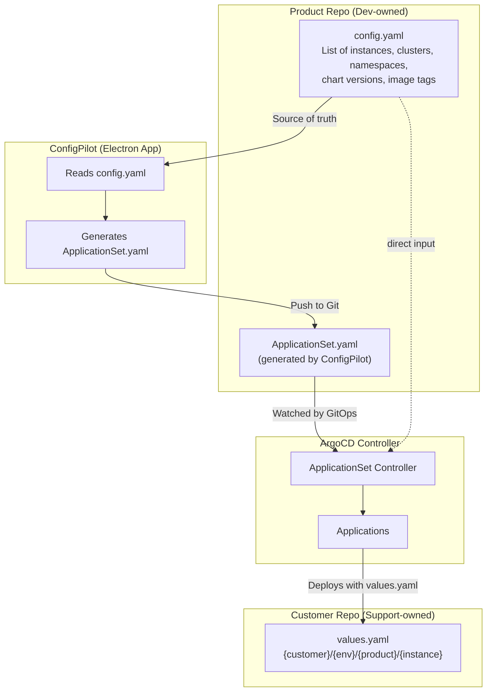
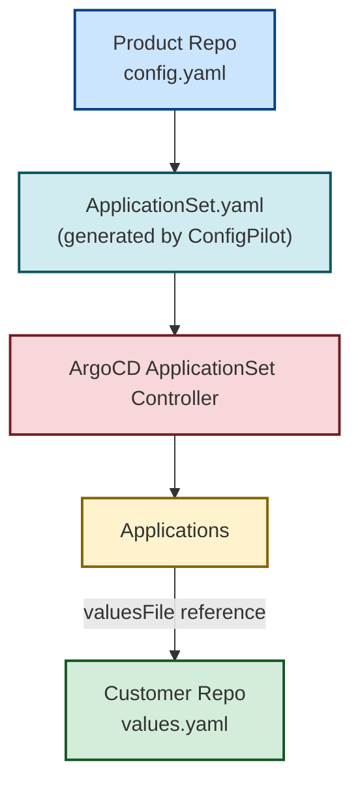
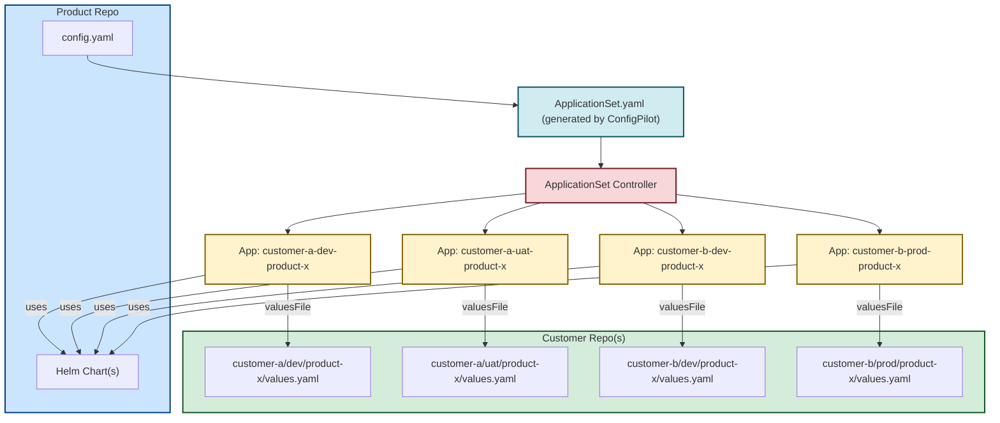

* **Product repo**

  * Owns the Helm chart(s) + ApplicationSet definitions
  * Defines *how* the app is deployed (templates, chart, ApplicationSet structure)
* **Customer repo**

  * Owns the actual configuration/values for each customer/environment/instance
  * Defines *what* is deployed for a customer (values.yaml, overrides, instance count, image tags, etc.)

This way, your **support/customer team** only touches configs (safe) and **dev/product team** only touches charts (logic).

---

### 🔹 Example Repo Layout

#### **Product Repo (`product-1.git`)**

```yaml
# product-1.git
charts/product-1/Chart.yaml
charts/product-1/templates/*.yaml
applicationset/customer-appset.yaml   # lives here
```

#### **Customer Repo (`customer-configs.git`)**

```yaml
# customer-configs.git
customer-a/dev/product-1/instance-0/values.yaml
customer-a/dev/product-1/instance-1/values.yaml
customer-a/uat/product-1/instance-0/values.yaml

customer-b/dev/product-1/instance-0/values.yaml
customer-b/prod/product-1/instance-0/values.yaml
```

Each `values.yaml` looks like:

```yaml
replicaCount: 2
image:
  tag: "1.4.2-hotfix3"
resources:
  limits:
    cpu: 500m
    memory: 512Mi
```

---

### 🔹 ApplicationSet in Product Repo

```yaml
apiVersion: argoproj.io/v1alpha1
kind: ApplicationSet
metadata:
  name: product-1-appset
spec:
  generators:
    - git:
        repoURL: https://gitea.local/customer-configs.git
        revision: main
        files:
          - path: "*/dev/product-1/*/values.yaml"
          - path: "*/uat/product-1/*/values.yaml"
          - path: "*/prod/product-1/*/values.yaml"
  template:
    metadata:
      name: '{{path.basename}}-{{path.dirname}}'
    spec:
      project: default
      destination:
        server: https://kubernetes.default.svc
        namespace: '{{path[0]}}-{{path[1]}}' # e.g. customer-a-dev
      source:
        repoURL: https://gitea.local/product-1.git
        targetRevision: main
        chart: charts/product-1
        helm:
          valueFiles:
            - '{{path}}' # points to the customer repo values.yaml
```

Here:

* `path` gives you the full path to the discovered file
* `path[0] = customer-a`, `path[1] = dev`, `path[2] = product-1`, `path[3] = instance-0`
* You can use these to build dynamic names, namespaces, etc.

---

### 🔹 GitOps Flow

1. **Product team** updates Helm chart in `product-1.git` → new deployment logic.
2. **Support team** updates `values.yaml` in `customer-configs.git` → changes for specific customer/env.
3. **ApplicationSet** (in product repo) scans the customer repo and regenerates `Application` objects.
4. ArgoCD syncs → cluster state updated accordingly.

---

Yes 🙌 — you don’t have to rely on brittle `path.parts[n]`. What you’re suggesting is actually a **more maintainable and explicit model**: keep a structured JSON/YAML file that lists the intended deployments, and let **ApplicationSet read from that config file** instead of parsing paths.

---

## 🔹 How This Works in ArgoCD ApplicationSet

ApplicationSet supports **`git.files` generators** that can load arbitrary JSON or YAML files. Each file is parsed into a structured object, and its fields become templating variables (`{{instance}}`, `{{namespace}}`, etc.).

So your example `config.json` works perfectly.

---

### Example Layout

#### **Customer Config Repo (`customer-configs.git`)**

```
customer-a/config/dev.json
customer-a/config/uat.json
customer-b/config/prod.json
```

Each file:

```json
{
  "instance": "customer-a",
  "namespace": "dev-customer-a",
  "cluster": "https://dev-cluster.k8s.local",
  "chartVersion": "1.4.2",
  "imageTag": "1.4.2-hotfix3",
  "replicas": 2,
  "valuesFile": "customer-a/values/dev-customer-a.yaml"
}
```

---

### ApplicationSet That Consumes It

```yaml
apiVersion: argoproj.io/v1alpha1
kind: ApplicationSet
metadata:
  name: product-1-appset
spec:
  generators:
    - git:
        repoURL: https://gitea.local/customer-configs.git
        revision: main
        files:
          - path: "customer-*/config/*.json"
  template:
    metadata:
      name: '{{instance}}-{{namespace}}'
    spec:
      project: default
      destination:
        server: '{{cluster}}'
        namespace: '{{namespace}}'
      source:
        repoURL: https://gitea.local/product-1.git
        targetRevision: '{{chartVersion}}'
        chart: charts/product-1
        helm:
          valueFiles:
            - '{{valuesFile}}'
          parameters:
            - name: image.tag
              value: '{{imageTag}}'
            - name: replicaCount
              value: '{{replicas}}'
```

---

### 🔹 Advantages of This Pattern

✅ **Separation of concerns**

* Product repo defines *how* (chart + ApplicationSet template).
* Customer repo defines *what* (configs).

✅ **More readable & explicit**

* No weird string parsing (`path.parts[2]` etc.).
* Configs are self-documenting JSON/YAML.

✅ **Future-proof**

* You can extend with new fields (e.g., resource requests, feature flags).
* Multiple products can share the same customer config structure.

---

### 🔹 Flow

1. Support team edits `customer-a/config/dev.json` (bump image tag, replicas, etc.).
2. ApplicationSet notices Git change, regenerates `Application`.
3. ArgoCD syncs with new Helm release using values + overrides.

---

Let’s tie it back to our **SoD (Separation of Duties)** requirement.

It **does matter where these live**, because of **who owns what**:

---

### 1. **Product repo (owned by Dev team)**

* Contains the **ApplicationSet template** (the “how”).
* Contains the **Helm chart** (product code + defaults).
* Should *not* contain per-customer values or configs.

---

### 2. **Customer repo (owned by Support/Ops team)**

* Contains **customer/environment/product config files** (your `config.json` or `.yaml`).
* Contains **values.yaml** overrides specific to each customer+env.
  Example:

  ```
  {customer}/{environment}/{product}/{instance}/values.yaml
  {customer}/{environment}/{product}/{instance}/config.yaml
  ```

---

### 3. **SoD in Action**

* ApplicationSet **lives in the product repo** (Dev responsibility).
* But ApplicationSet is *configured* to read customer config from the **customer repo** (Support responsibility).
* That way:

  * Devs can’t accidentally change customer replicas, namespaces, or tags.
  * Support can’t modify chart internals or the template logic.

---

### Example Split

**Product Repo (dev-team)**

```
charts/product-1/...
applicationsets/product-1-appset.yaml
```

**Customer Repo (support-team)**

```
customer-a/dev/product-1/config.yaml
customer-a/dev/product-1/values.yaml
customer-a/prod/product-1/config.yaml
```

---

### Does mixing them break SoD?

* If we **co-locate config and chart in the same repo**, then both Dev and Support need access → breaks separation.
* If you **keep them in separate repos**, Dev only manages product, Support only manages per-customer config → SoD preserved.

---

👉 So the answer is:
Yes, it *does matter* — to maintain SoD, keep **ApplicationSet + charts** in the **product repo**, and keep **config.json/.yaml + values.yaml** in the **customer repo**.

---

Let’s write this in a **clear, opinionated layout** so you can always refer back and not get lost.

We’ll use our **Separation of Duties (SoD)** model:

---

## 🔹 Repo Structure (SoD-aligned)

**📦 Product Repo (owned by Devs)**
Contains only **templates** + **chart logic**.

```
product-repo/
 ├─ charts/product-1/               # Helm chart (code + defaults)
 └─ applicationsets/product-1.yaml  # ApplicationSet template
```

---

**📦 Customer Repo (owned by Support/Ops)**
Contains **per-customer config + overrides**.

```
customer-repo/
 ├─ customer-a/
 │   ├─ dev/
 │   │   └─ product-1/
 │   │       ├─ config.yaml         # structured config (cluster, version, valuesFile, etc.)
 │   │       └─ values.yaml         # helm overrides
 │   └─ prod/
 │       └─ product-1/
 │           ├─ config.yaml
 │           └─ values.yaml
 └─ customer-b/
     └─ sit/
         └─ product-1/
             ├─ config.yaml
             └─ values.yaml
```

---

## 🔹 Sample `config.yaml` (per customer/env/product)

```yaml
instance: "customer-a-dev-1"
namespace: "dev-customer-a"
cluster: "https://kube-api.dev-cluster.local"
chartVersion: "1.4.2"
imageTag: "1.4.2-hotfix3"
replicas: 2
valuesFile: "values.yaml"
```

---

## 🔹 ApplicationSet (in product repo)

This **never hardcodes customer info**.
Instead, it *generates* Applications based on `config.yaml` files from the **customer repo**.

```yaml
apiVersion: argoproj.io/v1alpha1
kind: ApplicationSet
metadata:
  name: product-1
  namespace: argocd
spec:
  generators:
    - git:
        repoURL: https://gitea.local/support/customer-repo.git
        revision: main
        directories:
          - path: "*/ */product-1"   # {customer}/{env}/product-1
  template:
    metadata:
      name: '{{path.basename}}-{{path.dirpath | splitList "/" | first}}'  
      # → product-1-customer-a
    spec:
      project: default
      source:
        repoURL: https://gitea.local/dev/product-repo.git
        targetRevision: main
        chart: charts/product-1
        helm:
          valueFiles:
            - '{{path}}/values.yaml'   # comes from customer repo
      destination:
        namespace: '{{values.namespace}}'
        server: '{{values.cluster}}'
      syncPolicy:
        automated:
          prune: true
          selfHeal: true
```

---

## 🔹 Flow

1. **Support team** edits `config.yaml` or `values.yaml` in **customer repo**.

   * Example: bump `replicas` or switch `imageTag`.
2. **ArgoCD ApplicationSet** scans the repo.
3. It generates an **Application** per `{customer}/{env}/{product}`.
4. ArgoCD deploys using:

   * Helm chart from **product repo** (dev-owned).
   * Overrides from **customer repo** (ops-owned).

---

✅ This way:

* **Devs** can only touch the chart & ApplicationSet logic.
* **Support/Ops** can only touch per-customer config.
* Both repos are independent but tied together at runtime by ArgoCD.

---

👍 — Let’s go **line by line** with heavy annotation so you never wonder *“who owns this?”* or *“where does this value come from?”*.

---

# 📘 Fully Annotated ApplicationSet (SoD-aligned)

```yaml
apiVersion: argoproj.io/v1alpha1
kind: ApplicationSet
metadata:
  name: product-1                      # 👈 Dev-owned: product name (per chart/application)
  namespace: argocd                    # 👈 Dev-owned: lives in central ArgoCD namespace
spec:
  generators:
    - git:                             # 👈 This generator watches a SUPPORT-OWNED repo
        repoURL: https://gitea.local/support/customer-repo.git  # 👈 Ops repo (customer configs)
        revision: main
        directories:                   # 👇 Pattern tells Argo where to look for configs
          - path: "*/ */product-1"     # 👈 Expands to: customer-a/dev/product-1, customer-b/prod/product-1
                                        #     ↳ 1st folder = customer
                                        #     ↳ 2nd folder = environment
                                        #     ↳ 3rd folder = product (must match chart name)

  template:                            # 👇 Defines HOW to create each Application
    metadata:
      name: '{{path.basename}}-{{path.dirpath | splitList "/" | first}}'
      # 👈 Result: product-1-customer-a
      #     - path.basename = product folder (e.g., product-1)
      #     - path.dirpath | splitList "/" | first = customer folder (e.g., customer-a)
      # 📌 Dev defines the template naming convention once.
      # 📌 Actual values expand dynamically from Ops-managed folder paths.

    spec:
      project: default                  # 👈 Dev-owned: ArgoCD Project (could be multi-tenanted later)

      source:
        repoURL: https://gitea.local/dev/product-repo.git
        # 👈 Dev repo (charts + templates only)
        targetRevision: main
        chart: charts/product-1
        # 👈 Helm chart (from Dev repo)
        helm:
          valueFiles:
            - '{{path}}/values.yaml'    # 👈 Ops-owned file: customer-specific Helm overrides
                                        #     ↳ Located in customer repo under {customer}/{env}/{product}/values.yaml
          parameters:                   # Optional: Dev may allow Ops to override via config.yaml later
            - name: replicaCount
              value: '{{values.replicas}}'
            - name: image.tag
              value: '{{values.imageTag}}'
            # 👆 These pull from config.yaml inside the same folder as values.yaml (Ops-owned)

      destination:
        namespace: '{{values.namespace}}'
        # 👈 Ops-owned: namespace defined in config.yaml
        server: '{{values.cluster}}'
        # 👈 Ops-owned: target cluster defined in config.yaml

      syncPolicy:
        automated:
          prune: true                   # 👈 Dev sets policy: allow deleting old resources
          selfHeal: true                # 👈 Dev sets policy: auto-heal drift
```

---

# 📘 Example `config.yaml` (Ops-owned)

Placed inside:
`customer-a/dev/product-1/config.yaml`

```yaml
instance: "customer-a-dev-1"            # Unique identifier for this deployment
namespace: "dev-customer-a"             # Target namespace
cluster: "https://kube-api.dev-cluster.local"  # Which cluster to deploy to
chartVersion: "1.4.2"                   # Which Helm chart version to use (dev chooses what’s published)
imageTag: "1.4.2-hotfix3"               # Which container image tag to run
replicas: 2                             # How many replicas to deploy
valuesFile: "values.yaml"               # Path to Ops overrides
```

---

# 📘 Example `values.yaml` (Ops-owned)

Placed inside:
`customer-a/dev/product-1/values.yaml`

```yaml
resources:
  requests:
    cpu: "250m"
    memory: "256Mi"
  limits:
    cpu: "500m"
    memory: "512Mi"

featureFlags:
  newFeatureX: true

ingress:
  enabled: true
  host: "dev.customer-a.example.com"
```

---

# 🔹 Who Owns What?

* **Dev / Product Repo**

  * `charts/product-1/` → Helm chart + defaults
  * `applicationsets/product-1.yaml` → ApplicationSet template

* **Ops / Customer Repo**

  * `customer-a/dev/product-1/config.yaml` → Structured settings (cluster, namespace, replicas, imageTag)
  * `customer-a/dev/product-1/values.yaml` → Helm overrides (resources, ingress, feature flags)

---

# 🔹 Deployment Flow

1. **Ops** commits changes in `customer-repo/` (config.yaml or values.yaml).
   Example: increase replicas → `replicas: 3`.
2. **ArgoCD ApplicationSet** notices the change (watches Git).
3. It generates an **Application** with:

   * Helm chart from **Dev repo**.
   * Overrides from **Ops repo**.
4. ArgoCD syncs automatically (if policy enabled).
5. App is deployed into the cluster + namespace specified by Ops.

---

✅ Result:

* Dev only controls **how apps are templated**.
* Ops only controls **where & how they’re deployed**.
* Both repos are separate → clear SoD, auditable via Git history.

---

Good catch 👍 — let me clarify exactly where `config.yaml` (or `config.json`) fits in the **ArgoCD ApplicationSet + GitOps** flow.

---

### 🔑 Where `config.yaml` is Used

The `config.yaml` file is **not consumed directly by ArgoCD itself** (since ApplicationSet natively only knows about `git` paths, `list`, `clusters`, etc.).
Instead, it’s used in two common patterns:

---

## **Option A – Use ApplicationSet’s Git Generator + `values.yaml` (no `config.yaml`)**

* ArgoCD ApplicationSet looks into **paths inside a Git repo**.
* Each path has its own `values.yaml` (customer/environment/product specific).
* No central `config.yaml`. The path layout is the config.

👉 Example:

```
customer-a/dev/product-x/instance-0/values.yaml
customer-a/dev/product-x/instance-1/values.yaml
customer-b/uat/product-y/instance-0/values.yaml
```

ApplicationSet template:

```yaml
spec:
  generators:
    - git:
        repoURL: https://gitea.local/customers
        revision: main
        directories:
          - path: "*/dev/*/*"    # customer/env/product/instance
  template:
    metadata:
      name: '{{path[0]}}-{{path[1]}}-{{path[2]}}-{{path[3]}}'
    spec:
      source:
        repoURL: https://gitea.local/{{path[0]}}/{{path[2]}}
        path: '{{path}}'
        helm:
          valueFiles:
            - values.yaml
```

✅ Simple
❌ Harder to add metadata like `chartVersion` or `replicas` unless inside `values.yaml`.

---

## **Option B – Use `config.yaml` as Metadata File (per instance)**

Here, you keep a **single config file per instance** (e.g., `config.yaml` alongside `values.yaml`):

```
customer-a/dev/product-x/instance-0/config.yaml
customer-a/dev/product-x/instance-0/values.yaml
```

`config.yaml` might look like:

```yaml
instance: "instance-0"
namespace: "dev-customer-a"
cluster: "dev-cluster"
chartVersion: "1.4.2"
imageTag: "1.4.2-hotfix3"
replicas: 2
valuesFile: "values.yaml"
```

But **ArgoCD can’t natively parse this YAML**. You need an **intermediate controller or generator**:

* **Option 1**: Use a [Pull Request generator](https://argo-cd.readthedocs.io/en/stable/operator-manual/applicationset/Generators-Pull-Request/) or custom plugin to parse config.yaml → inject into ApplicationSet.
* **Option 2 (easier)**: Still point ApplicationSet to the folder, but treat `config.yaml` as documentation / human config file. ArgoCD will only use `values.yaml`.

✅ Maintains metadata in `config.yaml`
❌ Requires custom tooling if you actually want ArgoCD to consume it.

---

## **Option C – Centralized `config.yaml` Driving Everything**

Instead of many `config.yaml` files, you keep **one config file listing all customers/products/instances**:

`customers-config.yaml`:

```yaml
customers:
  - name: customer-a
    environment: dev
    products:
      - name: product-x
        instances:
          - id: 0
            namespace: dev-customer-a
            chartVersion: 1.4.2
            imageTag: 1.4.2-hotfix3
            valuesFile: values/dev-customer-a.yaml
```

Now, how does ApplicationSet use it?

* **Directly:** It can’t. ApplicationSet cannot parse arbitrary YAML lists directly.
* **Workaround:** Use `list` generator and paste JSON/YAML inside ApplicationSet manifest itself.
* **Proper solution:** Write a small **ConfigSyncer job** that reads `customers-config.yaml` and renders a `List` generator manifest for ApplicationSet.

✅ Centralized config, easy SOD
❌ Needs automation glue (ArgoCD alone won’t parse it).

---

### 📌 Summary

* **If you want ArgoCD to “just work” without custom glue → Option A (path layout + values.yaml).**
* **If you want more metadata but don’t mind adding a helper process → Option B or C with config.yaml.**

So, to your original question:
👉 **`config.yaml` is not read by ApplicationSet directly** — it’s either:

* (Option B) co-located as metadata for humans or pre-processed into values.yaml, or
* (Option C) centralized and transformed into ApplicationSet list input by a helper.

---

Perfect 👍 Let’s make this concrete.
We’ll go with **Option B**: each instance has its own `config.yaml` (metadata) + `values.yaml` (Helm values).
A **helper script** will read all `config.yaml`s and auto-generate an **ApplicationSet (List generator)** YAML that ArgoCD can consume directly.

---

## 🔧 Directory Layout

```
customers/
  customer-a/
    dev/
      product-x/
        instance-0/
          config.yaml
          values.yaml
        instance-1/
          config.yaml
          values.yaml
    uat/
      product-x/
        instance-0/
          config.yaml
          values.yaml
  customer-b/
    prod/
      product-y/
        instance-0/
          config.yaml
          values.yaml
```

---

## 📄 Example `config.yaml`

```yaml
instance: "instance-0"
namespace: "dev-customer-a"
cluster: "dev-cluster"
chart: "product-x"
chartVersion: "1.4.2"
imageTag: "1.4.2-hotfix3"
valuesFile: "values.yaml"
```

---

## 📄 Example `values.yaml`

```yaml
replicaCount: 2
resources:
  limits:
    cpu: "500m"
    memory: "512Mi"
```

---

## 🛠 Script (Python or PowerShell)

Here’s a **Python version** that scans all `config.yaml`s and generates an ApplicationSet manifest:

```python
import os, yaml

BASE_DIR = "customers"
output_file = "applicationset-generated.yaml"

apps = []

for root, dirs, files in os.walk(BASE_DIR):
    if "config.yaml" in files:
        config_path = os.path.join(root, "config.yaml")
        with open(config_path) as f:
            cfg = yaml.safe_load(f)

        app = {
            "name": f"{cfg['namespace']}-{cfg['chart']}-{cfg['instance']}",
            "namespace": cfg["namespace"],
            "cluster": cfg["cluster"],
            "chart": cfg["chart"],
            "chartVersion": cfg["chartVersion"],
            "valuesFile": os.path.join(root, cfg["valuesFile"])
        }
        apps.append(app)

applicationset = {
    "apiVersion": "argoproj.io/v1alpha1",
    "kind": "ApplicationSet",
    "metadata": {"name": "customers-applications"},
    "spec": {
        "generators": [
            {"list": {"elements": apps}}
        ],
        "template": {
            "metadata": {
                "name": "{{name}}"
            },
            "spec": {
                "project": "default",
                "destination": {
                    "server": "{{cluster}}",
                    "namespace": "{{namespace}}"
                },
                "source": {
                    "repoURL": "https://gitea.local/helm-charts",
                    "chart": "{{chart}}",
                    "targetRevision": "{{chartVersion}}",
                    "helm": {
                        "valueFiles": ["{{valuesFile}}"]
                    }
                },
                "syncPolicy": {
                    "automated": {
                        "prune": True,
                        "selfHeal": True
                    }
                }
            }
        }
    }
}

with open(output_file, "w") as f:
    yaml.dump(applicationset, f, sort_keys=False)

print(f"Generated {output_file}")
```

---

## 📄 Example Generated ApplicationSet (`applicationset-generated.yaml`)

```yaml
apiVersion: argoproj.io/v1alpha1
kind: ApplicationSet
metadata:
  name: customers-applications
spec:
  generators:
    - list:
        elements:
          - name: dev-customer-a-product-x-instance-0
            namespace: dev-customer-a
            cluster: dev-cluster
            chart: product-x
            chartVersion: 1.4.2
            valuesFile: customers/customer-a/dev/product-x/instance-0/values.yaml
          - name: dev-customer-a-product-x-instance-1
            namespace: dev-customer-a
            cluster: dev-cluster
            chart: product-x
            chartVersion: 1.4.2
            valuesFile: customers/customer-a/dev/product-x/instance-1/values.yaml
  template:
    metadata:
      name: '{{name}}'
    spec:
      project: default
      destination:
        server: '{{cluster}}'
        namespace: '{{namespace}}'
      source:
        repoURL: https://gitea.local/helm-charts
        chart: '{{chart}}'
        targetRevision: '{{chartVersion}}'
        helm:
          valueFiles:
            - '{{valuesFile}}'
      syncPolicy:
        automated:
          prune: true
          selfHeal: true
```

---

## 🔄 Flow Recap

1. You add/update `config.yaml` + `values.yaml` for each instance.
2. Run the helper script → regenerates `applicationset-generated.yaml`.
3. Commit & push this file to the Git repo that ArgoCD watches.
4. ArgoCD reconciles → creates/updates all Applications automatically.

---

⚡ This approach means:

* `config.yaml` = metadata (chart version, image, cluster, namespace).
* `values.yaml` = Helm overrides.
* Script = bridge → transforms configs into an ApplicationSet manifest.

---

The `config.yaml` (or `config.json`) plays the role of a **single source of truth** about each customer/environment/product/instance. Then you have two different consumers of that file:

1. **ConfigPilot**

   * Reads the `config.yaml`
   * Generates the `ApplicationSet` manifest(s) for ArgoCD
   * Pushes them to the right Git repo (product repo, most likely)
   * Handles SoD by letting support own the customer repo with values.yaml, and devs own the product repo

2. **ArgoCD ApplicationSet (optional direct use)**

   * If you want to avoid regenerating full manifests, you can also have ApplicationSet point directly to the `config.yaml` and treat it as input (via the `git generator`)
   * This way, ArgoCD re-evaluates whenever `config.yaml` changes in Git, so even if ConfigPilot is not used, GitOps still flows

So it gives you **two modes of operation**:

* **Normal workflow** → ConfigPilot generates ApplicationSet YAML from `config.yaml`.
* **Backup/verification workflow** → ArgoCD ApplicationSet itself can parse `config.yaml` directly and render applications.

That’s why keeping the `config.yaml` in Git is valuable — it decouples *what should be deployed* from *how the ApplicationSet is rendered*.


👍 Here’s a **side-by-side diagram** showing how `config.yaml` fits into the flow with **ConfigPilot** and **ArgoCD ApplicationSet**:



### 🔑 Key points in this diagram:

* **`config.yaml` lives in the product repo** (Dev-owned).
* **ConfigPilot** consumes `config.yaml` and **generates ApplicationSet.yaml** → which ArgoCD then picks up.
* **ArgoCD ApplicationSet** creates per-customer Applications → each referencing the customer repo for `values.yaml`.
* **Optional path**: if you want, ArgoCD can read `config.yaml` directly instead of relying on ConfigPilot’s generated ApplicationSet (so GitOps still flows if ConfigPilot is offline).

This way:

* Support team only ever edits their **customer repo** (`values.yaml`).
* Dev team maintains **product repo** (charts + `config.yaml`).
* **ConfigPilot sits in the middle** as an orchestrator but isn’t a hard dependency for GitOps continuity.

---

👍 Let’s lay out the **repo structures** clearly.
We’ll have two repos:

---

## 🟦 Product Repo (Dev-owned)

This repo contains:

* Helm chart(s) for the product
* `config.yaml` (the inventory of instances/clusters/namespaces, etc.)
* Generated `ApplicationSet.yaml` (pushed by ConfigPilot or manually)

```
product-repo/
├── charts/
│   └── myproduct/
│       ├── Chart.yaml
│       ├── values.schema.json
│       ├── templates/
│       └── ...
├── config.yaml            # list of all instances + metadata
├── applicationset.yaml    # generated from config.yaml by ConfigPilot
└── README.md
```

### Example `config.yaml`

```yaml
instances:
  - instance: customer-a
    environment: dev
    namespace: dev-customer-a
    cluster: dev-cluster
    chartVersion: 1.4.2
    imageTag: 1.4.2-hotfix3
    replicas: 2
    valuesFile: values/dev-customer-a.yaml
  - instance: customer-b
    environment: sit
    namespace: sit-customer-b
    cluster: sit-cluster
    chartVersion: 1.5.0
    imageTag: 1.5.0
    replicas: 1
    valuesFile: values/sit-customer-b.yaml
```

---

## 🟩 Customer Repo (Support-owned)

This repo contains **only environment-specific overrides** (values.yaml).
Each customer, environment, product, and instance gets its own folder.

```
customer-repo/
├── customer-a/
│   ├── dev/
│   │   └── myproduct/
│   │       └── instance1/
│   │           └── values.yaml
│   └── uat/
│       └── myproduct/
│           └── instance1/
│               └── values.yaml
└── customer-b/
    ├── sit/
    │   └── myproduct/
    │       └── instance1/
    │           └── values.yaml
    └── prod/
        └── myproduct/
            └── instance1/
                └── values.yaml
```

### Example `values.yaml`

```yaml
replicaCount: 2
resources:
  limits:
    cpu: "1"
    memory: "1Gi"
  requests:
    cpu: "500m"
    memory: "512Mi"
featureFlags:
  enableCoolFeature: true
```

---

## 🟨 ArgoCD ApplicationSet Flow

* **ApplicationSet.yaml** (in Product Repo) references **config.yaml**.
* For each instance, it creates an **Application** pointing to the correct **values.yaml** in the Customer Repo.
* Example snippet:

```yaml
generators:
  - matrix:
      generators:
        - git:
            repoURL: https://git.example.com/product-repo.git
            revision: main
            files:
              - path: config.yaml
        - list:
            elements:
              - product: myproduct
      template:
        spec:
          source:
            repoURL: https://git.example.com/customer-repo.git
            targetRevision: main
            helm:
              valueFiles:
                - "{{ valuesFile }}"
```

---

✅ This separation ensures:

* **Product team** controls charts + cluster/instance metadata (`config.yaml`).
* **Support team** controls per-customer configuration (`values.yaml`).
* **ConfigPilot** can regenerate ApplicationSet.yaml whenever product team updates config.yaml.

---

👌 Let’s walk one **end-to-end example**:

---

## 🟦 Step 1 — Product repo: `config.yaml`

In the product repo, devs declare the deployment inventory:

```yaml
instances:
  - instance: instance1
    customer: customer-a
    environment: dev
    cluster: dev-cluster
    namespace: dev-cust-a
    chartVersion: 1.4.2
    imageTag: 1.4.2-hotfix3
    replicas: 2
    valuesFile: customer-a/dev/myproduct/instance1/values.yaml
```

---

## 🟩 Step 2 — Customer repo: values.yaml

In the customer repo, support provides overrides:

```
customer-repo/
└── customer-a/
    └── dev/
        └── myproduct/
            └── instance1/
                └── values.yaml
```

```yaml
replicaCount: 2
featureFlags:
  enableBeta: true
resources:
  requests:
    cpu: "200m"
    memory: "256Mi"
```

---

## 🟨 Step 3 — ApplicationSet.yaml (generated from config.yaml)

ConfigPilot (or a script) turns `config.yaml` into an ApplicationSet in the **product repo**:

```yaml
apiVersion: argoproj.io/v1alpha1
kind: ApplicationSet
metadata:
  name: myproduct-applicationset
  namespace: argocd
spec:
  generators:
    - matrix:
        generators:
          - git:
              repoURL: https://git.example.com/product-repo.git
              revision: main
              files:
                - path: config.yaml
          - list:
              elements:
                - product: myproduct
  template:
    metadata:
      name: "{{customer}}-{{environment}}-{{instance}}"
    spec:
      project: default
      destination:
        namespace: "{{namespace}}"
        name: "{{cluster}}"
      source:
        repoURL: https://git.example.com/product-repo.git
        targetRevision: main
        chart: charts/myproduct
        helm:
          version: v3
          valueFiles:
            - >-
              https://git.example.com/customer-repo.git/{{valuesFile}}?ref=main
      syncPolicy:
        automated:
          prune: true
          selfHeal: true
```

---

## 🟧 Step 4 — ArgoCD expands ApplicationSet

ArgoCD reads `config.yaml`, finds the entry for `customer-a / dev / myproduct / instance1`, and instantiates an **Application**:

```yaml
apiVersion: argoproj.io/v1alpha1
kind: Application
metadata:
  name: customer-a-dev-instance1
  namespace: argocd
spec:
  project: default
  destination:
    namespace: dev-cust-a
    name: dev-cluster
  source:
    repoURL: https://git.example.com/product-repo.git
    targetRevision: main
    chart: charts/myproduct
    helm:
      valueFiles:
        - >-
          https://git.example.com/customer-repo.git/customer-a/dev/myproduct/instance1/values.yaml?ref=main
  syncPolicy:
    automated:
      prune: true
      selfHeal: true
```

---

## ✅ Outcome

* Product team updates chart logic or adds entries in `config.yaml`.
* ConfigPilot regenerates `ApplicationSet.yaml`.
* Support team edits customer-specific overrides in their repo.
* ArgoCD pulls both repos, matches them, and deploys the right combo.

---

Here’s the **visual flow** in Mermaid to tie it all together:



### 🔎 How to read it

1. **Product repo** (`config.yaml`) → the **source of truth for instances**.
2. ConfigPilot generates **ApplicationSet.yaml** from it.
3. ArgoCD’s **ApplicationSet controller** expands that into **Applications**.
4. Each Application points to the chart in the product repo **+** a `values.yaml` from the **customer repo**.

So:

* **Product repo** = structure, chart, versions.
* **Customer repo** = overrides.
* **ArgoCD** stitches them together.

---

Perfect 👍 let’s scale up the diagram for **multi-customer + multi-environment**.

Here’s how it looks in Mermaid:



### 🔎 Breakdown

* **Product Repo**

  * `config.yaml` → master list of which customers/environments/products exist.
  * Helm chart(s) → the deployable units.
* **Customer Repo(s)**

  * Each customer maintains their overrides in their own repo.
  * Path convention: `{customer}/{environment}/{product}/{instance}/values.yaml`.
* **ConfigPilot**

  * Reads `config.yaml` and generates the **ApplicationSet.yaml**.
* **ArgoCD**

  * ApplicationSet expands into multiple **Applications**.
  * Each Application points to **product repo Helm chart** + **customer repo values.yaml**.

So you get **clear separation of duties (SoD)**:

* **Product team** manages product repo (charts + config.yaml).
* **Customer/support team** manages values in customer repos.
* **ArgoCD** stitches both at runtime.

---

👍 Let’s make it concrete.

We’ll assume the following:

* **Product repo** contains:

  * `config.yaml` → master list of deployments
  * Helm chart(s)

```yaml
# product-repo/config.yaml
instances:
  - instance: "customer-a-dev-product-x"
    customer: "customer-a"
    product: "product-x"
    environment: "dev"
    namespace: "dev-customer-a"
    cluster: "dev-cluster"
    chartVersion: "1.4.2"
    imageTag: "1.4.2-hotfix3"
    replicas: 2
    valuesFile: "customer-a/dev/product-x/values.yaml"

  - instance: "customer-a-uat-product-x"
    customer: "customer-a"
    product: "product-x"
    environment: "uat"
    namespace: "uat-customer-a"
    cluster: "uat-cluster"
    chartVersion: "1.4.2"
    imageTag: "1.4.2"
    replicas: 3
    valuesFile: "customer-a/uat/product-x/values.yaml"

  - instance: "customer-b-prod-product-x"
    customer: "customer-b"
    product: "product-x"
    environment: "prod"
    namespace: "prod-customer-b"
    cluster: "prod-cluster"
    chartVersion: "1.5.0"
    imageTag: "1.5.0"
    replicas: 2
    valuesFile: "customer-b/prod/product-x/values.yaml"
```

---

### 🔹 ApplicationSet.yaml (generated by ConfigPilot)

```yaml
apiVersion: argoproj.io/v1alpha1
kind: ApplicationSet
metadata:
  name: product-x-multi-customer
  namespace: argocd
spec:
  generators:
    - list:
        elements:
          - instance: customer-a-dev-product-x
            namespace: dev-customer-a
            cluster: dev-cluster
            chartVersion: 1.4.2
            imageTag: 1.4.2-hotfix3
            replicas: 2
            valuesFile: customer-a/dev/product-x/values.yaml

          - instance: customer-a-uat-product-x
            namespace: uat-customer-a
            cluster: uat-cluster
            chartVersion: 1.4.2
            imageTag: 1.4.2
            replicas: 3
            valuesFile: customer-a/uat/product-x/values.yaml

          - instance: customer-b-prod-product-x
            namespace: prod-customer-b
            cluster: prod-cluster
            chartVersion: 1.5.0
            imageTag: 1.5.0
            replicas: 2
            valuesFile: customer-b/prod/product-x/values.yaml

  template:
    metadata:
      name: '{{instance}}'
    spec:
      project: default
      destination:
        namespace: '{{namespace}}'
        name: '{{cluster}}'
      source:
        repoURL: https://git.example.com/product-repo.git
        targetRevision: '{{chartVersion}}'
        chart: product-x
        helm:
          valueFiles:
            - '{{valuesFile}}'
          parameters:
            - name: image.tag
              value: '{{imageTag}}'
            - name: replicaCount
              value: '{{replicas}}'
      syncPolicy:
        automated:
          prune: true
          selfHeal: true
```

---

### 🔎 Key Notes

* `generators.list.elements` is directly derived from `config.yaml` by **ConfigPilot**.
* Each `element` → one **ArgoCD Application**.
* `valuesFile` points to the **customer repo override file**.
* `helm.parameters` lets you enforce important overrides centrally (image tag, replicas, etc.), while still allowing customer-specific values.
* **Clear SoD**:

  * Product team updates chart + default config.yaml.
  * Customer/support team updates their own values.yaml.
  * ConfigPilot stitches them into one ApplicationSet.yaml.

---

Great questions 👍 let’s break this down carefully, because this is the subtle part of using **ApplicationSet + GitOps**.

---

## 🔹 1. What triggers a deployment?

* **ArgoCD watches the repo (`repoURL`) at the `targetRevision`** (branch, tag, or commit).
* Any change in that repo → ArgoCD notices and *re-syncs* the application.
* That includes:

  * ✅ Changing a `values.yaml`
  * ✅ Changing `config.yaml` (so ApplicationSet regenerates)
  * ✅ Updating Helm chart templates
  * ❌ Even *non-functional* changes like `README.md` updates → still count as a Git diff, so ArgoCD will re-sync.

👉 **But:**

* If only `README.md` changes, the rendered manifests from Helm don’t change.
* So ArgoCD will *try* a sync, but nothing actually changes in the cluster (it’s a no-op).
* This still burns some cycles, but doesn’t redeploy anything unnecessarily.

---

## 🔹 2. What happens when we add/remove customers?

* **Add a customer**:

  * Add a new entry to `config.yaml` (and optionally a new `values.yaml`).
  * ConfigPilot regenerates `ApplicationSet.yaml`.
  * ArgoCD detects a new Application (`elements` list is longer).
  * ArgoCD will **deploy that new customer app** automatically.
  * ✅ No redeployment of other customers required.

* **Remove a customer**:

  * Delete the entry from `config.yaml`.
  * Regenerate `ApplicationSet.yaml`.
  * ArgoCD notices one Application is *gone* from the set.
  * With `syncPolicy.automated.prune: true` → ArgoCD will **clean up the removed customer’s namespace resources**.
  * ✅ Other customers are unaffected, no redeploy.

---

## 🔹 3. Do we have to redeploy existing customers?

* **No full redeploy is needed** unless:

  * You change a value (e.g. `imageTag`, `replicas`) in `config.yaml` or their `values.yaml`.
  * You change chart version / Helm templates.
* **Adding/removing customers** only creates/destroys *new Applications*, doesn’t redeploy others.

---

## 🔹 4. Optimizations (to avoid unnecessary “README.md syncs”)

If you want to avoid **ArgoCD syncing on irrelevant changes** (like docs), there are two patterns:

1. **Path-based filtering**:
   Configure ArgoCD ApplicationSet to only watch `values.yaml`, `config.yaml`, or `charts/` folders, ignoring `README.md`.

   ```yaml
   spec:
     source:
       directory:
         recurse: true
         include: 
           - "**/values.yaml"
           - "config.yaml"
           - "charts/**"
   ```

2. **Split repos**:

   * One repo for **application config** (`config.yaml`, `values.yaml`) → watched by ArgoCD.
   * Another repo for docs, pipelines, etc. → not watched by ArgoCD.

---

✅ So in short:

* Updating `README.md` will *trigger sync* but won’t redeploy anything.
* Adding/removing customers only impacts those customers.
* Existing customers are untouched unless their config changes.

---

Perfect 👌 that makes total sense — your Git repo is doing **double duty**:

* **Operational config** (the stuff ArgoCD needs → values.yaml, config.yaml)
* **Business/customer/product metadata** (driving your UI, CRUD operations)

By default, ArgoCD treats *any* Git change as a sync trigger. But since you don’t want noisy syncs on `metadata.json`, `README.md`, or UI-related files, we can scope what ArgoCD actually “watches”.

---

## 🔹 1. Path-based filtering with ApplicationSet (Directory Generator)

You can use the `include`/`exclude` patterns on the **Directory generator**. Example:

```yaml
apiVersion: argoproj.io/v1alpha1
kind: ApplicationSet
metadata:
  name: customer-applications
  namespace: argocd
spec:
  generators:
    - git:
        repoURL: https://git.example.com/org/config-repo.git
        revision: main
        directories:
          - path: "*/*/*"
            include: 
              - "*/values.yaml"
              - "config.yaml"
            exclude:
              - "**/metadata.json"
              - "**/*.md"
  template:
    metadata:
      name: '{{path.basename}}'
    spec:
      project: default
      source:
        repoURL: https://git.example.com/org/config-repo.git
        targetRevision: main
        path: charts/my-app
        helm:
          valueFiles:
            - '{{path}}/values.yaml'
      destination:
        namespace: '{{path.basename}}'
        server: https://kubernetes.default.svc
      syncPolicy:
        automated:
          prune: true
          selfHeal: true
```

### 🔎 What’s happening:

* `include` → only watch `values.yaml` and `config.yaml`.
* `exclude` → ignore metadata (`metadata.json`, docs).
* So if `metadata.json` changes, your UI can still pick it up, but ArgoCD won’t sync.

---

## 🔹 2. Alternative: Two Repos (cleaner SoD)

Another option:

* **Config repo** → only has `config.yaml` + `values.yaml` → ArgoCD watches this.
* **Metadata repo** → has customer/product metadata.json, docs, UI stuff → not watched by ArgoCD.

This avoids overloading ArgoCD with filtering logic, but it does introduce an extra repo to manage.

---

## 🔹 3. Trade-offs

* **Path-based filtering**:

  * ✅ Single repo
  * ✅ Simpler for CRUD UI to manage
  * ⚠️ Need to carefully maintain include/exclude rules

* **Split repos**:

  * ✅ Super clean separation of duties (SoD)
  * ✅ ArgoCD only sees “deployment material”
  * ⚠️ Might require syncing metadata updates between repos if they influence config

---

👉 Given our SoD model (support team vs dev team) and UI-driven Git workflows, the **path-based filtering is the sweet spot** for you right now.

---
