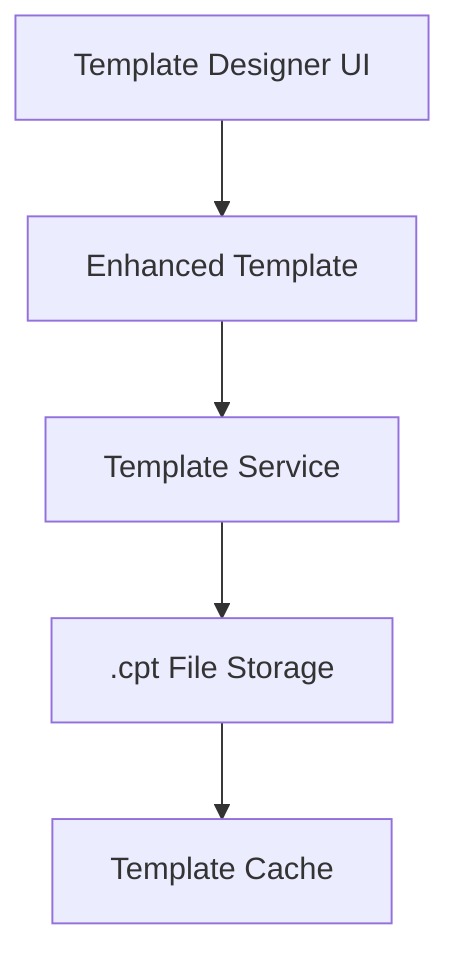
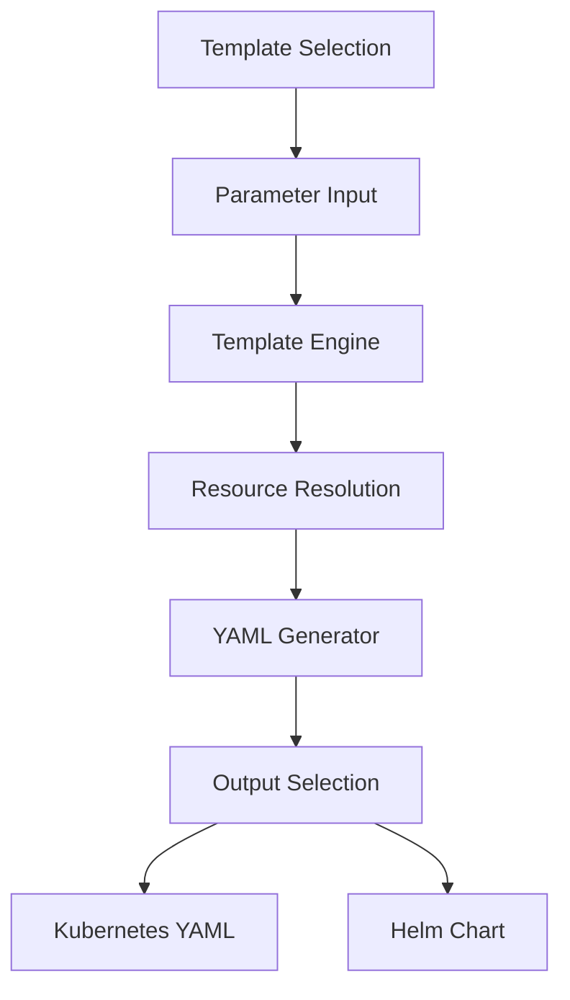

# Kubernetes Application Templates PRD

## 1. Overview

This document outlines a system for managing predefined Kubernetes application templates that can generate Helm charts and Kustomize configurations. The templates will cover common application patterns with support for the specified technologies (.NET, Node.js, and the listed infrastructure components).

## 2. Objectives

- Create a library of reusable Kubernetes application templates
- Each template should generate both Helm charts and Kustomize configurations
- Include comprehensive schema definitions for form-based UI editing
- Support infrastructure and application resources separation
- Maintain consistent structure across all templates

## 3. Template Structure

Each template will follow this directory structure:

### Application related tempalate
```
templates/
  [product]/
    ├── metadata.json
    ├── README.md
    ├── helm/
    │   ├── Chart.yaml
    │   ├── values.yaml
    │   ├── values.schema.json
    │   ├── templates/
    │   │   └── [app-resources].yaml
    ├── kustomize/
    │   ├── base/
    │   │   └── kustomization.yaml
    │   │   └── [app-resources].yaml
    │   └── overlays/
    │       ├── dev/
    │       ├── sit/
    │       ├── uat/
    │       └── prod/
    └── examples/
        ├── helm-values/
        │   ├── dev.yaml
        │   ├── sit.yaml
        │   ├── uat.yaml
        │   └── prod.yaml
        └── kustomize-patches/
            ├── dev-patch.yaml
            ├── sit-patch.yaml
            ├── uat-patch.yaml
            └── prod-patch.yaml
```
### Application's Infrastructure related tempalate

```
templates/
  [product-infra]/
    ├── metadata.json
    ├── README.md
    ├── helm/
    │   ├── Chart.yaml
    │   ├── values.yaml
    │   ├── values.schema.json
    │   ├── templates/
    │   │   ├── [infra-resources].yaml
    ├── kustomize/
    │   ├── base/
    │   │   ├── kustomization.yaml
    │   │   ├── [infra-resources].yaml
    │   └── overlays/
    │       ├── dev/
    │       ├── sit/
    │       ├── uat/
    │       └── prod/
    └── examples/
        ├── helm-values/
        │   ├── dev.yaml
        │   ├── sit.yaml
        │   ├── uat.yaml
        │   └── prod.yaml
        └── kustomize-patches/
            ├── dev-patch.yaml
            ├── sit-patch.yaml
            ├── uat-patch.yaml
            └── prod-patch.yaml
```

## 5. Metadata Specification

Each template will include a `metadata.json` with:

```json
{
  "name": "template-name",
  "description": "Template description",
  "category": "web|worker|database|gateway|security|monitoring|storage|mesh|dotnet|nodejs|multiservice|openshift",
  "technologies": ["dotnet", "nodejs", "postgresql", "vault"],
  "infrastructure": {
    "required": ["postgresql", "redis"],
    "optional": ["vault", "prometheus"]
  },
  "parameters": {
    "required": ["image.repository", "replicaCount"],
    "optional": ["resources.limits.cpu", "service.type"]
  },
  "versions": {
    "helm": "v3",
    "kustomize": "v4",
    "kubernetes": "v1.24+"
  }
}
```

## 6. Example Template (Basic ASP.NET Web API)

### 6.1 File Structure

#### 6.1.1 Product File Structure

```
templates/
  aspnet-webapi/
    ├── metadata.json
    ├── README.md
    ├── helm/
    │   ├── Chart.yaml
    │   ├── values.yaml
    │   ├── values.schema.json
    │   ├── templates/
    │   │   └── ├── deployment.yaml
    │   │   └── ├── configmap.yaml
    │   │   └── ├── hpa.yaml
    ├── kustomize/
    │   ├── base/
    │   │   └── deployment.yaml
    │   │   └── configmap.yaml
    │   │   └── hpa.yaml
    │   └── overlays/
    │       ├── dev/
    │       ├── sit/
    │       ├── uat/
    │       └── prod/
    └── examples/
        ├── helm-values/
        │   ├── dev.yaml
        │   ├── sit.yaml
        │   ├── uat.yaml
        │   └── prod.yaml
        └── kustomize-patches/
            ├── dev-patch.yaml
            ├── sit-patch.yaml
            ├── uat-patch.yaml
            └── prod-patch.yaml
```

#### 6.1.2 Product's Infrastructure File Structure
```
templates/
  aspnet-webapi/
    ├── metadata.json
    ├── README.md
    ├── helm/
    │   ├── Chart.yaml
    │   ├── values.yaml
    │   ├── values.schema.json
    │   ├── templates/
    │   │   ├── ingress.yaml
    │   │   ├── service.yaml
    ├── kustomize/
    │   ├── base/
    │   │   ├── kustomization.yaml
    │   │   ├── ingress.yaml
    │   │   ├── service.yaml
    │   └── overlays/
    │       ├── dev/
    │       ├── sit/
    │       ├── uat/
    │       └── prod/
    └── examples/
        ├── helm-values/
        │   ├── dev.yaml
        │   ├── sit.yaml
        │   ├── uat.yaml
        │   └── prod.yaml
        └── kustomize-patches/
            ├── dev-patch.yaml
            ├── sit-patch.yaml
            ├── uat-patch.yaml
            └── prod-patch.yaml
```

### 6.2 Sample values.schema.json (Helm)

```json
{
  "$schema": "http://json-schema.org/draft-07/schema#",
  "title": "ASP.NET Web API Values",
  "description": "Configuration values for ASP.NET Web API",
  "type": "object",
  "properties": {
    "replicaCount": {
      "description": "Number of replicas",
      "type": "integer",
      "minimum": 1,
      "default": 1
    },
    "image": {
      "type": "object",
      "properties": {
        "repository": {
          "type": "string",
          "description": "Container image repository"
        },
        "tag": {
          "type": "string",
          "description": "Container image tag",
          "default": "latest"
        },
        "pullPolicy": {
          "type": "string",
          "enum": ["Always", "IfNotPresent", "Never"],
          "default": "IfNotPresent"
        }
      },
      "required": ["repository"]
    },
    "service": {
      "type": "object",
      "properties": {
        "type": {
          "type": "string",
          "enum": ["ClusterIP", "NodePort", "LoadBalancer"],
          "default": "ClusterIP"
        },
        "port": {
          "type": "integer",
          "default": 80
        }
      }
    },
    "ingress": {
      "type": "object",
      "properties": {
        "enabled": {
          "type": "boolean",
          "default": false
        },
        "host": {
          "type": "string"
        },
        "annotations": {
          "type": "object"
        }
      }
    },
    "resources": {
      "type": "object",
      "properties": {
        "limits": {
          "type": "object",
          "properties": {
            "cpu": {
              "type": "string",
              "default": "500m"
            },
            "memory": {
              "type": "string",
              "default": "512Mi"
            }
          }
        },
        "requests": {
          "type": "object",
          "properties": {
            "cpu": {
              "type": "string",
              "default": "200m"
            },
            "memory": {
              "type": "string",
              "default": "256Mi"
            }
          }
        }
      }
    },
    "appSettings": {
      "type": "object",
      "description": "ASP.NET application settings",
      "additionalProperties": {
        "type": "string"
      }
    },
    "connectionStrings": {
      "type": "object",
      "description": "Database connection strings",
      "additionalProperties": {
        "type": "string"
      }
    }
  },
  "required": ["image"]
}
```

### 6.3 Sample Kustomize Structure

For Kustomize, we'll use patches for environment-specific configurations:

```yaml
# base/application/kustomization.yaml
resources:
- deployment.yaml
- configmap.yaml
- hpa.yaml

# overlays/dev/kustomization.yaml
bases:
- ../../base
patchesStrategicMerge:
- deployment-patch.yaml
- configmap-patch.yaml
```

## 7. Generation Requirements

The system should:

1. Parse template metadata and structure
2. Generate complete Helm charts with:
   - All template files
   - values.yaml with defaults
   - values.schema.json for validation
3. Generate Kustomize configurations with:
   - Base resources
   - Environment overlays
   - Patch files for customization
4. Support parameter injection for both Helm and Kustomize
5. Maintain separation of infrastructure and application resources

## 8. Implementation Plan

1. **Template Development Phase**:
   - Create all 70 template structures
   - Populate with standard configurations
   - Define schemas for each template

2. **Generator Development**:
   - Build engine to process templates
   - Implement Helm chart generation
   - Implement Kustomize generation
   - Create validation system

3. **UI Integration**:
   - Develop form-based editor using schemas
   - Implement template selection interface
   - Add preview functionality

4. **Testing**:
   - Validate generated artifacts
   - Test across different Kubernetes versions
   - Verify OpenShift compatibility

## 9. Quality Requirements

1. All templates must be tested on:
   - Vanilla Kubernetes (v1.24+)
   - OpenShift (4.10+)
   - Local development clusters (Docker Desktop, Minikube)

2. Helm charts must pass:
   - Helm lint validation
   - Helm template generation
   - Schema validation

3. Kustomize configurations must:
   - Build successfully with `kustomize build`
   - Support multiple overlays
   - Maintain resource separation

## 10. Delivery Artifacts

1. Complete template library (70 templates)
2. Generation engine (CLI or library)
3. Documentation for:
   - Template structure
   - Generation process
   - Customization options
4. Example implementations for each template

## 11. Example JSON Template Representation

For the ASP.NET Web API template:

```json
{
  "template": "aspnet-webapi",
  "description": "Basic ASP.NET Web API deployment with configurable infrastructure",
  "category": "web",
  "technologies": ["dotnet", "kubernetes"],
  "resources": {
    "infrastructure": [
      {
        "type": "Service",
        "file": "service.yaml",
        "parameters": ["service.type", "service.port"]
      },
      {
        "type": "Ingress",
        "file": "ingress.yaml",
        "conditional": "ingress.enabled",
        "parameters": ["ingress.host", "ingress.annotations"]
      }
    ],
    "application": [
      {
        "type": "Deployment",
        "file": "deployment.yaml",
        "parameters": [
          "replicaCount",
          "image.repository",
          "image.tag",
          "image.pullPolicy",
          "resources.limits.cpu",
          "resources.limits.memory",
          "resources.requests.cpu",
          "resources.requests.memory"
        ]
      },
      {
        "type": "ConfigMap",
        "file": "configmap.yaml",
        "parameters": ["appSettings", "connectionStrings"]
      },
      {
        "type": "HorizontalPodAutoscaler",
        "file": "hpa.yaml",
        "optional": true,
        "parameters": ["hpa.minReplicas", "hpa.maxReplicas", "hpa.targetCPUUtilization"]
      }
    ]
  },
  "parameters": {
    "required": ["image.repository"],
    "optional": [
      "replicaCount",
      "image.tag",
      "image.pullPolicy",
      "service.type",
      "service.port",
      "ingress.enabled",
      "ingress.host",
      "resources.limits.cpu",
      "resources.limits.memory",
      "resources.requests.cpu",
      "resources.requests.memory",
      "appSettings",
      "connectionStrings"
    ]
  }
}
```

## 12. Additional Considerations

1. **Secret Management**:
   - Integration with Vault/ESO
   - Secure handling of sensitive parameters
   - Secret template generation

2. **Multi-environment Support**:
   - Helm values for dev/sit/uat/prod
   - Kustomize overlays
   - Environment-specific patches

3. **CRD Support**:
   - Templates for custom resources
   - CRD installation handling
   - Version compatibility

4. **Tekton Integration**:
   - Pipeline templates for CI/CD
   - Build and deployment tasks
   - Testing workflows

5. **ArgoCD Integration**:
   - Application definitions
   - Sync policies
   - Health checks

This PRD provides a comprehensive framework for creating and managing Kubernetes application templates with support for Helm and Kustomize generation. Each template follows a consistent structure while accommodating the specific requirements of different application patterns and technologies.

### metadata.json
```json
{
  "$schema": "http://json-schema.org/draft-07/schema#",
  "templateId": "aspnet-webapi",
  "name": "ASP.NET Web API",
  "description": "Production-ready ASP.NET Core Web API with configurable infrastructure",
  "version": "1.0.0",
  "category": "web",
  "type": "product", // or "infrastructure"
  "technologies": ["dotnet", "kubernetes", "helm", "kustomize"],
  "targetTeams": ["product-engineers", "ops", "support"],
  "environments": ["dev", "sit", "uat", "prod"],
  "permissions": {
    "dev": ["product-engineers", "ops", "support"],
    "sit": ["ops", "support"],
    "uat": ["ops", "support"],
    "prod": ["ops"]
  },
  "infrastructure": {
    "required": [],
    "optional": ["ingress", "hpa"],
    "companionTemplate": "aspnet-webapi-infra"
  },
  "generation": {
    "helm": {
      "chart": {
        "name": "aspnet-webapi",
        "version": "0.1.0",
        "description": "A Helm chart for ASP.NET Web API",
        "apiVersion": "v2",
        "type": "application",
        "keywords": ["aspnet", "webapi", "dotnet"]
      },
      "values": {
        "replicaCount": 1,
        "image": {
          "repository": "",
          "tag": "latest",
          "pullPolicy": "IfNotPresent"
        },
        "resources": {
          "limits": {
            "cpu": "500m",
            "memory": "512Mi"
          },
          "requests": {
            "cpu": "200m",
            "memory": "256Mi"
          }
        },
        "appSettings": {},
        "connectionStrings": {}
      },
      "schema": {
        "$schema": "http://json-schema.org/draft-07/schema#",
        "title": "ASP.NET Web API Values",
        "type": "object",
        "properties": {
          "replicaCount": {
            "type": "integer",
            "minimum": 1,
            "default": 1,
            "description": "Number of replicas"
          },
          "image": {
            "type": "object",
            "properties": {
              "repository": {
                "type": "string",
                "description": "Container image repository"
              },
              "tag": {
                "type": "string",
                "default": "latest"
              },
              "pullPolicy": {
                "type": "string",
                "enum": ["Always", "IfNotPresent", "Never"],
                "default": "IfNotPresent"
              }
            },
            "required": ["repository"]
          }
        },
        "required": ["image"]
      },
      "templates": [
        {
          "name": "deployment.yaml",
          "content": "apiVersion: apps/v1\nkind: Deployment\nmetadata:\n  name: {{ include \"aspnet-webapi.fullname\" . }}\n  labels:\n    {{- include \"aspnet-webapi.labels\" . | nindent 4 }}\nspec:\n  replicas: {{ .Values.replicaCount }}\n  selector:\n    matchLabels:\n      {{- include \"aspnet-webapi.selectorLabels\" . | nindent 6 }}\n  template:\n    metadata:\n      labels:\n        {{- include \"aspnet-webapi.selectorLabels\" . | nindent 8 }}\n    spec:\n      containers:\n        - name: {{ .Chart.Name }}\n          image: \"{{ .Values.image.repository }}:{{ .Values.image.tag }}\"\n          imagePullPolicy: {{ .Values.image.pullPolicy }}\n          ports:\n            - name: http\n              containerPort: 80\n              protocol: TCP\n          resources:\n            {{- toYaml .Values.resources | nindent 12 }}\n          env:\n            {{- range $key, $value := .Values.appSettings }}\n            - name: {{ $key }}\n              value: {{ $value | quote }}\n            {{- end }}\n            {{- range $key, $value := .Values.connectionStrings }}\n            - name: ConnectionStrings__{{ $key }}\n              value: {{ $value | quote }}\n            {{- end }}"
        },
        {
          "name": "configmap.yaml",
          "content": "{{- if or .Values.appSettings .Values.connectionStrings }}\napiVersion: v1\nkind: ConfigMap\nmetadata:\n  name: {{ include \"aspnet-webapi.fullname\" . }}-config\n  labels:\n    {{- include \"aspnet-webapi.labels\" . | nindent 4 }}\ndata:\n  {{- range $key, $value := .Values.appSettings }}\n  {{ $key }}: {{ $value | quote }}\n  {{- end }}\n  {{- range $key, $value := .Values.connectionStrings }}\n  ConnectionStrings__{{ $key }}: {{ $value | quote }}\n  {{- end }}\n{{- end }}"
        },
        {
          "name": "hpa.yaml",
          "condition": ".Values.hpa.enabled",
          "content": "{{- if .Values.hpa.enabled }}\napiVersion: autoscaling/v2\nkind: HorizontalPodAutoscaler\nmetadata:\n  name: {{ include \"aspnet-webapi.fullname\" . }}\n  labels:\n    {{- include \"aspnet-webapi.labels\" . | nindent 4 }}\nspec:\n  scaleTargetRef:\n    apiVersion: apps/v1\n    kind: Deployment\n    name: {{ include \"aspnet-webapi.fullname\" . }}\n  minReplicas: {{ .Values.hpa.minReplicas }}\n  maxReplicas: {{ .Values.hpa.maxReplicas }}\n  metrics:\n    - type: Resource\n      resource:\n        name: cpu\n        target:\n          type: Utilization\n          averageUtilization: {{ .Values.hpa.targetCPUUtilization }}\n{{- end }}"
        }
      ]
    },
    "kustomize": {
      "base": {
        "kustomization": {
          "apiVersion": "kustomize.config.k8s.io/v1beta1",
          "kind": "Kustomization",
          "resources": [
            "deployment.yaml",
            "configmap.yaml",
            "hpa.yaml"
          ]
        },
        "resources": [
          {
            "name": "deployment.yaml",
            "content": "apiVersion: apps/v1\nkind: Deployment\nmetadata:\n  name: aspnet-webapi\nspec:\n  replicas: 1\n  selector:\n    matchLabels:\n      app: aspnet-webapi\n  template:\n    metadata:\n      labels:\n        app: aspnet-webapi\n    spec:\n      containers:\n        - name: aspnet-webapi\n          image: aspnet-webapi:latest\n          ports:\n            - containerPort: 80\n          resources:\n            limits:\n              cpu: 500m\n              memory: 512Mi\n            requests:\n              cpu: 200m\n              memory: 256Mi"
          },
          {
            "name": "configmap.yaml",
            "content": "apiVersion: v1\nkind: ConfigMap\nmetadata:\n  name: aspnet-webapi-config\ndata:\n  ASPNETCORE_ENVIRONMENT: Production"
          }
        ]
      },
      "overlays": {
        "dev": {
          "kustomization": {
            "apiVersion": "kustomize.config.k8s.io/v1beta1",
            "kind": "Kustomization",
            "bases": ["../../base"],
            "patchesStrategicMerge": ["deployment-patch.yaml"],
            "replicas": [
              {
                "name": "aspnet-webapi",
                "count": 1
              }
            ]
          },
          "patches": [
            {
              "name": "deployment-patch.yaml",
              "content": "apiVersion: apps/v1\nkind: Deployment\nmetadata:\n  name: aspnet-webapi\nspec:\n  template:\n    spec:\n      containers:\n        - name: aspnet-webapi\n          env:\n            - name: ASPNETCORE_ENVIRONMENT\n              value: Development"
            }
          ]
        },
        "prod": {
          "kustomization": {
            "apiVersion": "kustomize.config.k8s.io/v1beta1",
            "kind": "Kustomization",
            "bases": ["../../base"],
            "replicas": [
              {
                "name": "aspnet-webapi",
                "count": 3
              }
            ]
          }
        }
      }
    },
    "examples": {
      "helm": {
        "dev.yaml": {
          "replicaCount": 1,
          "image": {
            "repository": "myregistry/aspnet-webapi",
            "tag": "dev-latest"
          },
          "appSettings": {
            "ASPNETCORE_ENVIRONMENT": "Development"
          }
        },
        "prod.yaml": {
          "replicaCount": 3,
          "image": {
            "repository": "myregistry/aspnet-webapi",
            "tag": "v1.0.0"
          },
          "appSettings": {
            "ASPNETCORE_ENVIRONMENT": "Production"
          }
        }
      }
    },
    "documentation": {
      "readme": "# ASP.NET Web API Template\n\nThis template creates a production-ready ASP.NET Core Web API deployment.\n\n## Usage\n\n### Helm\n\n```bash\nhelm install my-api ./helm-chart\n```\n\n### Kustomize\n\n```bash\nkustomize build overlays/prod | kubectl apply -f -\n```\n\n## Configuration\n\n- **replicaCount**: Number of pod replicas\n- **image.repository**: Container image repository\n- **appSettings**: Application configuration\n- **connectionStrings**: Database connections"
    }
  }
}
```

## Phase 1: Template Creation & Management


## Phase 2: Template Processing & Generation

