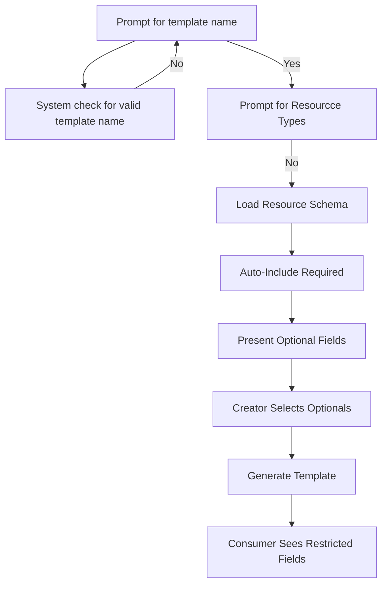
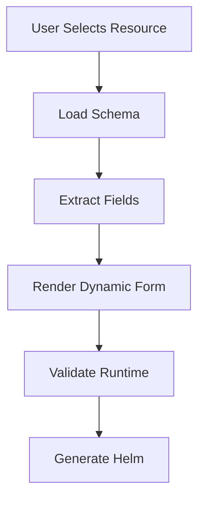
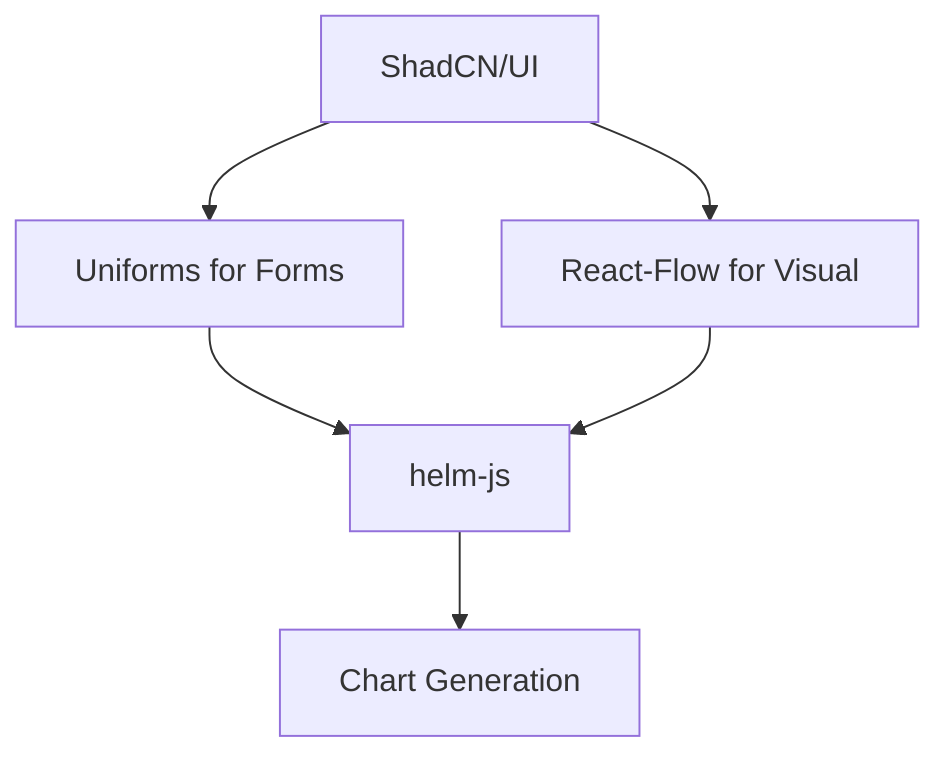
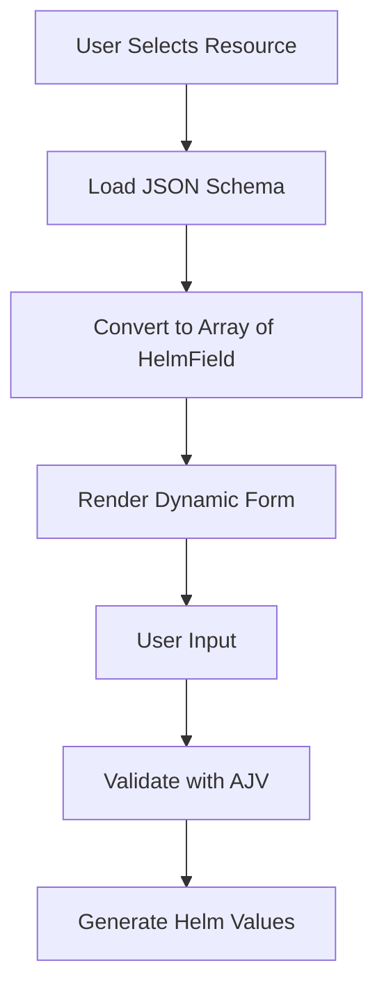

# Helm Chart Generator

A sophisticated Electron application that automatically generates, validates, and manages Helm charts with separation of concerns between infrastructure and product-specific configurations.

## Overview

This application addresses the complexity of Kubernetes deployments by providing an intelligent template-driven approach to Helm chart generation. It separates infrastructure concerns from product-specific configurations to comply with Separation of Duties (SoD) regulations while maintaining ease of use.

## Key Features

### 🎯 **Context-Driven Generation**
- Dynamic chart generation based on product context
- Support for multiple product types (web-api, frontend, cronjob, background-job, etc.)
- Environment-specific configurations (dev, uat, prod)

### 📋 **Template Management**
- Pre-defined templates for common deployment patterns
- Customizable Kubernetes resource type schemas
- Version-controlled template definitions

### ✅ **Validation & Compliance**
- Built-in Helm chart validation
- Kubernetes resource schema validation
- SoD compliance checks

## Quick Start

### Prerequisites
- Node.js 16+
- Kubernetes cluster access
- Helm 3.x
- kubectl configured

### Installation
```bash
# Clone the repository
git clone <repository-url>
cd helm-chart-generator

# Install dependencies
npm install

# Start the application
npm start
```

## Context Schema

The application uses a standardized context object to drive chart generation:

```json
{
  "customer": "acf",
  "product": "cai-api-service",
  "environment": "uat",
  "instance": "01",
  "version": "1.23.4"
}
```

### Required Context Fields

- **customer**: Customer/organization identifier
- **product**: Product name (used for chart naming)
- **environment**: Target environment (dev/uat/prod)
- **instance**: Instance identifier for multi-instance deployments
- **version**: Product version

## Product Types

The system supports various product deployment patterns:

| Product Type | Description | Generated Resources |
|-------------|-------------|-------------------|
| `web-api` | REST API services | Deployment, Service, Ingress, HPA |
| `frontend` | Web applications | Deployment, Service, Ingress, ConfigMap |
| `cronjob` | Scheduled tasks | CronJob, ConfigMap, Secret |
| `background-job` | Long-running processes | Deployment, ConfigMap, Secret |
| `database` | Database services | StatefulSet, Service, PVC, Secret |
| `message-queue` | Messaging services | Deployment, Service, ConfigMap |

## Chart Structure

### Infrastructure Chart (`{product}-infra`)
```
charts/{product}-infra/
├── Chart.yaml
├── values.yaml
├── templates/
│   ├── namespace.yaml
│   ├── rbac.yaml
│   ├── network-policy.yaml
│   ├── resource-quota.yaml
│   └── security-context.yaml
└── schemas/
    └── values.schema.json
```

### Product Chart (`{product}`)
```
charts/{product}/
├── Chart.yaml
├── values.yaml
├── templates/
│   ├── deployment.yaml
│   ├── service.yaml
│   ├── ingress.yaml
│   ├── configmap.yaml
│   └── hpa.yaml
└── schemas/
    └── values.schema.json
```

## Template Configuration

Templates define the Kubernetes resources and their default configurations:

```yaml
# template-config.yaml
templates:
  web-api:
    infra:
      resources:
        - apiVersion: v1
          kind: Namespace
        - apiVersion: rbac.authorization.k8s.io/v1
          kind: Role
    product:
      resources:
        - apiVersion: apps/v1
          kind: Deployment
        - apiVersion: v1
          kind: Service
```

## Usage Examples

### Generate Charts for Web API
```bash
# Via CLI
helm-generator generate \
  --customer=acf \
  --product=payment-service \
  --type=web-api \
  --environment=uat

# Via GUI
# Use the Electron interface to fill context and select templates
```

### Validate Generated Charts
```bash
# Validate infrastructure chart
helm lint ./charts/payment-service-infra

# Validate product chart
helm lint ./charts/payment-service
```

### Deploy with Separation of Duties
```bash
# Infrastructure team deploys infra chart
helm install payment-service-infra ./charts/payment-service-infra

# Development team deploys product chart
helm install payment-service ./charts/payment-service
```

## Configuration

### Environment Variables
- `KUBE_CONFIG_PATH`: Path to kubeconfig file
- `HELM_REGISTRY_URL`: Helm chart registry URL
- `TEMPLATE_REPO_URL`: Git repository for templates

### Application Settings
- Template repository configuration
- Default resource limits
- Validation rules
- Environment-specific overrides

## API Integration

The application integrates with various APIs and tools:

- **Kubernetes API**: Resource validation and cluster information
- **Helm**: Chart packaging and deployment
- **HashiCorp Vault**: Secret management integration
- **Kong Gateway**: API gateway configuration
- **F5 AS3**: Load balancer configuration

## Security Considerations

- Templates enforce security best practices
- Resource quotas and limits are automatically applied
- RBAC configurations follow principle of least privilege
- Secrets are properly managed and encrypted

## Contributing

1. Fork the repository
2. Create a feature branch
3. Implement changes with tests
4. Submit a pull request

## Support

For issues and questions:
- Create an issue in the repository
- Check the troubleshooting guide
- Review the FAQ section

## Core Concepts

### 1. Context Configuration
The app uses a JSON context to determine chart generation:
```json
{
  "customer": "acf",
  "product": "cai-api-service",
  "environment": "uat",
  "instance": "01",
  "version": "1.23.4"
}
```

### 2. Template Types
- **Infrastructure Templates**: Define cluster-level resources (NetworkPolicies, RBAC, etc.)
- **Product Templates**: Define application resources (Deployments, Services, etc.)

### 3. Resource Selection
Templates specify allowed:
- Kubernetes resource kinds
- API versions
- Namespaces
- Default values

## Usage Flow

1. **Import Resources**: Load Kubernetes schemas and CRDs
2. **Create Templates**: Design infrastructure/product templates
3. **Generate Charts**: Create environment-specific Helm charts
4. **Package & Push**: Build and publish to OCI registry

## Requirements

- Node.js 16+
- Kubernetes cluster access (for schema discovery)
- Helm 3+

# Helm Template Generator Development Plan

## Phase 1: Core Functionality

### 1. Schema Management
- Implement Kubernetes schema importer
  - Support for multiple API versions
  - CRD discovery and validation
  - Schema caching mechanism

### 2. Template Designer
- UI for template creation
  - Resource kind selector with version picker
  - Namespace specification
  - Default values configuration
- Template validation
- Export/import template functionality

### 3. Context Management
- Context editor with validation
- Context versioning
- Environment-specific overrides

## Phase 2: Helm Generation

### 1. Chart Structure
```
charts/
  {product}-infra/
    templates/
    Chart.yaml
    values.yaml
  {product}/
    templates/
    Chart.yaml
    values.yaml
```

### 2. Generation Logic
- Template application with context variables
- Resource validation against schema
- Values.yaml generation with context-aware defaults

### 3. Packaging
- Helm chart linting
- OCI packaging (Quay/Harbor support)
- Version tagging based on context

## Phase 3: Advanced Features

### 1. Dependency Management
- Infrastructure/product chart dependencies
- External chart references

### 2. Multi-Cluster Support
- Cluster-specific template variations
- Context-aware cluster targeting

### 3. Governance Features
- SoD enforcement
- Compliance checks
- Audit logging

## Technical Considerations

### Schema Handling
- Implement Kubernetes OpenAPI schema parser
- CRD discovery via cluster connection or predefined bundles
- Version conflict resolution

### Electron Architecture
- Main process: Schema management, Helm operations
- Renderer process: Template design UI
- IPC for heavy operations

### Storage
- Template storage format (JSON/YAML)
- Local cache for schemas
- Project file structure

## Milestones

1. M1: Basic schema loading and template design (4 weeks)
2. M2: Helm generation with simple resources (3 weeks)
3. M3: OCI packaging and context integration (3 weeks)
4. M4: Advanced validation and SoD features (4 weeks)

## Implementation Notes

1. **Schema Import**:
   - Use `@kubernetes/client-node` for live cluster schema discovery
   - Provide fallback bundled schemas for offline use
   - Implement version picker with compatibility checks

2. **Template Design**:
   - Create visual resource selector with filtering
   - Implement template versioning system
   - Allow template inheritance/extension

3. **Context Handling**:
   - Support variable substitution in templates (`{{.customer}}`, `{{.environment}}`)
   - Implement context validation against product type

4. **Helm Generation**:
   - Use helm-js SDK for chart operations
   - Implement template-aware linter
   - Add dry-run capability for validation


---

Here's a complete example of the folder structure and file contents for a product template with **Deployment** and **Service** resources:

---

### **Folder Structure**
```
my-helm-templates/
├── product-webapp/                   # Template Name
│   ├── template-definition.yaml      # Template configuration
│   ├── values.schema.json            # Validation schema
│   └── resources/                    # Resource templates
│       ├── deployment.yaml           # Deployment template
│       └── service.yaml              # Service template
```

---

### **1. Template Definition (`template-definition.yaml`)**
```yaml
kind: HelmTemplate
metadata:
  name: product-webapp
  description: "Web application with Deployment and Service"
spec:
  formFields:
    - name: appName
      label: "Application Name"
      type: text
      required: true
      pattern: "^[a-z0-9-]+$"
    
    - name: replicaCount
      label: "Replica Count"
      type: number
      default: 2
      min: 1
      max: 10
    
    - name: containerImage
      label: "Container Image"
      type: text
      required: true
      placeholder: "registry/repo:tag"

    - name: servicePort
      label: "Service Port"
      type: number
      default: 8080
      min: 1024
      max: 9999

  resources:
    - kind: Deployment
      file: resources/deployment.yaml
      required: true
    
    - kind: Service
      file: resources/service.yaml
      required: true
```

---

### **2. Values Schema (`values.schema.json`)**
```json
{
  "$schema": "http://json-schema.org/draft-07/schema#",
  "type": "object",
  "required": ["appName", "containerImage"],
  "properties": {
    "appName": {
      "type": "string",
      "pattern": "^[a-z0-9-]+$"
    },
    "replicaCount": {
      "type": "integer",
      "minimum": 1,
      "maximum": 10,
      "default": 2
    },
    "containerImage": {
      "type": "string",
      "format": "uri-reference"
    },
    "servicePort": {
      "type": "integer",
      "minimum": 1024,
      "maximum": 9999
    }
  }
}
```

---

### **3. Resource Templates**

#### **Deployment (`resources/deployment.yaml`)**
```yaml
apiVersion: apps/v1
kind: Deployment
metadata:
  name: {{ .Values.appName }}
  labels:
    app: {{ .Values.appName }}
spec:
  replicas: {{ .Values.replicaCount }}
  selector:
    matchLabels:
      app: {{ .Values.appName }}
  template:
    metadata:
      labels:
        app: {{ .Values.appName }}
    spec:
      containers:
      - name: {{ .Values.appName }}
        image: {{ .Values.containerImage }}
        ports:
        - containerPort: {{ .Values.servicePort }}
```

#### **Service (`resources/service.yaml`)**
```yaml
apiVersion: v1
kind: Service
metadata:
  name: {{ .Values.appName }}-svc
spec:
  selector:
    app: {{ .Values.appName }}
  ports:
    - protocol: TCP
      port: {{ .Values.servicePort }}
      targetPort: {{ .Values.servicePort }}
  type: ClusterIP
```

---

### **4. Generated Helm Chart (After User Input)**
```
my-webapp-chart/
├── Chart.yaml
├── values.yaml
└── templates/
    ├── deployment.yaml
    └── service.yaml
```

#### **Chart.yaml**
```yaml
apiVersion: v2
name: my-webapp-chart
description: Generated from product-webapp template
version: 0.1.0
```

#### **values.yaml**
```yaml
# User-provided values
appName: "frontend-app"
replicaCount: 3
containerImage: "quay.io/acf/frontend:v1.2.0"
servicePort: 8080

# System-generated
_template: product-webapp
_templateVersion: 1.0.0
```

---

### **Electron App Form UI Mockup**
```typescript
// Sample form configuration derived from template
const formConfig = [
  {
    id: "appName",
    type: "text",
    label: "Application Name",
    required: true,
    pattern: /^[a-z0-9-]+$/,
    errorMessage: "Only lowercase letters, numbers and hyphens"
  },
  {
    id: "containerImage",
    type: "text",
    label: "Container Image",
    required: true,
    placeholder: "registry/repo:tag"
  },
  {
    id: "replicaCount",
    type: "number",
    label: "Replica Count",
    min: 1,
    max: 10,
    defaultValue: 2
  }
];
```

---

### **Key Features Demonstrated**
1. **Clear Separation**  
   - Template definition vs. generated chart
   - Resource files kept in dedicated folder

2. **Template Flexibility**  
   - User-defined form fields map directly to Helm values
   - Required/Optional resource control

3. **Validation Layers**  
   - Schema validation (JSON Schema)
   - Kubernetes manifest linting
   - Template-level pattern matching (`^[a-z0-9-]+$`)

4. **Traceability**  
   - `_template` metadata in generated charts
   - Version tracking


## Template Creator Workflow

### Overall Workflow


### 1. Template Definition Schema

`template-definition.yaml` with Optional Field Selection

```yaml
kind: HelmTemplate
metadata:
  name: webapp-deployment
spec:
  resourceSchemas:
    Deployment:
      includeAllRequired: true  # Mandatory fields auto-included
      optionalFields:
        - spec.strategy          # Object field
        - spec.template.spec.securityContext  # Nested field
        - metadata.annotations   # Map field
      fieldOverrides:
        spec.replicas:
          default: 3            # Override schema default
          uiGroup: "Scaling"    # Custom grouping
```

### 2. Template Creator UI Wireframe

#### Optional Field Selection Panel

```text
┌──────────────────────────────────────────────────────┐
│  Optional Fields for Deployment                      │
├───────────────────┬──────────────────────────────────┤
│ Available Fields  │ Selected Fields                  │
│ ────────────────  │ ────────────────                 │
│ [ ] strategy      │ [x] replicas (required)          │
│ [x] annotations   │ [x] resources                    │
│ [ ] tolerations   │ [x] annotations                  │
│                   │                                  │
├───────────────────┴──────────────────────────────────┤
│           [Save Selection] [Select All]              │
└──────────────────────────────────────────────────────┘
```
**Key Interactions:**

- Checkbox toggles for optional fields
- Required fields appear grayed out but selected
- Search/filter for large schemas

#### Backend Processing
**Field Inclusion Logic**
```ts
function processTemplate(schema: JSONSchema7, templateDef: HelmTemplate) {
  const result: HelmField[] = [];
  
  // Add required fields
  Object.entries(schema.properties || {}).forEach(([name, prop]) => {
    if (schema.required?.includes(name)) {
      result.push(createField(name, prop));
    }
  });
  
  // Add selected optional fields
  templateDef.spec.optionalFields?.forEach(path => {
    const prop = getNestedProperty(schema, path);
    if (prop) result.push(createField(path, prop));
  });
  
  return result;
}

// Example output for Deployment:
[
  { name: 'spec.replicas', required: true, type: 'number' },
  { name: 'spec.strategy', required: false, type: 'object' },
  { name: 'metadata.annotations', required: false, type: 'object' }
]
```

### 4. Consumer Values File Generation
**Template-Driven** `values.yaml`
```yaml
# Template-defined fields (mix of required + selected optional)
deployment:
  replicas: 3          # Required field with template default
  strategy: {}         # Optional field included by template
  annotations:         # Optional field 
    team: "frontend"

# Consumer-overridable fields only appear if:
# 1. Defined in template's optionalFields
# 2. Have consumerConfigured: true    
```
---

### Recommended Stack




****Example**** `package.json:`

```json
{
  "dependencies": {
    "@rjsf/core": "^5.13.0",
    "@uniforms-bridges/zod": "^4.0.0",
    "reactflow": "^11.10.0",
    "helm-js": "^0.8.0",
    "shadcn-ui": "^0.5.0"
  }
}
```

### Implementation Tips
#### 1. **For JSON Schema → ShadCN Fields:**
```ts
// Dynamically map schema types to ShadCN components
const fieldComponents = {
  string: Input,
  number: ({ onChange, ...props }) => (
    <Input 
      {...props} 
      type="number" 
      onChange={(e) => onChange(parseInt(e.target.value))} 
    />
  ),
  boolean: Checkbox
};
```

#### 2. **For Helm Schema Validation::**
```ts
import { validate } from 'helm-js';

const errors = validate(values, {
  type: 'object',
  properties: {
    replicaCount: { type: 'integer', minimum: 1 }
  }
});
```
---

### Which to Choose?
- **For simple forms: @rjsf/core with custom Tailwind theme**
- **For type-safety: Uniforms + shadcn/ui**
- **For visual pipelines: ReactFlow + custom nodes**

---

### Solution: Hybrid Dynamic + Static Typing
**1. Dynamic Schema Loading**:

```ts
// Load schema dynamically based on user selection
async function getResourceSchema(kind: string): Promise<JSONSchema7> {
  const schemas = {
    Deployment: await import('./schemas/deployment.json'),
    Service: await import('./schemas/service.json')
  };
  return schemas[kind];
}
```

**2. Type-Safe Wrapper**:

```ts
// Generic type for known fields
type HelmField = {
  name: string;
  type: 'string' | 'number' | 'boolean';
  required: boolean;
};

// Dynamic form component
function DynamicForm({ resourceKind }: { resourceKind: string }) {
  const [schema, setSchema] = useState<JSONSchema7>();
  const [fields, setFields] = useState<HelmField[]>([]);

  useEffect(() => {
    getResourceSchema(resourceKind).then(schema => {
      setSchema(schema);
      setFields(extractFields(schema)); // Convert schema -> HelmField[]
    });
  }, [resourceKind]);
}
```

**3. Runtime Validation:**

****A. AJV (JSON Schema Validator)****
```bash
npm install ajv ajv-formats
```

```ts
import Ajv from 'ajv';
import addFormats from 'ajv-formats';

const ajv = new Ajv();
addFormats(ajv);

function validate(values: unknown, schema: JSONSchema7) {
  const validate = ajv.compile(schema);
  return validate(values); // Returns boolean + errors
}
```

****B. Zod Coercion for Known Fields****

```ts
// Only apply Zod to common fields
const commonFieldsSchema = z.object({
  metadata: z.object({
    name: z.string().min(1),
    namespace: z.string().optional()
  })
});

function validatePartial(values: unknown) {
  return commonFieldsSchema.safeParse(values); // ZodResult
}
```

**4. Dynamic Form Rendering:**
****Tailwind + ShadCN Components****

```tsx
function FieldRenderer({ field }: { field: HelmField }) {
  switch (field.type) {
    case 'string':
      return <Input 
               placeholder={field.name} 
               className="w-full" 
             />;
    case 'number':
      return <Input 
               type="number" 
               className="w-20" 
             />;
    default:
      return <Checkbox />;
  }
}

// In parent component
<Card>
  <CardHeader>
    <CardTitle>{resourceKind} Form</CardTitle>
  </CardHeader>
  <CardContent className="grid gap-4">
    {fields.map(field => (
      <div key={field.name}>
        <Label>{field.name}</Label>
        <FieldRenderer field={field} />
      </div>
    ))}
  </CardContent>
</Card>
```

---

Here's how to handle **enums, arrays, and nested objects** in your dynamic Helm form generator while maintaining compatibility with Tailwind/ShadCN:

---

### **1. Enum Handling**
#### **Schema Definition (JSON Schema)**
```json
{
  "type": "object",
  "properties": {
    "serviceType": {
      "type": "string",
      "enum": ["ClusterIP", "NodePort", "LoadBalancer"],
      "default": "ClusterIP"
    }
  }
}
```

#### **UI Component (ShadCN Select)**
```tsx
import { Select, SelectTrigger, SelectContent, SelectItem } from "@/components/ui/select";

function EnumField({ field }: { field: HelmField }) {
  return (
    <Select>
      <SelectTrigger className="w-[180px]">
        <span>{field.value || field.default}</span>
      </SelectTrigger>
      <SelectContent>
        {field.enum?.map((option) => (
          <SelectItem key={option} value={option}>
            {option}
          </SelectItem>
        ))}
      </SelectContent>
    </Select>
  );
}
```

---

### **2. Array of Primitives**
#### **Schema Definition**
```json
{
  "type": "object",
  "properties": {
    "command": {
      "type": "array",
      "items": {
        "type": "string"
      }
    }
  }
}
```

#### **UI Component (Dynamic List)**
```tsx
import { Button } from "@/components/ui/button";

function StringArrayField({ value, onChange }: { 
  value: string[], 
  onChange: (val: string[]) => void 
}) {
  const [items, setItems] = useState<string[]>(value || []);

  const addItem = () => setItems([...items, ""]);
  const updateItem = (idx: number, val: string) => {
    const newItems = [...items];
    newItems[idx] = val;
    setItems(newItems);
    onChange(newItems);
  };

  return (
    <div className="space-y-2">
      {items.map((item, idx) => (
        <div key={idx} className="flex gap-2">
          <Input
            value={item}
            onChange={(e) => updateItem(idx, e.target.value)}
          />
          <Button variant="ghost" size="icon" onClick={() => removeItem(idx)}>
            <TrashIcon className="h-4 w-4" />
          </Button>
        </div>
      ))}
      <Button type="button" variant="outline" onClick={addItem}>
        Add Item
      </Button>
    </div>
  );
}
```

---

### **3. Array of Complex Objects**
#### **Schema Definition**
```json
{
  "type": "object",
  "properties": {
    "env": {
      "type": "array",
      "items": {
        "type": "object",
        "properties": {
          "name": { "type": "string" },
          "value": { "type": "string" },
          "valueFrom": { 
            "type": "object",
            "properties": {
              "secretKeyRef": {
                "type": "object",
                "properties": {
                  "name": { "type": "string" },
                  "key": { "type": "string" }
                }
              }
            }
          }
        }
      }
    }
  }
}
```

#### **UI Component (Accordion List)**
```tsx
import { Accordion, AccordionItem, AccordionTrigger, AccordionContent } from "@/components/ui/accordion";

function ObjectArrayField({ fields, value, onChange }: {
  fields: HelmField[],
  value: Record<string, unknown>[],
  onChange: (val: Record<string, unknown>[]) => void
}) {
  const [items, setItems] = useState(value || [{}]);

  const updateItem = (idx: number, field: string, val: unknown) => {
    const newItems = [...items];
    newItems[idx] = { ...newItems[idx], [field]: val };
    setItems(newItems);
    onChange(newItems);
  };

  return (
    <Accordion type="multiple">
      {items.map((item, idx) => (
        <AccordionItem key={idx} value={`item-${idx}`}>
          <AccordionTrigger>Item {idx + 1}</AccordionTrigger>
          <AccordionContent className="p-4 space-y-4">
            {fields.map((field) => (
              <div key={field.name}>
                <Label>{field.name}</Label>
                {renderField({
                  field,
                  value: item[field.name],
                  onChange: (val) => updateItem(idx, field.name, val)
                })}
              </div>
            ))}
            <Button
              variant="destructive"
              size="sm"
              onClick={() => removeItem(idx)}
            >
              Remove
            </Button>
          </AccordionContent>
        </AccordionItem>
      ))}
      <Button 
        type="button" 
        variant="outline" 
        className="mt-2"
        onClick={() => setItems([...items, {}])}
      >
        Add Item
      </Button>
    </Accordion>
  );
}
```

---

### **4. Dynamic Field Renderer**
#### **Unified Component**
```tsx
function renderField({ field, value, onChange }: {
  field: HelmField,
  value: unknown,
  onChange: (val: unknown) => void
}) {
  // Handle enums
  if (field.enum) {
    return <EnumField field={{ ...field, value }} onChange={onChange} />;
  }

  // Handle arrays
  if (field.type === 'array') {
    if (field.items?.type === 'object') {
      return (
        <ObjectArrayField 
          fields={field.itemFields} 
          value={value as Record<string, unknown>[]} 
          onChange={onChange}
        />
      );
    }
    return (
      <StringArrayField 
        value={value as string[]} 
        onChange={onChange}
      />
    );
  }

  // Handle primitives
  switch (field.type) {
    case 'number':
      return (
        <Input
          type="number"
          value={value as number}
          onChange={(e) => onChange(Number(e.target.value))}
        />
      );
    default:
      return (
        <Input
          value={value as string}
          onChange={(e) => onChange(e.target.value)}
        />
      );
  }
}
```

---

### **5. Schema Processing**
#### **Transform JSON Schema to HelmField[]**
```ts
interface HelmField {
  name: string;
  type: 'string' | 'number' | 'boolean' | 'array' | 'object';
  required: boolean;
  enum?: string[];
  items?: {
    type: HelmField['type'];
    fields?: HelmField[]; // For object arrays
  };
}

function schemaToFields(schema: JSONSchema7, path: string[] = []): HelmField[] {
  if (schema.type !== 'object') return [];

  return Object.entries(schema.properties || {}).map(([name, prop]) => {
    const field: HelmField = {
      name,
      type: prop.type as HelmField['type'],
      required: schema.required?.includes(name) || false,
      enum: prop.enum as string[] | undefined
    };

    if (prop.type === 'array' && prop.items) {
      field.items = {
        type: prop.items.type as HelmField['type'],
        fields: prop.items.type === 'object' 
          ? schemaToFields(prop.items as JSONSchema7, [...path, name]) 
          : undefined
      };
    }

    return field;
  });
}
```

---

### **6. Validation**
#### **AJV Validator Setup**
```ts
import Ajv from 'ajv';
import addFormats from 'ajv-formats';

const ajv = new Ajv({
  allErrors: true,
  strict: false,
  coerceTypes: true
});
addFormats(ajv);

function validateForm(schema: JSONSchema7, data: unknown) {
  const validate = ajv.compile(schema);
  const valid = validate(data);
  
  return {
    valid,
    errors: validate.errors?.map(err => ({
      field: err.instancePath.replace('/', ''),
      message: err.message
    })) || []
  };
}
```

---

### **Complete Workflow**


---

### **Key Features**
1. **Enum Support**: Rendered as ShadCN `<Select>`
2. **Arrays**: 
   - Primitives: Dynamic list with add/remove
   - Objects: Accordion with nested forms
3. **Validation**: 
   - Runtime validation with AJV
   - Error highlighting
4. **Tailwind Compatibility**: 
   - Uses ShadCN primitives
   - Responsive layout
